### Начинаем вспоминать ATL

Раз уж я решил устроить в блоге «парад древностей», то нельзя обойти вниманием такую технологию как ATL (Active Template Library). Это всего-навсего набор шаблонных классов C++, разработанных Microsoft для упрощения написания COM-компонентов. Она позволяет создавать различные COM-объекты, серверы автоматизации OLE и управляющие элементы ActiveX. В отличие от своей сестры WTL, она входит в стандартную поставку Visual Studio, надо только не забыть её отметить в установщике.

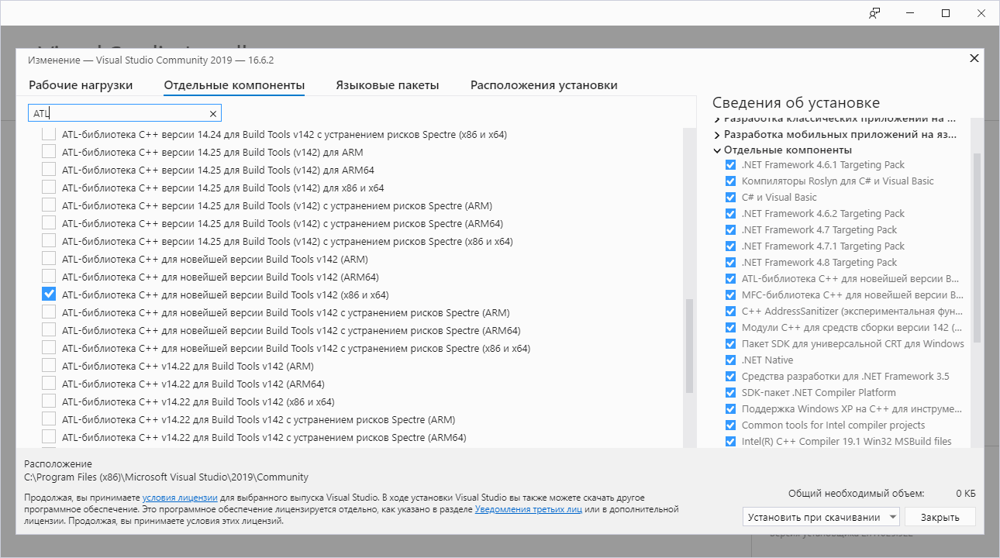

В Visual Studio есть «волшебники» для ATL, позволяющие создать первичную объектную структуру практически без программирования вручную. От программиста лишь требуется вызывать их в правильном порядке, и в конце концов наполнить скелет «мясом», т. е. рабочим кодом.

Стандартный «Hello World» для ATL заключается в написании простейшего COM-сервера (например, калькулятора, умеющего складывать числа) и клиента к нему.

Итак, приступим! Сначала создаём пустой солюшн, а в нём — проект типа «ATL Project», называем его `FirstLibrary`.

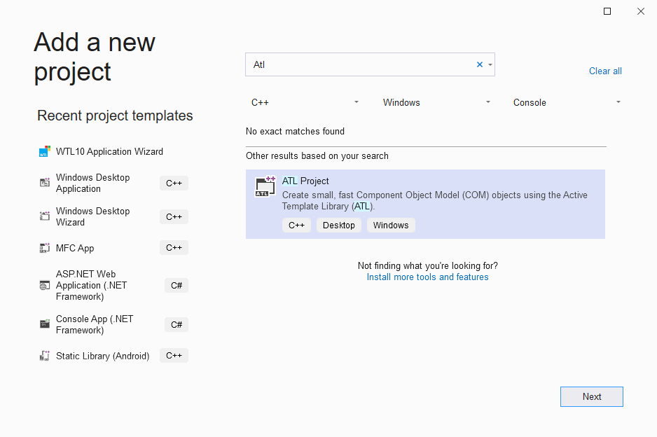

В «волшебнике» практически ничего делать не надо, разве что указать, что сервер будет располагаться в DLL.

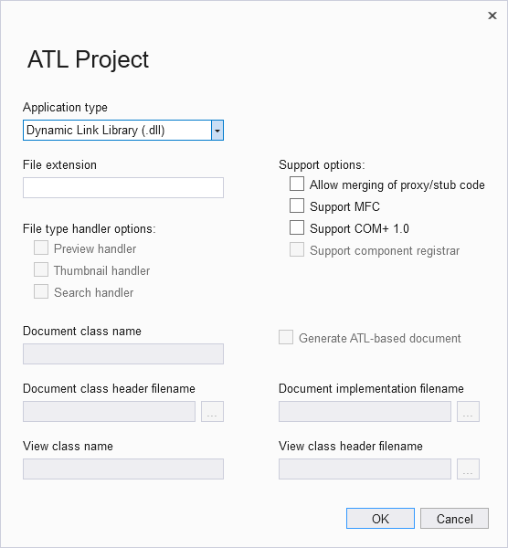

Не забудьте настроть линкёр, чтобы он регистрировал получаемые COM-библиотеки на уровне пользователя, а не системы. Это позволит работать от обычного пользователя и не отвлекаться на ругачки Windows.

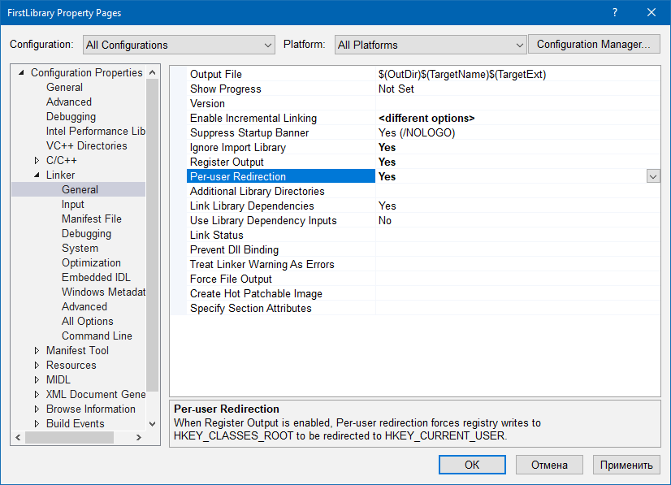

Добавляем в проект «ATL Simple Object» с именем Calculator.


Волшебник всё угадывает правильно, нам остаётся лишь ввести пояснения.

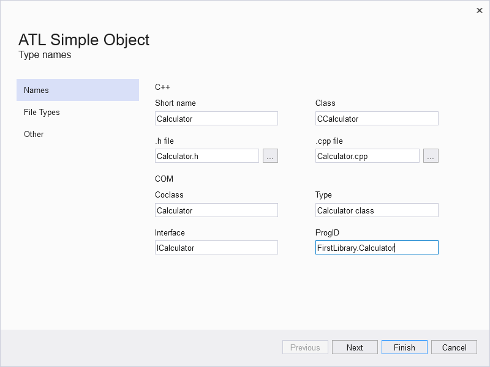

Если переключиться на Class View, то становится видна структура COM-библиотеки: модуль `CFirstLibraryModule`, интерфейс `ICalculator` и класс `CCalculator`.

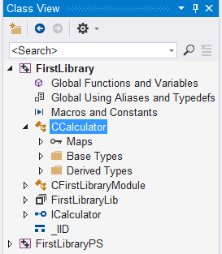

Щёлкаем правой кнопкой мыши по интерфейсу `ICalculator` (именно по интерфейсу, а не по классу!) и выбираем пункт «Add method…» Всплывает крайне полезный «Волшебник», который позволяет добавить метод в интерфейс без утомительного лазания по разным файлам.

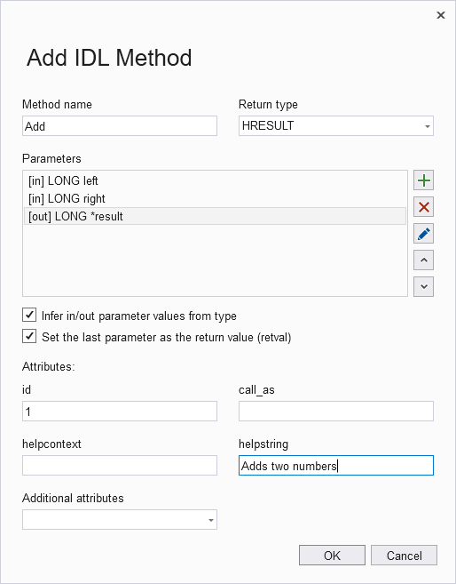

Волшебник достаточно умён, чтобы сам добавлять атрибуты `[in]` и `[out, retval]` к аргументам. Пару раз щёлкнули мышкой на «Add method…» — получите сгенерированную болванку класса и распишитесь.

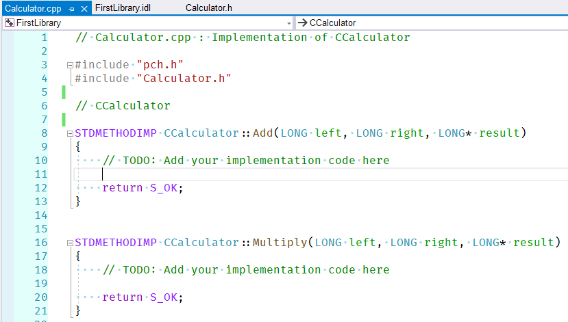

Нам остаётся лишь зайти в файл Calculator.cpp и наполнить содержанием сгенерированные методы класса.

```c++
// Calculator.cpp : Implementation of CCalculator
 
#include "pch.h"
#include "Calculator.h"
 
// CCalculator
 
STDMETHODIMP CCalculator::Add (LONG left, LONG right, LONG* result)
{
    *result = left + right;
 
    return S_OK;
}
 
STDMETHODIMP CCalculator::Multiply (LONG left, LONG right, LONG* result)
{
    *result = left * right;
 
    return S_OK;
}
```

Собственно программирование на этом закончено. Пробуем скомпилировать код и убеждаемся, что Visual Studio претензий не имеет. Остаётся лишь последний штрих. Добавляем Post-build step для проекта: нам надо скопировать TLB-файл библиотеки в директорию назначения — так удобнее настраивать клиентский проект, он всегда будет знать, где найти TLB. Да и с точки зрения упаковки приложения так проще, когда всё в одном месте. Ума не приложу, почему до сих пор этот шаг не автоматизирован.

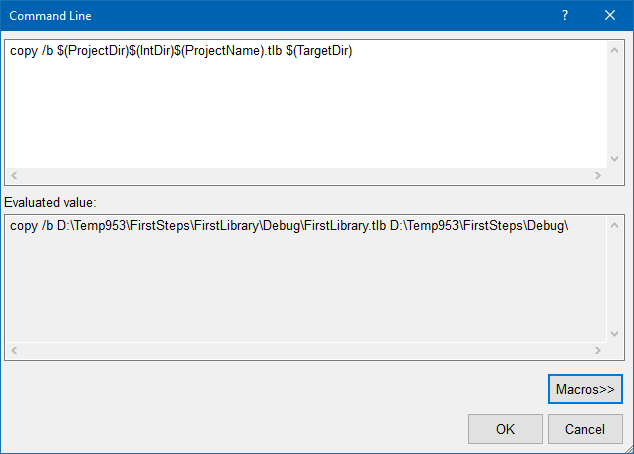

Итак, сервер у нас есть. Переходим к клиенту. Создаём проект типа «Windows Desktop Wizard» и называем его `FirstClient`.

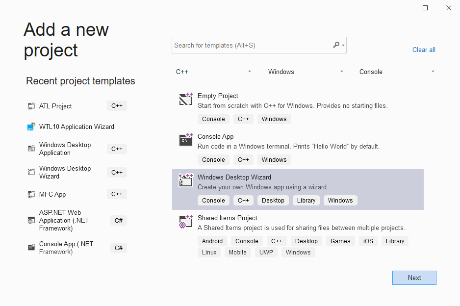

Волшебник практически всё правильно угадал.

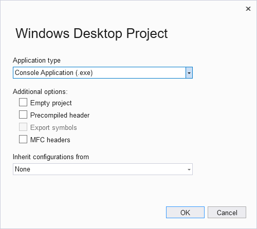

Лучше установить зависимость между проектами, чтобы изменения в коде сервера автоматически подхватывались в клиенте.

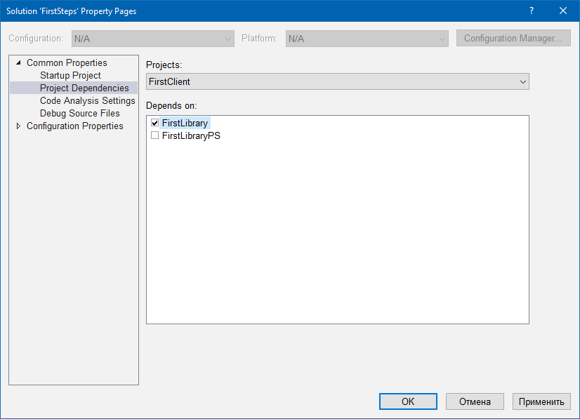

Подсказываем Visual Studio, где искать TLB-файл.

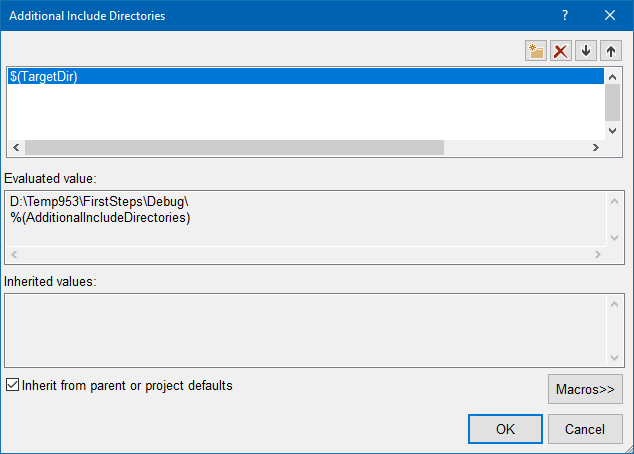

В `FirstClient.cpp` пишем простецкий код:

```c++
// FirstClient.cpp : This file contains the 'main' function. 
// Program execution begins and ends there.
 
#include <windows.h>
#include <iostream>
 
#import "FirstLibrary.tlb"
 
int main()
{
    // инициализируем подсистему COM
    CoInitialize (nullptr);
 
    {
        // получаем указатель на объект калькулятора
        FirstLibraryLib::ICalculatorPtr 
            calculator (__uuidof(FirstLibraryLib::Calculator));
 
        // первый и второй аргументы для методов калькулятора
        LONG left = 10, right = 15;
 
        // складываем числа        
        std::cout << left << " + " << right << " = "
            << calculator->Add (left, right) << std::endl;
 
        // перемножаем числа
        std::cout << left << " * " << right << " = "
            << calculator->Multiply (left, right) << std::endl;
 
        // объект калькулятора будет автоматически освобождён
        // по выходу из данного блока
    }
 
    // освобождаем подсистему COM
    CoUninitialize();
}
```

На дворе 2020 год, а Visual Studio всё ещё продолжает тупить и подсвечивать красным произвольные куски плюсового кода. Похоже, в Microsoft давно махнули рукой на подобные глюки. 🙁

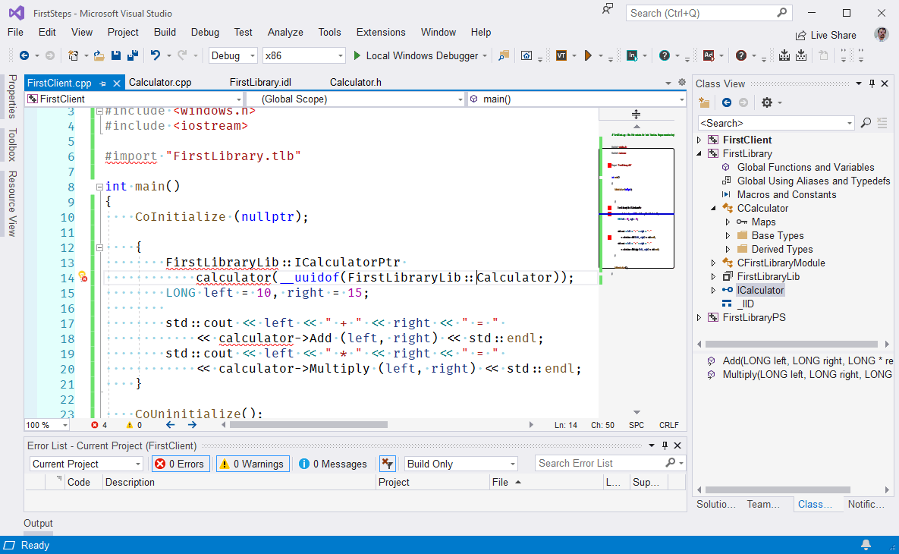

Несмотря на красноту в редакторе, код успешно компилируется. Запускаем, убеждаемся, что всё работает.

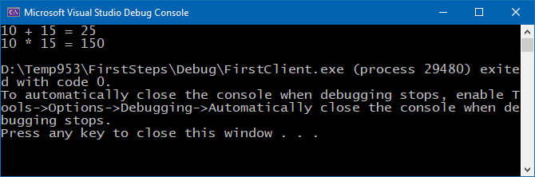
