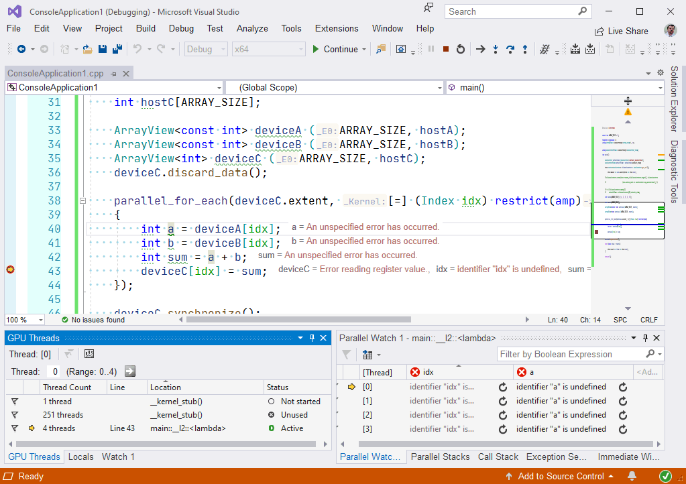

### C++ AMP

C++ Accelerated Massive Parallelism (сокращенно C++ AMP) — библиотека, использующая DirectX 11, и открытая спецификация, созданные Microsoft для реализации параллельных программ для гибридных систем на языке C++. Система C++AMP позволяет переносить вычисления на GPU (видеоускорители) без внесения большого количества изменений в программы.

Вот как с помощью AMP можно ловко сложить два массива на GPU:

```c++
#include <iostream>
#include <amp.h>

const int ARRAY_SIZE = 5;

// для упрощения кода
template <typename T>
using ArrayView = concurrency::array_view <T, 1>;
using Index = concurrency::index <1>;

int main()
{
    // данные в оперативной памяти
    int hostA[ARRAY_SIZE] { 1, 2, 3, 4, 5 };
    int hostB[ARRAY_SIZE] { 4, 5, 6, 7, 8 };
    int hostC[ARRAY_SIZE];

    // данные в памяти GPU
    ArrayView <const int> deviceA (ARRAY_SIZE, hostA);
    ArrayView <const int> deviceB (ARRAY_SIZE, hostB);
    ArrayView <int> deviceC (ARRAY_SIZE, hostC);
    deviceC.discard_data();

    // сложение с помощью GPU
    parallel_for_each (deviceC.extent, [=] (Index idx) restrict (amp)
    {
        int a = deviceA[idx];
        int b = deviceB[idx];
        int sum = a + b;
        deviceC[idx] = sum;
    });

    // получаем результат, т. е. переносим в оперативную память
    deviceC.synchronize();

    for (auto item : hostC) {
        std::cout << item << std::endl;
    }

    return 0;
}
```

Требования к системе:

* Windows 7 и более поздние версии;
* Windows Server 2008 R2 и более поздние версии;
* DirectX 11 с уровнем компонентов 11.0 или более поздней версии оборудования.

Примечание. AMP сейчас не поддерживается в ARM64.

[Пишут, что](https://www.phoronix.com/scan.php?page=news_item&px=MTc3Nzg) технология C++ AMP доступна на Linux</a>:

> AMD and Microsoft jointly released C++ AMP version 1.2 compiler that supports Linux alongside Windows. Ubuntu is the officially supported distribution at this time.

> AMD with support from Microsoft have been developing a C++ AMP 1.2 compiler implementation that will support HSA devices for AMD APUs but also support NVIDIA hardware and other platforms by dumping the output to Khroos SPIR or OpenCL C. AMP in this context is short for Accelerated Massive Parallelism. Microsoft originally developed AMP on DirectX 11 and is similar in nature to OpenMP but designed to exploit the parallel capabilities of graphics processors. Intel has been experimenting with implementing C++ AMP over LLVM/Clang for some time on Linux but there hasn't been any news on that effort lately while an independent developer using LLVM also tackled C++ AMP support to target NVIDIA GPUs with OpenCL. AMD is investing in C++ AMP over LLVM/Clang now to further their Heterogeneous System Architecture (HSA) agenda.

> AMD's cppamp-driver-ng compiler project will take C++ AMP 1.2 compliant code and transform it into HSAIL/BRIG for AMD HSA devices or Khronos SPIR and OpenCL C for other hardware. The Clang-based compiler is called Clamp and there's also the libcxxamp runtime library.

> Overall this work appears interesting and we'll certainly be following it on Phoronix. This new C++ AMP compiler with Ubuntu Linux support can be found hosted at BitBucket.org.

Чтобы воспользоваться этой технологией в Visual Studio, практически ничего делать не надо (т. е. не надо ничего доустанавливать, всё уже включено в поставку). Единственное, что нужно - отключить режим совместимости C++, иначе компилятор падает с ошибкой:


В язык добавлена синтаксическая конструкция `restrict(amp)`, которая может быть указана для любой функции (в том числе для лямбда-функции), обозначающая что она может быть исполнена на акселераторе C++ AMP. Ключевое слово <code>restrict</code> в данном случае означает, что компилятор должен оценить, подходит ли данная функция для GPU (использует ли она лишь те возможности языка C++, которые могут быть исполнены на большинстве GPU).

Чтобы заработала отладка кода, выполняемого на GPU, необходимо переключить отладчик:


В актуальныъ версиях Windows 10, однако, Microsoft рекомендует поставить тип отладчика `Auto`.

В принципе, отладка работает, однако, значения переменных Visual Studio мне показывать отказалась :(


