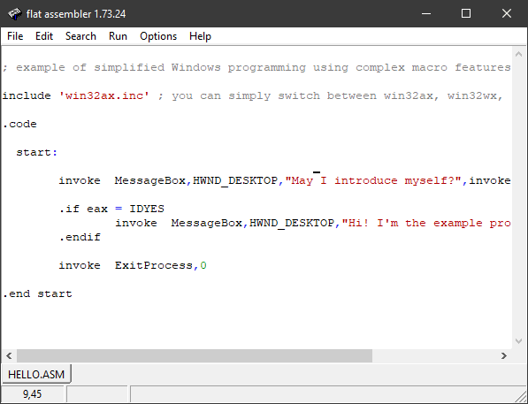

### Ассемблер FASM

https://ru.wikipedia.org/wiki/Fasm

FASM (сокращение от flat assembler) — свободно распространяемый многопроходной ассемблер, написанный Томашем Грыштаром (Tomasz Grysztar). FASM имеет небольшой размер и очень высокую скоростью компиляции, богатый и ёмкий макро-синтаксис, позволяющий автоматизировать множество рутинных задач. Поддерживаются как объектные форматы, так и форматы исполняемых файлов. Это позволяет в большинстве случаев обойтись без компоновщика. Помимо базового набора инструкций процессора и сопроцессора FASM поддерживает наборы инструкций MMX, SSE, SSE2, SSE3, SSSE3, SSE4.1, SSE4.2, SSE4a, AVX и 3DNow!, а также EM64T и AMD64 (включая AMD SVM и Intel SMX).

Официальный сайт: http://flatassembler.net

В FASM используется Intel-синтаксис записи инструкций. Единственное существенное отличие от формата, принятого в других ассемблерах (MASM, TASM в режиме совместимости с MASM) — значение ячейки памяти всегда записывается как `[label_name]`, а просто `label_name` означает адрес (то есть порядковый номер) ячейки. Это позволяет обходиться без ключевого слова `offset`. Также в FASM при переопределении размера операнда вместо `byte ptr` пишется просто `byte`, вместо `word ptr` — `word` и т. д. Не позволяется использовать несколько квадратных скобок в одном операнде, таким образом вместо `[bx][si]` необходимо писать `[bx+si]`. Эти изменения синтаксиса привели к более унифицированному и лёгкому для чтения коду.

С помощью директивы `format` можно указать следующие форматы выходных файлов:

* **MZ** — исполняемые файлы DOS.
* **PE** — исполняемые файлы Windows (консольные, графические приложения и динамические библиотеки).
* **PE64** — исполняемые файлы 64-битных версий Windows.
* **COFF**, **MS COFF**, **MS64 COFF** — объектные файлы Microsoft.
* **ELF**, **ELF64** — исполняемые файлы в UNIX-подобных системах.
* **ARM** — разработка энтузиастов, можно найти на официальном форуме.
* **Binary** — файлы произвольной структуры. Указав смещение 100h (org 100h), можно получить исполняемый файл формата `.COM`. Также, с помощью `format binary` можно компилировать файлы данных.

Операционные системы:

* MS-DOS.
* Windows: NT, XP, Vista, 7, 10.
* Основанные на Linux — напрямую, через системные вызовы.
* FreeBSD.
* Другие, основанные на libc (UNIX-подобные).
* MenuetOS, KolibriOS — не поставляется в стандартном пакете fasm, поставляется вместе с этими операционными системами.

«Hello world» для 32-битной Windows

```asm
; example of simplified Windows programming using complex macro features
 
include 'win32ax.inc' ; you can simply switch between win32ax, win32wx, win64ax and win64wx here
 
.code
 
  start:
 
    invoke  MessageBox,HWND_DESKTOP,"May I introduce myself?",invoke GetCommandLine,MB_YESNO
 
    .if eax = IDYES
        invoke  MessageBox,HWND_DESKTOP,"Hi! I'm the example program!","Hello!",MB_OK
    .endif
 
    invoke  ExitProcess,0
 
.end start
```

Выглядит довольно круто, надо признать. Плюс в поставку входит оболочка



