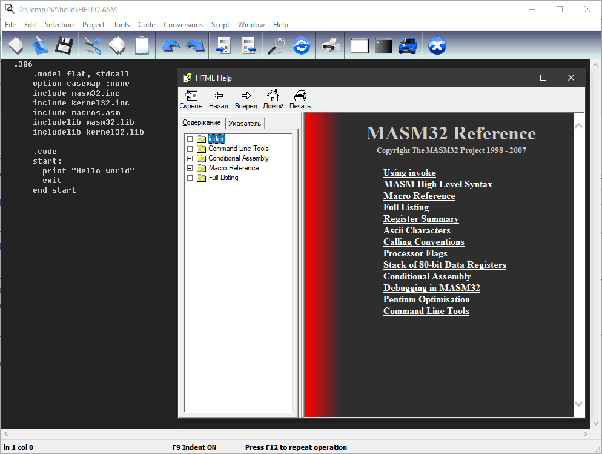

### Microsoft Macro Assembler

https://ru.wikipedia.org/wiki/MASM

Macro Assembler (MASM) — ассемблер для процессоров семейства x86. Первоначально был произведён компанией Microsoft для написания программ в операционной системе MS-DOS и был в течение некоторого времени самым популярным ассемблером, доступным для неё. MASM поддерживал широкое разнообразие макросредств и структурированность программных идиом, включая конструкции высокого уровня для повторов, вызовов процедур и чередований (поэтому MASM — ассемблер высокого уровня). Позднее была добавлена возможность написания программ для Windows. MASM — один из немногих инструментов разработки Microsoft, для которых не было отдельных 16- и 32-битных версий.

Можно скачать: https://www.microsoft.com/en-us/download/details.aspx?id=12654

При установленной Visual Studio проживает по адресу `"C:\Program Files (x86)\Microsoft Visual Studio\2019\Редакция\VC\Tools\MSVC\Тулчейн\bin\Host(x64|x86)\(x64|x86)\ml.exe"`. Этот запускается только из соответствующего окружения, например, «x86 Native Tools Command Prompt». К сожалению, INC-файлов, так нужных при программировании на ассемблере, с ним не поставляется.

Лучше скачать с http://www.masm32.com пакет «MASM32 SDK Version 11», который создаст в папке `C:\masm32` всю необходимую инфраструктуру, включая папку `include` с тремя сотнями INC-файлов на все случаи жизни, начиная с `1394bus.inc`, заканчивая `xolehlp.inc`. Попутно будет установлен редактор «Quick Editor 4.0» со справкой по MASM32 и прочими радостями жизни



Пусть мы установили вышеописанный пакет и теперь хотим написать простенькую 32-битную программу «Hello world». Для этого создаём внутри папки `C:\masm32` подпапку `projects` с файлом `hello.asm` следующего содержания:

```asm
.386
.model flat, stdcall
option casemap :none
    
include \masm32\include\masm32.inc
include \masm32\include\kernel32.inc
include \masm32\macros\macros.asm
includelib \masm32\lib\masm32.lib
includelib \masm32\lib\kernel32.lib
 
.code
 
start:
 
    print "Hello world"
    exit
 
end start
```

Компилируется это так:

```
\masm32\bin\ml /c /coff "hello.asm"
\masm32\bin\PoLink /SUBSYSTEM:CONSOLE "hello.obj"
```

Получается EXE-файл размером 1536 байт. Неплохо!

Впрочем, штатный `ml.exe` из поставки Visual Studio тоже воспринимает INC-файлы от «MASM32 SDK Version 11». Вот пример графического «Hello world», собираемого из «x86 Native Tools Command Prompt»:

```asm
.386
.model flat, stdcall
option casemap: none
 
include kernel32.inc
include user32.inc
 
includelib kernel32.lib
includelib user32.lib
 
.const
    szCaption   db  'Hello', 0
    szText      db  'Hello, World!', 0
 
.code
 
start:
 
    invoke MessageBoxA, 0, offset szText, offset szCaption, 0
    invoke ExitProcess, 0
 
end start
```

Компилируется так:

```
ml /c  /I C:\masm32\include HELLO.ASM
link /subsystem:windows hello.obj
```

Получается EXE-файл размером 2560 байт. Если же линковать этот `hello.obj` с помощью `polink.exe`, то получается EXE-файл размером 2048 байт. Однако, `polink.exe` собирает заметно меньшие EXE-файлы, чем штатный `link.exe`!
