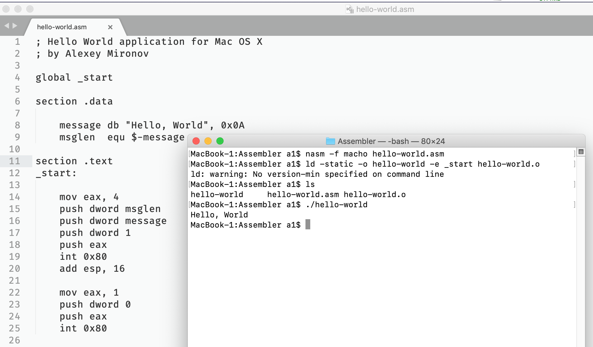

### Пишем на ассемблере под OS X

Оказывается, в 32-битном режиме писать на ассемблере под OS X так же просто, как и под DOS/Windows/Linux. Во многом это заслуга NASM. Итак, нам понадобится: 1) nasm, устанавливаемый стандартным заклинанием `brew install nasm`, 2) XCode, устанавливаемая из App Store, 3) редактор типа Sublime Text (или любой другой аналогичный), 4) если мы собираемся вызывать ядро напрямую (а мы именно это собираемся делать), то надо найти на жёстком диске файл `syscall.h`, содержащий номера этих самых вызовов. У меня он нашёлся в папке `/Library/Developer/CommandLineTools/SDKs/MacOSX.sdk/usr/include/sys/syscall.h`.

Стандартное приложение «Здравствуй, мир» в синтаксисе NASM выглядит так:

```asm
; Hello World application for Mac OS X
 
global _start ; делаем точку входа публичной
 
section .data ; данные
 
    message db "Hello, World", 0x0A ; текст сообщения
    msglen  equ $-message ; его длина в байтах
 
section .text ; инструкции процессора
 
_start: ; точка входа в программу
 
    mov eax, 4         ; номер syscall "write"
    push dword msglen  ; длина сообщения
    push dword message ; собственно сообщение
    push dword 1       ; файл номер 1 -- стандартный вывод
    push eax           ; снова номер syscall
    int 0x80           ; вызываем ядро
    add esp, 16        ; выравниваем стек
 
    mov eax, 1         ; номер syscall "exit"
    push dword 0       ; код возврата
    push eax           ; снова номер syscall
    int 0x80           ; вызываем ядро
;       выравнивать стек не нужно, программа завершилась
```

Теперь заклинания для компиляции и линковки:

```
$ nasm -f macho hello-world.asm
$ ld -static -o hello-world -e _start hello-world.o
```

В итоге мы имеем исполняемый модуль размером 8284 байта (многовато, как по мне!).



Всё хорошо, лишь одно плохо: начиная с Catalina, 32-битные приложения не поддерживаются совсем. Надо учиться делать 64-битные.
