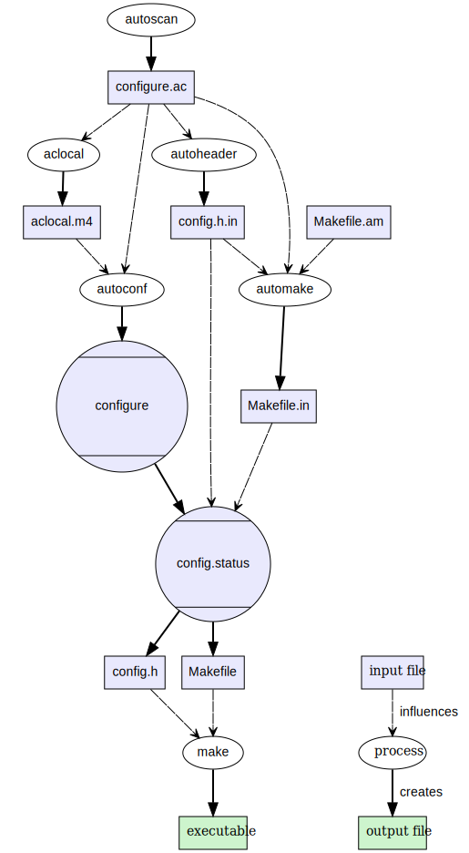

### GNU autotools: начало

Представим себе, что у нас есть очень полезная программа на языке C:

```c
#include <stdio.h>

int main ()
{
    printf ("Hello, aututools!\n");

    return 0;
}
```

и мы хотим, чтобы: 1) её можно было скомпилировать на любой UNIX-системе, 2) опакетить наш шедевр, чтобы его легко было включить в любой дистрибутив.

Как уже, наверное, читатель понял из исходного текста, мы призовём на помощь GNU Autotools. Autotools – это признанный широкой общественностью набор костылей, позволюящий программисту заявлять «Я написал кроссплатформенное приложение». :)

Autotools состоят из трёх костылей: `autoconf`, `automake` и `libtool`. Если что, устанавливается это счастье тривиально (скорее всего, в вашей системе они уже установлены):

```bash
sudo apt install autoconf automake libtool
```

Чем занимается autotools? Вот чем:


Надеюсь, всё понятно из этой простой картинки (в прямоугольниках голубым фоном помечены файлы, ради которых всё и затевается). Если нет, то вот вам более развесистая и подробная картинка из Википедии:



В любом случае, от программиста требуется где-нибудь раздобыть файл `configure.ac`. Для начала подойдёт и такой простой:

```bash
AC_INIT([helloauto], [1.0])
AC_CONFIG_FILES([Makefile])
AC_OUTPUT
````

По факту, это обычный shell-файл, сначала препроцессируемый [макропроцессором M4](https://ru.wikipedia.org/wiki/M4_(%D0%BC%D0%B0%D0%BA%D1%80%D0%BE%D0%BF%D1%80%D0%BE%D1%86%D0%B5%D1%81%D1%81%D0%BE%D1%80)). Вышеприведённый скрипт говорит, что мы хотим создать проект «helloauto» версии «1.00», и мы просим, чтобы нам создали `Makefile`. Выполняем команду

```bash
autoreconf -i
```

которая молча создаёт файл `configure` размером 83791 байт. Поверьте, внутрь него лучше не заглядывать. :)

Нам понадобится также «затравка» для `Makefile` — файл с именем `Makefile.in`. В принципе, это обычный `Makefile`, но с возможностью макроподстановки, которой мы пока не воспользуемся:

```makefile
.PHONY: all clear

CFLAGS  := -Wall -Wextra -O2

SOURCES  := helloauto.c
OBJFILES := helloauto.o
TARGET   := helloauto

all: $(TARGET)

clean:
	rm -rf $(TARGET) $(OBJFILES)

$(TARGET): $(OBJFILES)
	$(CC) -o $@ $^

$(OBJFILES): %.o : %.c
	$(CC) -c -o $@ $< $(CFLAGS)
```

Запускаем

```bash
./configure
```

Кроме `Makefile` он создаёт, например, интереснейший файл `config.log`, в котором рассказывает, что он нашёл в нашей системе (вывод довольно сильно сокращён):

```
This file contains any messages produced by compilers while
running configure, to aid debugging if configure makes a mistake.

It was created by helloauto configure 1.0, which was
generated by GNU Autoconf 2.69.  Invocation command line was

$ ./configure

## --------- ##
## Platform. ##
## --------- ##

hostname = ASUS
uname -m = x86_64
uname -r = 4.4.0-18362-Microsoft
uname -s = Linux
uname -v = #1049-Microsoft Thu Aug 14 12:01:00 PST 2020

/usr/bin/uname -p = x86_64
/bin/uname -X     = unknown

/bin/arch              = x86_64
/usr/bin/arch -k       = unknown
/usr/convex/getsysinfo = unknown
/usr/bin/hostinfo      = unknown
/bin/machine           = unknown
/usr/bin/oslevel       = unknown
/bin/universe          = unknown

PATH: /home/miron/.local/bin
PATH: /usr/local/sbin
PATH: /usr/local/bin
PATH: /usr/sbin
PATH: /usr/bin
PATH: /sbin
PATH: /bin
PATH: /snap/bin

## ----------- ##
## Core tests. ##
## ----------- ##

configure:1816: creating ./config.status

## ---------------------- ##
## Running config.status. ##
## ---------------------- ##

config.status:709: creating Makefile

## ----------------- ##
## Output variables. ##
## ----------------- ##

DPACKAGE_URL=\"\"'
ECHO_C=''
ECHO_N='-n'
ECHO_T=''
LIBOBJS=''
LIBS=''
LTLIBOBJS=''
PACKAGE_BUGREPORT=''
PACKAGE_NAME='helloauto'
PACKAGE_STRING='helloauto 1.0'
PACKAGE_TARNAME='helloauto'
PACKAGE_URL=''
PACKAGE_VERSION='1.0'
PATH_SEPARATOR=':'
SHELL='/bin/bash'
bindir='${exec_prefix}/bin'
build_alias=''
datadir='${datarootdir}'
datarootdir='${prefix}/share'
docdir='${datarootdir}/doc/${PACKAGE_TARNAME}'
dvidir='${docdir}'
exec_prefix='${prefix}'

## ----------- ##
## confdefs.h. ##
## ----------- ##

/* confdefs.h */
#define PACKAGE_NAME "helloauto"
#define PACKAGE_TARNAME "helloauto"
#define PACKAGE_VERSION "1.0"
#define PACKAGE_STRING "helloauto 1.0"
#define PACKAGE_BUGREPORT ""
#define PACKAGE_URL ""

configure: exit 0
```

Теперь мы можем запустить

```bash
make
```

и получить скомпилированную программу. Пока никакой пользы от autotools мы не увидели и очутились в той же точке, из которой стартовали. Но не спешите разочаровываться! Дальше будет интереснее!

Файл configure.ac является гибридом скрипта bash и программы для M4. Строковые литералы в нём заключаются в квадратные скобки, не допускаются пробелы перед открывающей скобкой и после имени аргумента при вызове макроса (вот такой это макропроцессор!). Решётка `#` — признак начала комментария. Сейчас мы начнём наполнять `configure.ac` полезными инструкциями.

```bash
AC_PREREQ([2.68]) # требуем autoconf версии не ниже указанной
AC_CONFIG_HEADERS([config.h]) # просим создать config.h
AC_PROG_CC # просим проверить наличие и работоспособность компилятора C
```

Вот какой `config.h` был создан по нашей просьбе:

```c
/* config.h.  Generated from config.h.in by configure.  */
/* config.h.in.  Generated from configure.ac by autoheader.  */

/* Define to the address where bug reports for this package should be sent. */
#define PACKAGE_BUGREPORT ""

/* Define to the full name of this package. */
#define PACKAGE_NAME "helloauto"

/* Define to the full name and version of this package. */
#define PACKAGE_STRING "helloauto 1.0"

/* Define to the one symbol short name of this package. */
#define PACKAGE_TARNAME "helloauto"

/* Define to the home page for this package. */
#define PACKAGE_URL ""

/* Define to the version of this package. */
#define PACKAGE_VERSION "1.0"
```

Приводим свой `configure.ac` к следующему виду:

```bash
AC_INIT([helloauto], [1.0], [amironov73@gmail.com],
    [helloauto], [http://mironov.online])
AC_PREREQ([2.68])
AC_CONFIG_SRCDIR([helloauto.c])
AC_CONFIG_HEADERS([config.h])
AC_CONFIG_AUX_DIR([build-aux])
AM_INIT_AUTOMAKE([1.11 -Wall -Werror])
AC_CONFIG_FILES([Makefile])
AC_PROG_CC
AC_OUTPUT
```

и кладём рядом `Makefile.am` следующего содержания:

```
bin_PROGRAMS = helloauto
helloauto_SOURCES = helloauto.c
```

Теперь у нас включен пакет `automake`, значит, файл `Makefile.in` будет генерироваться автоматически. Но, чтобы эта магия заработала, нужно положить в папку с проектом следующие файлы (можно пустые, но лучше осмысленные): `NEWS`, `README`, `AUTHORS` и `ChangeLog`. Ещё два файла – `INSTALL` и `COPYING` система любезно добавит сама. Теперь можно снова запустить последовательность команд

```bash
mkdir ~/tmp
autoreconf -i
./configure
make
DESTDIR=~/tmp make install
DESTDIR=~/tmp make uninstall
make dist
make distcheck
```

и насладиться "взрослым" процессом сборки, установки и удаления. :) Последние две команды формируют для нас архив, который можно отдавать пользователям:

```
===============================================
helloauto-1.0 archives ready for distribution:
helloauto-1.0.tar.gz
===============================================
```

Согласитесь, неплохо для начала.

Проект: [helloauto.zip](helloauto.zip)
