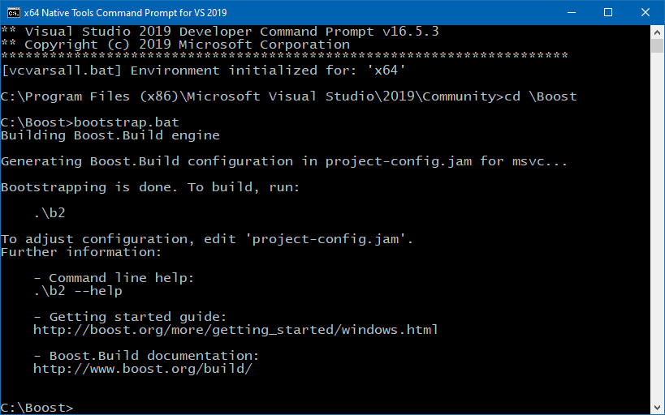
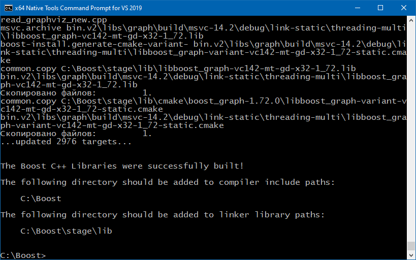

### Супербиблиотека Boost

Именно так — супербиблиотека, т. е. библиотека библиотек. Простое перечисление библиотек, входящих в Boost довольно длинное, а если к каждой библиотеке добавить пару абзацев краткой характеристики, то получится небольшая брошюра.

Как воспользоваться этим чудом в своекорыстных целях? Оказывается, довольно просто: надо пойти на сайт boost.org, скачать оттуда архив с исходными текстами и распаковать его, например, в папку `C:\Boost`. Этого достаточно, чтобы начать пользоваться большинством библиотек, т. к. они header-only, т. е. достаточно сослаться на них с помощью `#include <...>`. Вот как это выглядит с точки зрения CLion (действие происходит в Windows, используется Visual Studio 2019 Community Edition):

`CMakeLists.txt`:

```cmake
cmake_minimum_required(VERSION 2.8)
add_compile_options(/std=c++14)
 
project(learnBoost)
 
add_executable(learnBoost main.cpp)
include_directories(C:/Boost)
```

В момент загрузки `CMakeLists.txt` CLion задумывается довольно надолго, т. к. индексация несметных сокровищ Boost — дело небыстрое.

Можно приступать к написанию первой программы, использующей, например `boost::lambda`:

`main.cpp`:

```c++
#include <iostream>
#include <boost/lambda/lambda.hpp>
#include <iterator>
#include <algorithm>
 
using namespace boost::lambda;
 
int main() 
{
    typedef std::istream_iterator <int> in;
 
    std::for_each
        (
            in (std::cin),
            in (),
            std::cout << (_1 * 3) << "\n"
        );
    return 0;
}
```

Компилируем и запускаем:

```
> learnBoost.exe
123
369
456
1368
^Z
```

Можем поздравить себя: мы успешно применили Boost в своем проекте. :)

Некоторые библиотеки придётся скомпилировать перед применением:

* **Boost.Chrono**;
* **Boost.Context**;
* **Boost.Filesystem**;
* **Boost.GraphParallel**;
* **Boost.IOStreams**;
* **Boost.Locale**;
* **Boost.Log** (see build documentation);
* **Boost.MPI**;
* **Boost.ProgramOptions**;
* **Boost.Python** (see the Boost.Python build documentation before building and installing it);
* **Boost.Regex**;
* **Boost.Serialization**;
* **Boost.Thread**;
* **Boost.Timer**;
* **Boost.Wave**.

Некоторые библиотеки можно использовать как header-only лишь частично, для полного функционала их придется скомпилировать:

* **Boost.DateTime** has a binary component that is only needed if you’re using its to_string/from_string or serialization features, or if you’re targeting Visual C++ 6.x or Borland;
* **Boost.Graph** also has a binary component that is only needed if you intend to parse GraphViz files;
* **Boost.Math** has binary components for the TR1 and C99 cmath functions;
* **Boost.Random** has a binary component which is only needed if you’re using random_device;
* **Boost.Test** can be used in “header-only” or “separately compiled” mode, although separate compilation is recommended for serious use;
* **Boost.Exception** provides non-intrusive implementation of exception_ptr for 32-bit _MSC_VER==1310 and _MSC_VER==1400 which requires a separately-compiled binary. This is enabled by `#define BOOST_ENABLE_NON_INTRUSIVE_EXCEPTION_PTR`;

Как же скомпилировать эту супербиблиотеку? Оказывается, все уже придумано за нас! В папке `C:\Boost` лежит волшебный файл `bootstrap.bat`, который нужно запустить в соответствующем окружении, созданном, например, с помощью скрипта `vcvarsall.bat`, входящего в поставку Visual Studio:



У Boost своя интеллектуальная система сборки `Boost.Build`, которую мы только что скомпилировали. Все, что от нас требуется – запустить ее, и она сама соберет все оставшееся. Правда, здорово?

По умолчанию `Boost.Build` собирает статическую многопоточную версию Boost. Если нас это не устраивает, ее довольно легко сконфигурировать:

```
General command line usage:
 
    b2 [options] [properties] [targets]
 
  Options, properties and targets can be specified in any order.
 
Properties:
 
  toolset=toolset         Indicate the toolset to build with.
  variant=debug|release   Select the build variant
  link=static|shared      Whether to build static or shared libraries
  threading=single|multi  Whether to build single or multithreaded binaries
  runtime-link=static|shared
                          Whether to link to static or shared C and C++
                          runtime.
```

Система настолько продуманная, что по окончании компиляции она подсказывает нам, какие директории необходимо добавить к проекту:



Собранные библиотеки, как статические, так и динамические, собираются в директории `C:\Boost\stage\lib`. Обратите внимание, что там одновременно могут находиться как релизные, так и отладочные сборки, как x86, так и x64, как однопоточные, так и многопоточные, как для VS 2019, так и для MinGW — они друг другу не мешают, т. к. у них разные имена:

```
libboost_atomic-vc142-mt-gd-x32-1_72.lib
libboost_atomic-vc142-mt-gd-x64-1_72.lib
libboost_atomic-vc142-mt-x32-1_72.lib
libboost_atomic-vc142-mt-x64-1_72.lib
libboost_chrono-vc142-mt-gd-x32-1_72.lib
libboost_chrono-vc142-mt-gd-x64-1_72.lib
libboost_chrono-vc142-mt-x32-1_72.lib
libboost_chrono-vc142-mt-x64-1_72.lib
...
```

Расшифровываем имена:

```
libboost _ библиотека - тулчейн - mt - gd - разрядность - версия Boost .lib
```

Здесь:

* **mt** – многопоточная версия;
* **s** – статическая линковка с рантаймом C/C++;
* **g** – отладочная версия рантайма C/C++;
* **d** – отладочная версия Boost

Впрочем, запоминать это нам не обязательно, т. к. в Boost есть специальный заголовочный файл `boost/config/auto_link.hpp`, который магически добавляет ссылку на нужную библиотеку, а он в свою очередь автоматически вызывается из используемых нами заголовочных файлов. Очень удобно!

Добавляем в CMakeLists.txt строчку

```c++
link_directories(C:/Boost/stage/lib)
```

Имею Boost, готов к приключениям! :)
