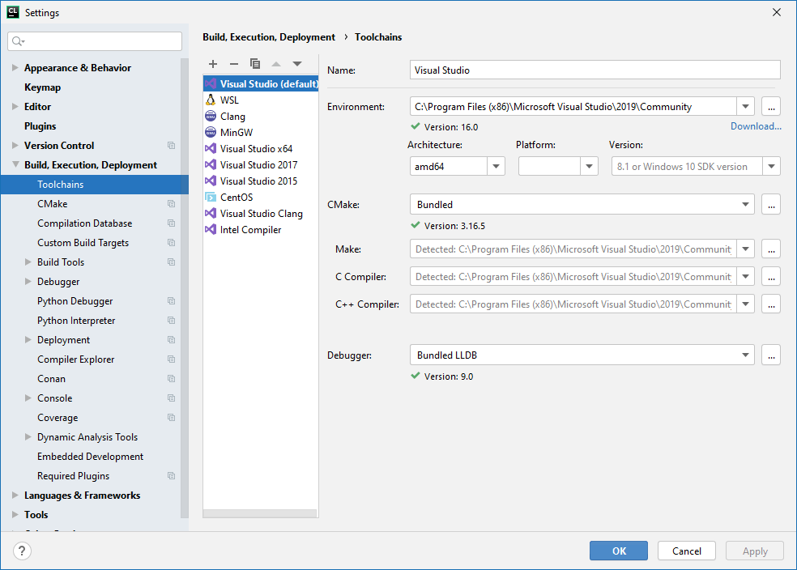

### 64-битная разработка на ассемблере в CLion

`hello.asm`

```asm
; Sample x64 Assembly Program
 
extrn ExitProcess: PROC   ; external functions in system libraries
extrn MessageBoxA: PROC
 
.data
 
caption db '64-bit hello!', 0
message db 'Hello World!', 0
 
.code
 
startup PROC
  sub    rsp,28h      ; shadow space, aligns stack
  mov    rcx, 0       ; hWnd = HWND_DESKTOP
  lea    rdx, message ; LPCSTR lpText
  lea    r8,  caption ; LPCSTR lpCaption
  mov    r9d, 0       ; uType = MB_OK
  call   MessageBoxA  ; call MessageBox API function
  mov    ecx, eax     ; uExitCode = MessageBox(...)
  call   ExitProcess
startup ENDP
 
END
```

`CMakeLists.txt`:

```cmake
cmake_minimum_required(VERSION 3.16)
# set(CMAKE_VERBOSE_MAKEFILE ON)
 
project(hello LANGUAGES ASM_MASM)
add_executable(hello hello.asm)
 
set(CMAKE_LINKER link)
set(CMAKE_ASM_MASM_COMPILER ml64)
set(ENTRY_POINT startup) # точка входа
set(SUBSYSTEM windows)   # оконное приложение
set(LIBRARIES "kernel32.lib user32.lib") # библиотеки
 
# собираем EXE-файл
set(CMAKE_ASM_MASM_LINK_EXECUTABLE "${CMAKE_LINKER}  \
  ${CMAKE_START_TEMP_FILE} <OBJECTS> ${LIBRARIES}    \
  /out:${CMAKE_CURRENT_BINARY_DIR}/<TARGET>          \
  /entry:${ENTRY_POINT} /subsystem:${SUBSYSTEM}      \
  ${CMAKE_END_TEMP_FILE}")
```


Очень важно, чтобы предполагаемая разрядность приложения совпадала с архитектурой в настройках процессора (в данном случае amd64):



Иначе CMake позовёт вместо ml64.exe его 32-разрядного брата ml.exe, который изругает в ASM-файлах почти всё, начиная с отсутствия директивы `.model flat`, которая в 64-битном режиме не нужна. Впрочем, это может не помочь, почему-то CMake не всегда подхватывает 64-битный режим. Поэтому я для подстраховки добавил строчку `set(CMAKE_ASM_MASM_COMPILER ml64)`.
