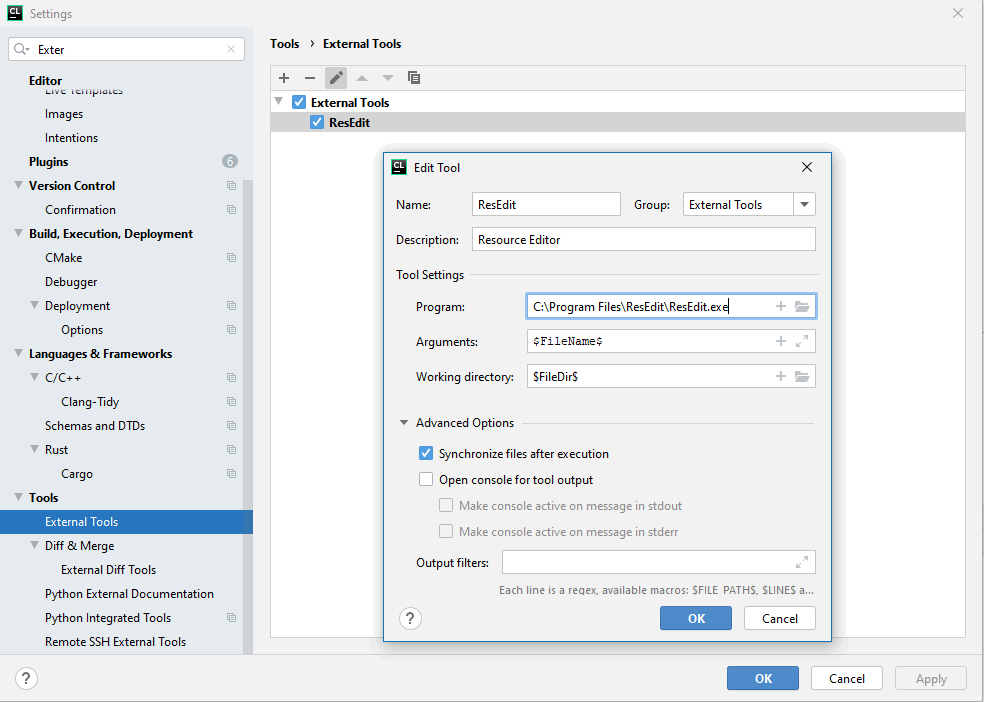
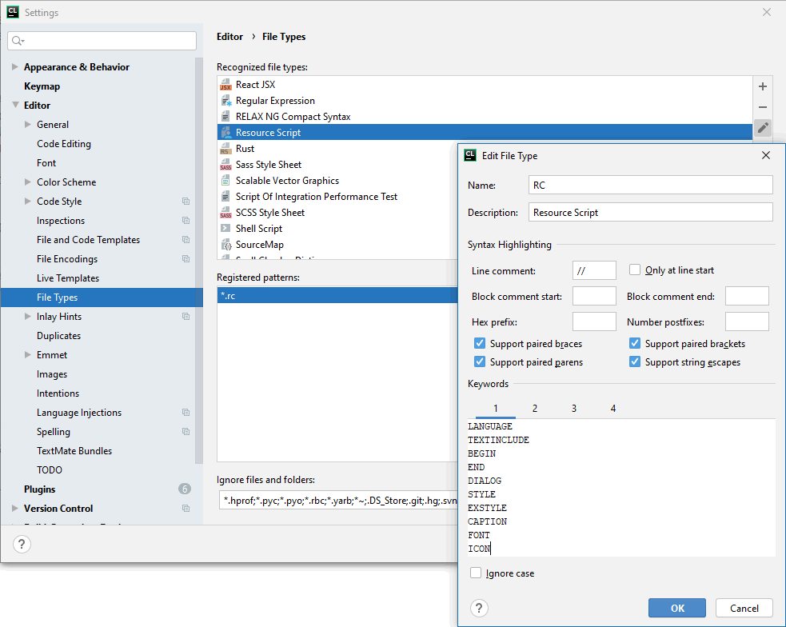
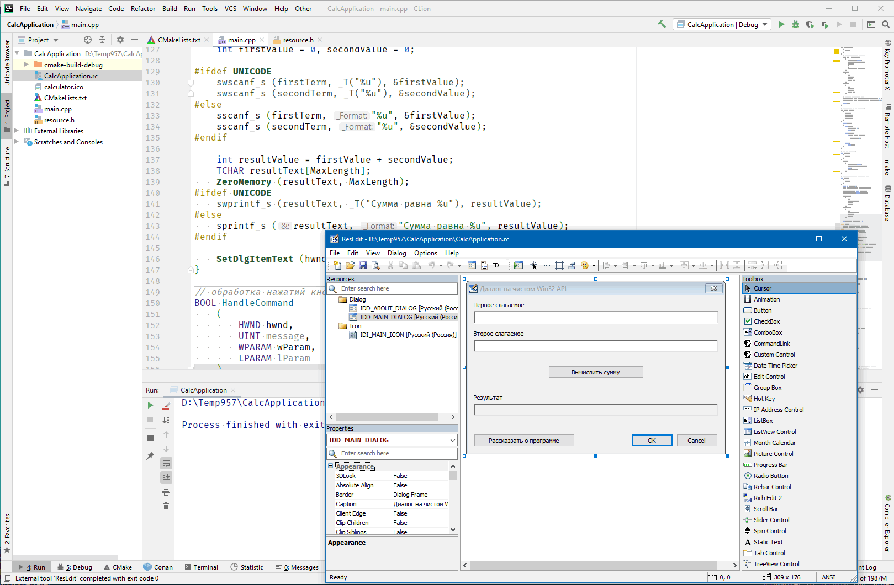
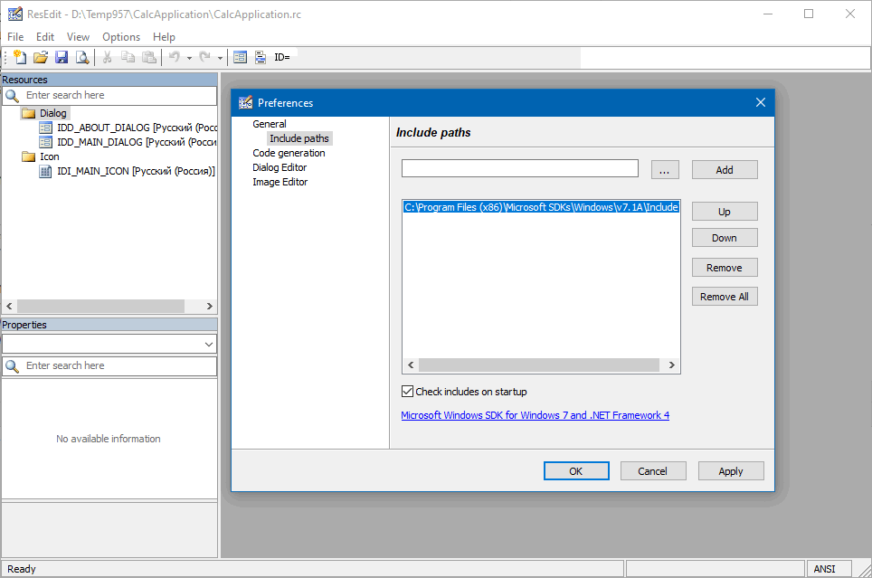

### Диалоговые приложения в CLion

Как известно, в CLion нет редактора ресурсов или какого-нибудь аналогичного инструмента для построения пользовательского интерфейса. И JetBrains не собирается его делать. Более того, среди плагинов я не нашёл ничего подобного. Видимо, считается, что CLion не предназначена для разработки десктопных приложений.

Ничего, научим и заставим! 🙂

Во-первых, идём на сайт http://www.resedit.net и скачиваем бесплатный редактор ResEdit. Он не требует установки, достаточно распаковать его в какую-нибудь папку. Возможности редактора не ошеломляющие, но вполне достаточные для наших целей:

* Понимает RC-файлы, созданные редактором ресурсов Visual Studio.
* Поддерживает форматы RC, RES и бинарные (EXE, DLL). Последнее нам пока не нужно, но всё равно приятно.
* Может конвертировать один формат в другой в командной строке.
* Работает примерно так же, как встроенный редактор ресурсов Visual Studio (т. е. позволяет, например, размещать контролы на диалогах и задавать их свойства), но не умеет «Add variable…» или «Add handler…».
* Есть простой редактор для иконок, битмапов и курсоров.
* Позволяет включать любые типы ресурсов.
* Умеет генерировать C++-код с `CreateWindowEx`, `CreateMenu`, `CreatePopupMenu` и т. д.
* Неограниченные буферы Undo/Redo.
* Настраиваемый внешний вид: панели можно таскать мышкой и располагать, как угодно, ResEdit запоминает их расположение.

ResEdit мы будем использовать для визуального редактирования RC-файлов. Для этого подключаем его как внешний редактор в «External Tools»



Во-вторых, учим CLion базовой подсветке синтаксиса RC-файлов в «File Types»



И в-третьих, немного дорабатываем `CMakeLists.txt`

```cmake
cmake_minimum_required(VERSION 2.8)
project(CalcApplication)
set(CMAKE_CXX_STANDARD 11)
 
add_executable(CalcApplication WIN32
        CalcApplication.cpp CalcApplication.rc resource.h)
```

Берём `CalcApplication.cpp`, `CalcApplication.rc` и `resource.h` и копируем их в проект CLion. Выделяем в дереве проекта `CalcApplication.rc`, щёлкаем правой кнопкой мыши и запускаем ResEdit



Вуаля! Теперь мы можем делать диалоговые приложения в CLion. Ура! 🙂

* * *
В ResEdit необходимо задать путь к Windows SDK (можно довольно старому, например, 7-й версии), чтобы он мог корректно отрабатывать строки

```c++
#define APSTUDIO_READONLY_SYMBOLS
/////////////////////////////////////////////////////////////////////////////
//
// Generated from the TEXTINCLUDE 2 resource.
//
#include "winres.h"
 
/////////////////////////////////////////////////////////////////////////////
#undef APSTUDIO_READONLY_SYMBOLS
```



Ключевые слова для «File Types»:

```
BEGIN CAPTION DIALOG DIALOGEX END EXSTYLE FONT ICON LANGUAGE 
STYLE TEXTINCLUDE

DEFPUSHBUTTON DS_CENTER DS_FIXEDSYS DS_MODALFRAME DS_SETFONT 
EDITTEXT LTEXT PUSHBUTTON WS_CAPTION WS_POPUP WS_SYSMENU
```
