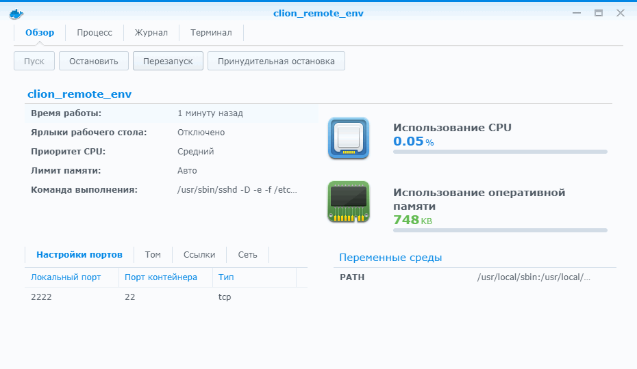

### Docker с CLion

Допустим, у нас есть Docker и CLion. Как нам объединить два этих чуда инженерной мысли? Смотрим видео [CLion Toolchains in Docker](http://clion%20toolchains%20in%20docker/) и учимся.

JetBrains любезно сочинила докер-образ, который мы можем применять для удалённой разработки. Вот он: https://github.com/JetBrains/clion-remote/blob/master/Dockerfile.remote-cpp-env.

Ниже часть вывода пропущена для краткости.


```
$ docker --version
Docker version 18.09.8, build 2c0a67b
$ git --version
git version 2.24.1
$ git clone --depth=1 https://github.com/JetBrains/clion-remote.git
Cloning into 'clion-remote'...
$ cd clion-remote/
$ sudo docker build -t clion/remote-cpp-env:0.5 -f Dockerfile.remote-cpp-env .
Sending build context to Docker daemon  61.44kB
Step 1/5 : FROM ubuntu:18.04
18.04: Pulling from library/ubuntu
...
Successfully built 71ed37e7264c
Successfully tagged clion/remote-cpp-env:0.5
$ sudo docker run -d --cap-add sys_ptrace -p127.0.0.1:2222:22 --name clion_remote_env clion/remote-cpp-env:0.5
fb8c7130f8ed503503e9e3b6b10fa8ba0cd6200d335b4984fee8a21bb3ede43b
```

На всякий случай заглядываем в Докер, видим, что наш образ успешно запущен:


При необходимости мы можем увидеть, что творится внутри образа (обратите внимание на вкладку «Журнал»):



Создаём тулчейн


и CMake-профиль


CLion жалуется на устаревшую CMake в контейнере


У нас два выхода: обновить CMake в контейнере либо просто понизить требования в `CMakeLists.txt`. Мы не используем фичи последних версий CMake, так что пойдём более простым путём:


Напишем следующую очень познавательную программу:

```c++
#include <iostream>
#include <unistd.h>
#include <cstring>
 
int main ()
{
    char hostname[255];
    memset (hostname, 0, sizeof(hostname));
    gethostname (hostname, sizeof(hostname));
    std::cout << "Hello from " << hostname << std::endl;
    return 0;
}
```

и запустим её в контейнере:


Мы только что выполнили свою первую программу внутри контейнера! А помогла нам в этом IDE CLion.
