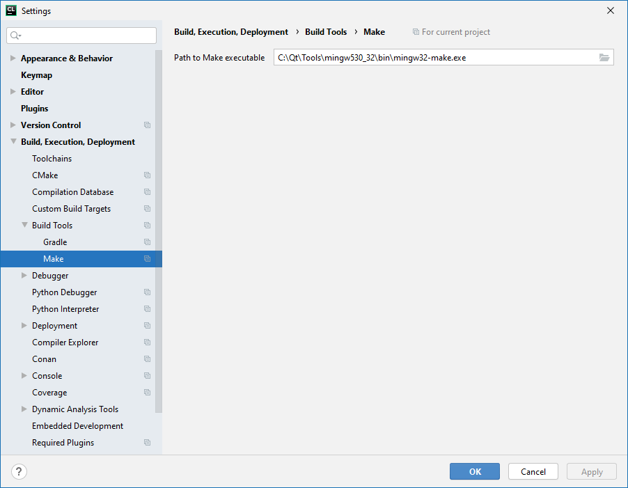
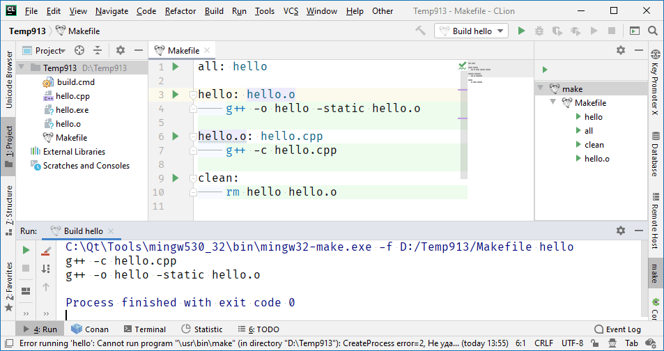
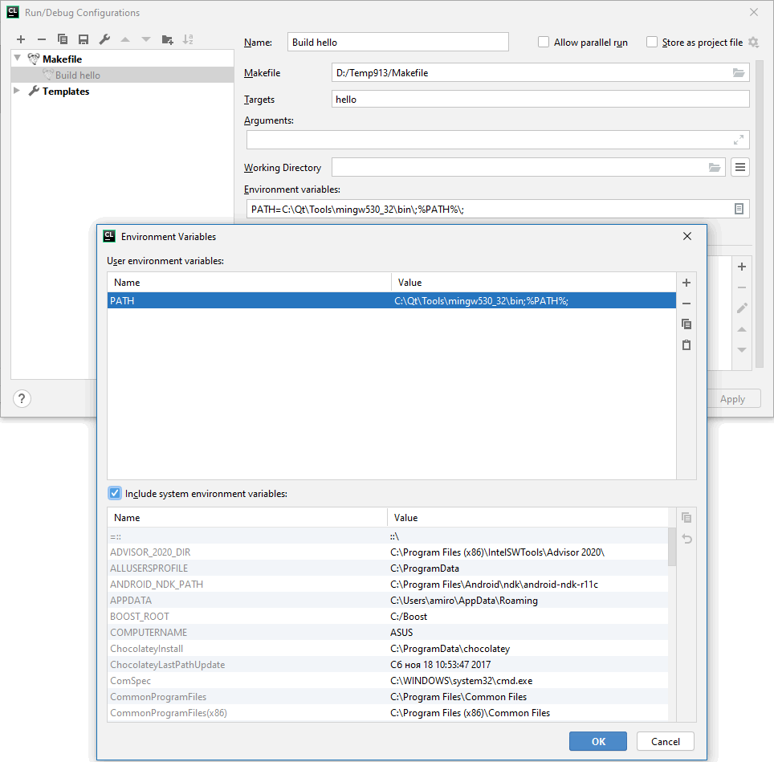
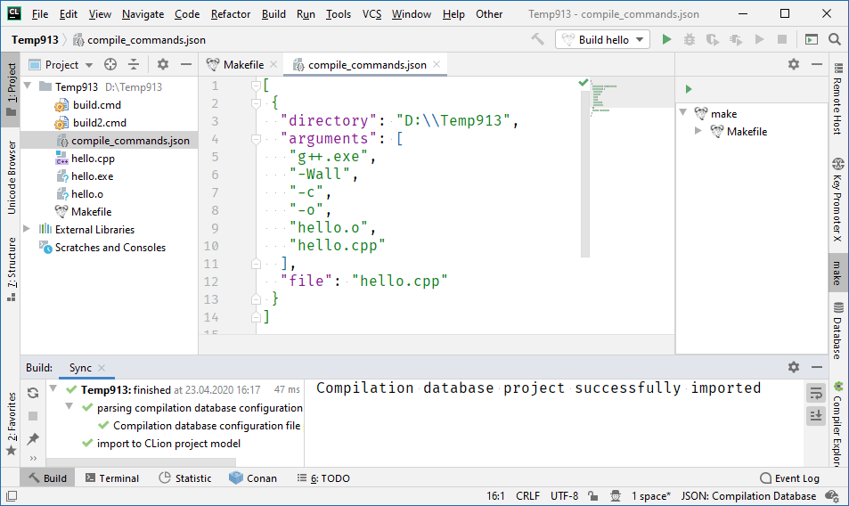
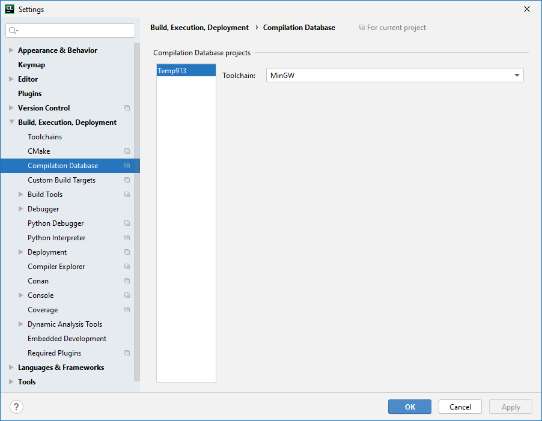
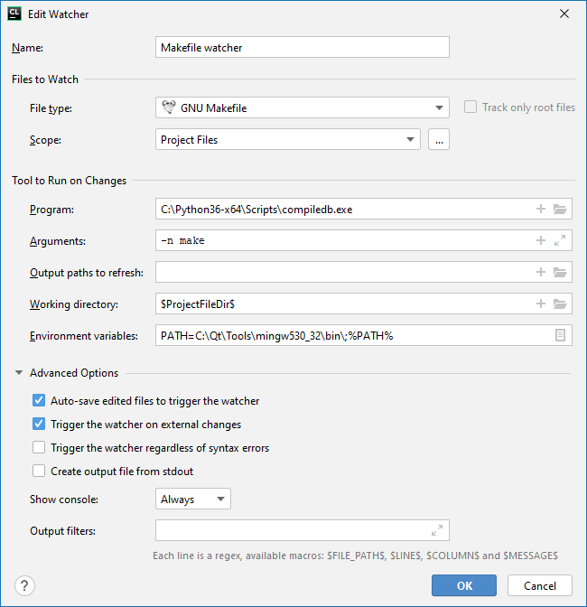

### Плагин Makefile support

Есть замечательный плагин "[Makefile support](https://plugins.jetbrains.com/plugin/9333-makefile-support)", добавляющий поддержку GNU Make во все IntelliJ IDEA-based IDE, в том числе CLion.

Официальная страница: https://victor.kropp.name/projects/makefile/ GitHub: https://github.com/kropp/intellij-makefile.

Плагин ориентируется на поддержку GNU Make, так что использовать фишки NMake не получится. Впрочем, использовать NMake вместо GNU Make можно, если не применять GNU-специфичные фичи. Главное - отыскать, куда Microsoft запрятала NMake :) У меня на компьютере сюда: "`C:\Program Files (x86)\Microsoft Visual Studio\2019\Community\VC\Tools\MSVC\14.25.28610\bin\Hostx64\x64\nmake.exe`"

Вот как это работает. Во-первых, надо сообщить среде, где лежит программа Make, которую мы собираемся использовать:



Я решил воспользоваться MinGW32-make в надежде, что она совместима с оригинальной GNU Make.

Во-вторых, работать придётся не через «New Project», а через «Open or Import». Создаём папку, в неё помещаем Makefile, например, следующего содержания:

```makefile
all: hello
 
hello: hello.o
    g++ -o hello -static hello.o
 
hello.o: hello.cpp
    g++ -c hello.cpp
 
clean:
    rm hello hello.o
```

Плагин сам всё определит и услужливо подсветит таргеты зелёным треугольником. Нам остаётся только нажимать на них, запуская компиляцию:



Можно настроить различные параметры сборки, в том числе переменные окружения:




### База данных компиляции

Допустим, мы раздобыли где-то на просторах Сети крайне полезную программу, умеющую приветствовать весь мир. Автор выложил её в виде исходника `hello.cpp`

```c++
#include <iostream>
 
int main ()
{
    std::cout << "Hello, world!" << std::endl;
    return 0;
}
```

Для её сборки прилагается файл `Makefile` следующего содержания

```c++
all: hello
 
CC=g++
CFLAGS=-Wall
 
.SUFFIXES: .cpp .o
 
hello: hello.o
    g++ -o hello -static hello.o
 
.cpp.o:
    $(CC) $(CFLAGS) -c -o $@ $<
 
clean:
    rm hello hello.o
```

Как же нам собирать и дорабатывать это сокровище с помощью CLion?

Вот как нам рекомендует действовать в этом случае [официальная документация](https://www.jetbrains.com/help/clion/managing-makefile-projects.html) от JetBrains:

Во-первых, устанавливаем питоновский модуль compiledb (подойдёт как Python 2.7, так и Python 3.6+):

```
> pip install compiledb
```

Запускаем в папке с нашим `Makefile`

```
> compiledb -n make
```

Если make не находит ошибок, утилита успешно генерирует файл `compile_commands.json` следующего содержания:

```json
[
 {
  "directory": "D:\\Temp913",
  "arguments": [
   "g++",
   "-Wall",
   "-c",
   "-o",
   "hello.o",
   "hello.cpp"
  ],
  "file": "hello.cpp"
 }
]
```

Открываем `compile_commands.json` в CLion **как проект** (не как обычный файл, это важно!), среда импортирует данные в свою проектную модель



Может понадобиться задать тулчейн, чтобы CLion нашёл g++ и другие упомянутые в `Makefile` программы:



Крайне рекомендуется установить плагин [File Watchers](https://plugins.jetbrains.com/plugin/7177-file-watchers), а в нём настроить отслеживание изменений в `Makefile`:



Это позволит редактировать `Makefile`, а CLion будет автоматически подхватывать изменения в проектной модели. Удобно! (ну, почти) 🙂

Обратите внимание: официальная поддержка Makefile никак не противоречит описанному ранее плагину Makefile Support. Я бы даже сказал, они взаимно дополняют друг друга.

