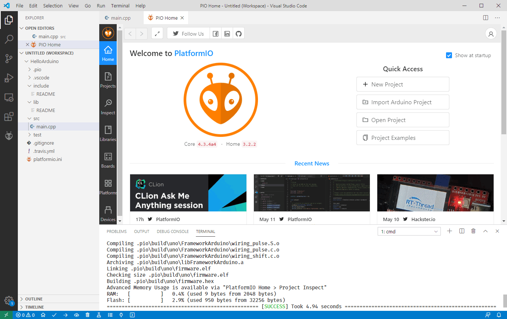
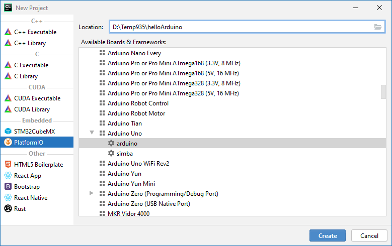
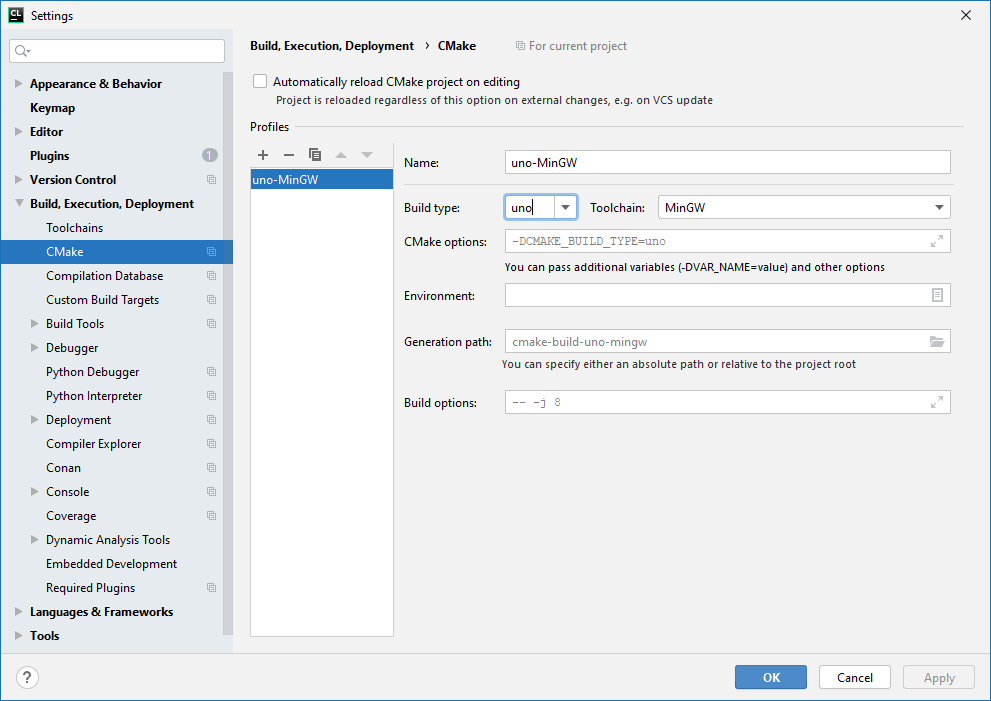
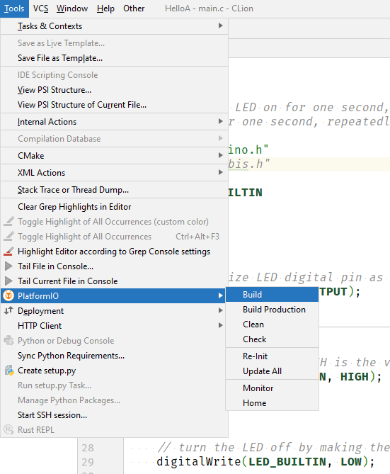
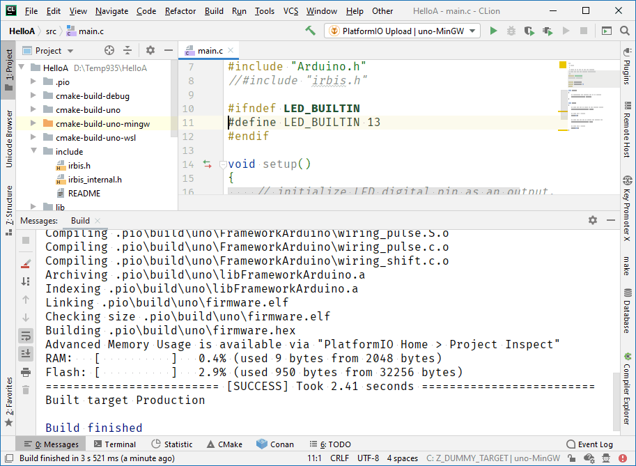

### PlatformIO с CLion

Размышляя над тем, нельзя ли впихнуть PlusIrbis если не в Ардуинку, то хотя бы в ESP8266, нельзя пройти мимо PlatformIO. [PlatformIO](https://platformio.org/) — суперагрегатор различных платформ и библиотек для микроконтроллеров, IoT и прочего такого. Работает на всех основных платформах: Windows, Linux, OS X. Сотни библиотек и фреймворков заботливо собраны в один реестр (с поиском и подробными описаниями), и специально обученный пакетный менеджер магически скачивает, подключает к нашему проекту и правильно компилирует их (что далеко не всегда тривиально!), затем хитроумные скрипты опять-таки магически заливают полученные программы на железо, разве не чудо?! 🙂

Если Господь посылает тебе чудо, грех не остановиться и не вглядеться в него повнимательнее.

Проще всего, наверное, установить PlatformIO вместе с одноименным плагином для VSCode. В VS находим плагин «PlatformIO» и тычем мышкой в «Install». Всё! От нас больше ничего не требуется! Плагин сам скачивает и устанавливает всё необходимое, от нас только требуется сидеть ровно и не дёргаться (реально – при установке плагин просит не закрывать окна, появляющиеся по мере установки 🙂 ). И сразу «из коробки» всё это дело работает! Компилируется и заливается в Ардуинку, причём порт определяется автоматически. Поневоле задумаешься, не перейти ли на VSCode. 🙂



Вообще, PlatformIO довольно прост в освоении для тех, кто уже сталкивался с Node.js, VueCLI, утилитой dotnet и прочими CLI-инструментами. Все подобные инструменты предоставляют примерно одинаковый набор действий: 1) создать пустой проект, 2) настроить проект (например, подключить к нему библиотеку), 3) скомпилировать проект, 4) запустить проект или залить его в железку. PlatformIO тут не является исключением. Надо выучить выучить буквально несколько простых заклинаний:

**pio init --ide clion|visualstudio|vscode --board uno** – создать проект для указанных IDE и железки. Если IDE не указывать, то будет проект для Notepad (условно говоря).

**pio lib** — подключение к проекту библиотек и вообще возня с пакетным менеджером (например, зарегистрировать свою библиотеку).

**pio run** — несмотря на название, всего лишь сборка проекта.

**pio run --target upload** — заливка в железо.

Вот так, при помощи нехитрых заклинаний в консоли можно заставить мигать светодиод на Ардуинке. 🙂

В VSCode можно вводить эти команды во встроенный терминал, но для «мышководов» предусмотрены иконки, которые фактически делают то же самое. Поэтому типичный сеанс в VSCode выглядит так: написал N строк кода => нажал «Run» => высветились ошибки => исправил => нажал «Run» => ошибок нет => нажал «Upload» => залилось => мигает не так, как задумано => возвращаемся к началу. Жизнь! 🙂

С CLion дело обстоит не так радужно, как с VSCode. Да, есть официальный плагин, который добавляет соответствующий пункт в перечень доступных проектов:



но под Windows он не работает «из коробки»! Кстати, под OS X или Linux он же заводится «с полпинка», т. е. с минимальным шаманством (про шаманство расскажу ниже). Но под Windows наш лев зачем-то пристаёт к Visual C++ с дурацкими вопросами, предназначенными для avr-gcc, обижается на отказ и не хочет собирать проект. Обидно!

Но, как выяснилось, беде можно помочь (если знать, как). Во-первых, счастье тем, у кого на машине есть MinGW (у меня есть), его можно подсунуть льву на допрос вместо Visual C++ (не пугайтесь, собирать проект будет всё-таки avr-gcc, от MinGW требуется лишь своим присутствием успокаивать CMake и CLion).



Во-вторых, PlatformIO плевать хотел с высокой колокольни на CMake, столь любимую JetBrains. У него собственная система сборки (основанная на питоновских скриптах), поэтому крайне рекомендуется выучить пункт меню «**Tools->PlatformIO**»



и широко применять в своей практике пункты «**Re-Init**», «**Build**» и «**Monitor**». Они вырабатывают вышеупомянутую шаманскую магию, которая обманывает CLion с CMake, отчего наши программы начинают успешно компилироваться и заливаться в Ардуинку.

И тут выясняется, что в avr-gcc стандартная библиотека настолько урезанная, что проще считать, её просто нет. Ладно бы файловая система (фиг с ней, нету файловой системы в Arduino), но нет и всего STL с его контейнерами и алгоритмами. Т. е. хочешь написать

```c++
#include <string>
```

а оно не понимает. Беда-беда, огорчение! Короче, каменный цветок в форме PlusIrbis на avr-gcc откладывается на неопределённый срок. 🙁

Зато хоть «мигалку» Blink успешно откомпилировал в CLion. 🙂


