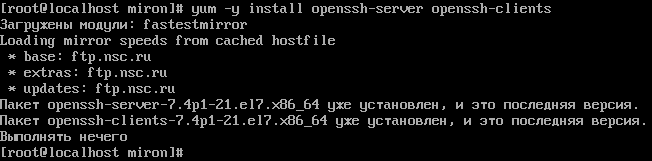
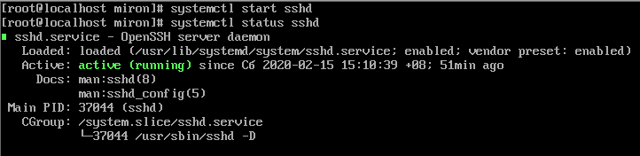
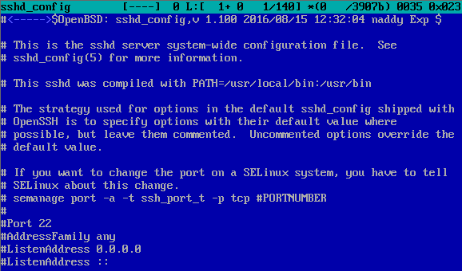
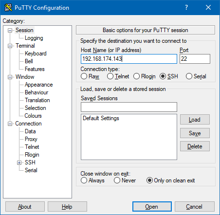
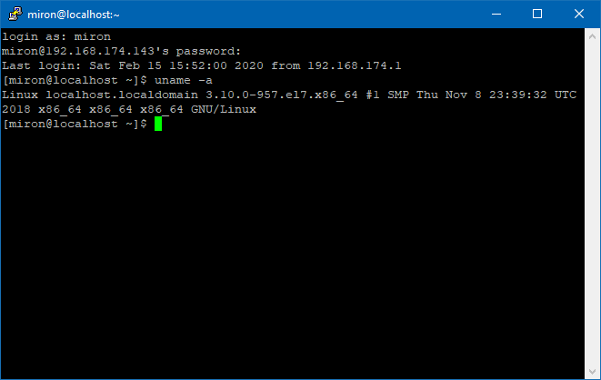
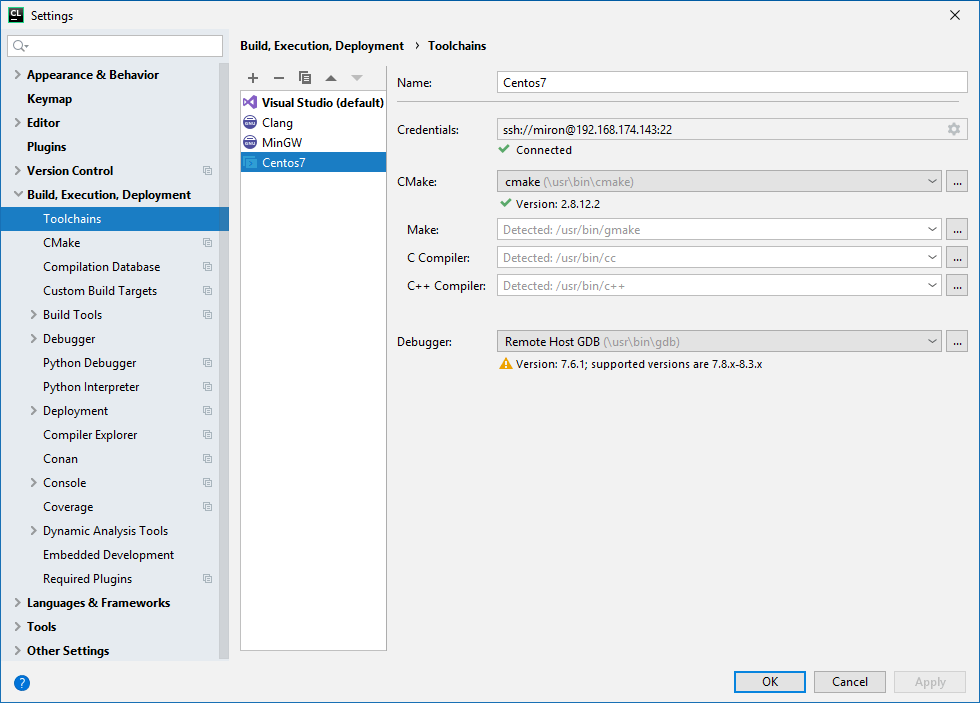
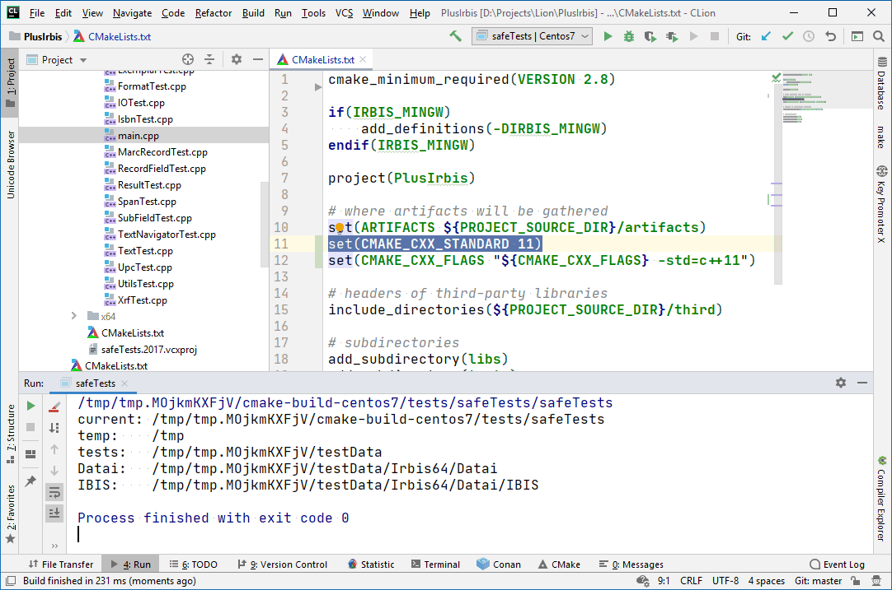
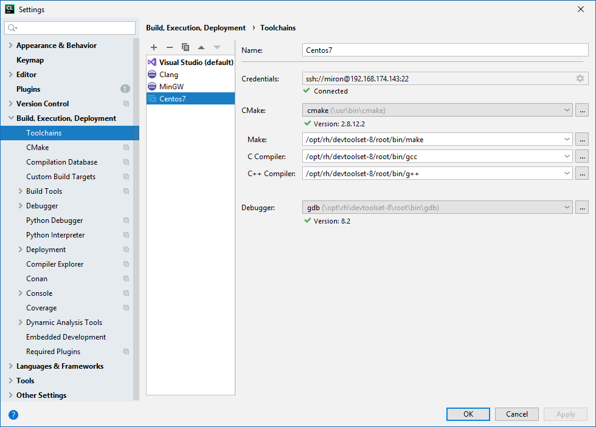
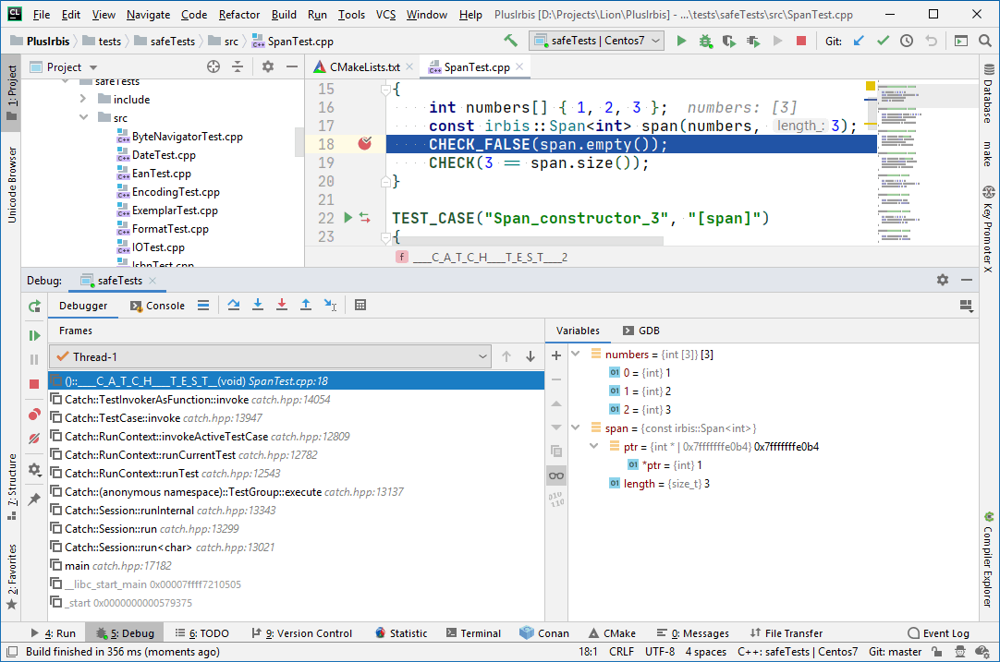

### Удалённая разработка через SSH

Допустим, мы сидим где-нибудь в привычной среде Windows или OS X, но хотим разрабатывать программы для Linux с максимальным комфортом. CLion позволяет нам провернуть такой фокус.

Для начала нам потребуется SSH на Linux (и соответственно администраторские права, чтобы настроить всё это дело). В CentOS 7 он есть по умолчанию, но лучше убедиться:



Запускаем сервер SSH и убеждаемся, что он работает:



Можно настроить автоматический запуск SSHD вместе с операционной системой:

```
# systemctl enable sshd
```

Если Linux-машина смотрит в Интернет, то может потребоваться прописать более безопасные настройки в `/etc/ssh/sshd_config`:



После редактирования конфигурации нужно перезапустить сервис: `service sshd restart`.

Если SSHD перенастроен на нестандартный порт, надо отредактировать `/etc/sysconfig/iptables`, чтобы разрешить прослушивать этот порт и принимать на нём входящие подключения, после чего перезапустить iptables: `systemctl restart iptables`.

Узнать IP-адрес Linux-машины:

```
$ hostname -I
192.168.174.143
```

Для пробы подключаемся к Linux с помощью Putty:



Putty может предупредить, что ключ удалённой системы ему неизвестен, надо просто попросить запомнить его.



Linux-машина пускает нас. Отлично! Переходим к настройке CLion: добавляем тулчейн типа «Remote Host»



Мда, отладчик в CentOS 7 староват, надо бы обновить, в остальном всё нормально. Обратите внимание, что тулчейнов (в том числе удалённых) можно завести сколько угодно. Главное – самому в них не запутаться. 🙂



Древний g++ из поставки CentOS 7 требовал добавить строчку `set(CMAKE_CXX_FLAGS "${CMAKE_CXX_FLAGS} -std=c++11")`, я так и сделал, он сразу успокоился и скомпилировал проект. Не знаю, почему это происходит, по идее строчка `set(CMAKE_CXX_STANDARD 11)` должна бы делать это. Наверное, CMake «из коробки» слишком старая, надо обновлять.


Как видим, программа компилируется и запускается на удалённой системе, а результат отображается в CLion. Отлично!

### * * *

Доустановить более-менее современный g++ (на выбор версии 7, 8 или 9) и соответствующий gdb в CentOS 7 просто:

```
> sudo yum install centos-release-scl
> sudo yum install devtoolset-7
> sudo yum install devtoolset-8
> sudo yum install devtoolset-9
 
# Можно установить clang++-5
sudo yum install llvm-toolset-7
 
# Проверяем, что установилось
> /opt/rh/devtoolset-7/root/bin/g++ --version
g++ (GCC) 7.3.1.20180303 (Red Hat 7.3.1-5)
Copyright (C) 2017 Free Software Foundation, Inc.
 
> /opt/rh/devtoolset-8/root/bin/g++ --version
g++ (GCC) 8.3.1.20190311 (Red Hat 8.3.1-3)
 
> /opt/rh/devtoolset-9/root/bin/g++ --version
g++ (GCC) 9.1.1.20190605 (Red Hat 9.1.1-2)
 
> /opt/rh/llvm-toolset-7/root/bin/clang++ --version
clang version 5.0.1 (tags/RELEASE_501/final)
Target: x86_64_unknown-linux-gnu
Thread model: posix
InstalledDir: /opt/rh/llvm-toolset-7/root/bin
 
# Можно сделать g++7 или компилятором по умолчанию
> scl enable devtoolset-7 bash
# или
> scl enable devtoolset-8 bash
# или
> scl enable devtoolset-9 bash
```

Редактируем конфигурацию тулчейна:



Пересобираем проект. Вуаля, у нас заработала отладка!


