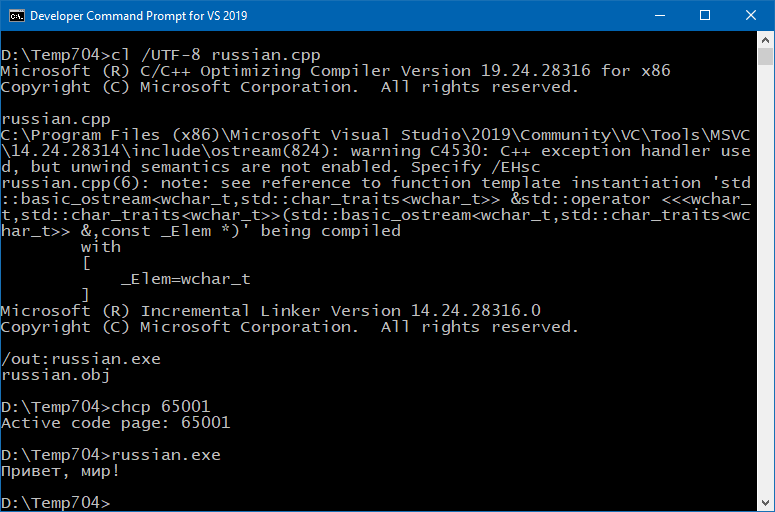
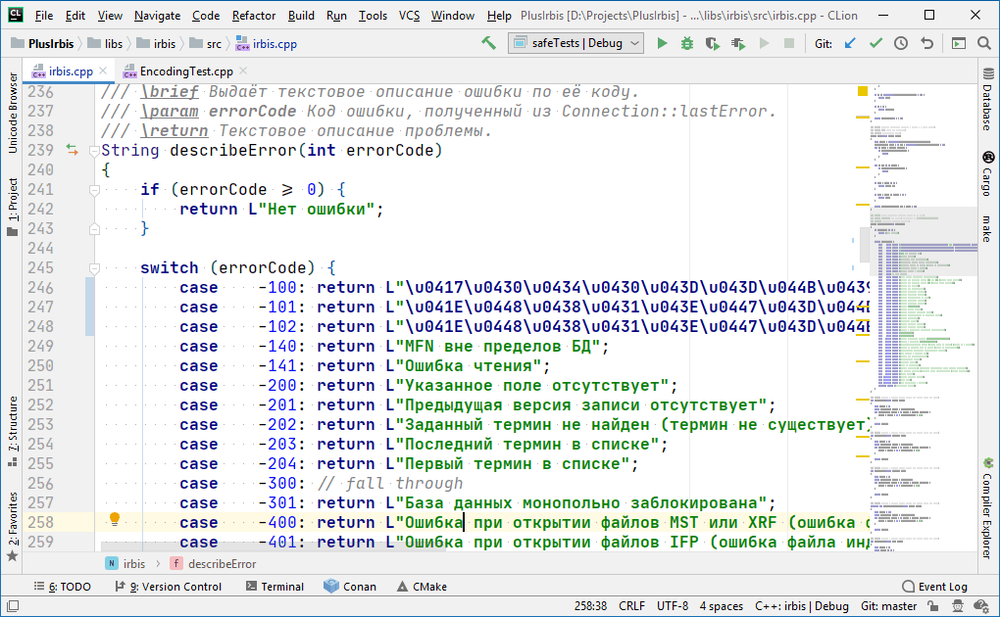

### Плагин Unicode Escaper для CLion

С Unicode в C++ какая-то беда. Да, он там есть и даже как-то поддерживается, но нужно не забывать делать специальные приседания (особенно под Windows), чтобы всё заработало как надо, а не печатало «кракозябры», как это оно любит делать. Возьмём простейшую программку `russian.cpp`:

```c++
#include <iostream>
 
int main ()
{
    std::wcout.imbue (std::locale("")); 
    std::wcout << L"Привет, мир!" << std::endl;
    return 0;
}
```

Если зевнуть и не проследить, в какой кодировке сохранился файл или не указать Visual C++, что исходники нужно считывать в кодировке UTF-8, можно словить «кракозябры». Конечно, если следить за собой и быть аккуратным, всё работает без нареканий:



Облегчить свою программистскую долю можно несколькими способами:

1. Мигрировать на Linux или OS X, там везде UTF-8, поэтому можно расслабиться; 🙂
2. Вынести все строки с сообщениями в специальные хранилища локализуемого контента. Это настолько правильно, что не будем обсуждать; 🙂
3. Записывать строковые литералы в Unicode-виде, тогда исходные тексты можно будет сохранять в любой кодировке, они от этого портиться не будут.

Последний пункт паллиативный, поэтому возьмём на вооружение его (последнее время я как-то полюбил полумеры, старею). Нам поможет плагин [Unicode Escaper](https://plugins.jetbrains.com/plugin/13268-unicode-escaper), совместимый со всеми IntelljJ-средами, в том числе и с CLion.



После его установки в контекстном меню появляется два пункта: «Convert from Characters to Unicode Escapes» и «Convert from Unicode Escapes to Characters». Можно выделить довольно большой кусок кода (хоть весь файл) и обработать его в один клик мыши. На снимке экрана выше я обработал таким образом три строки. Удобно!

