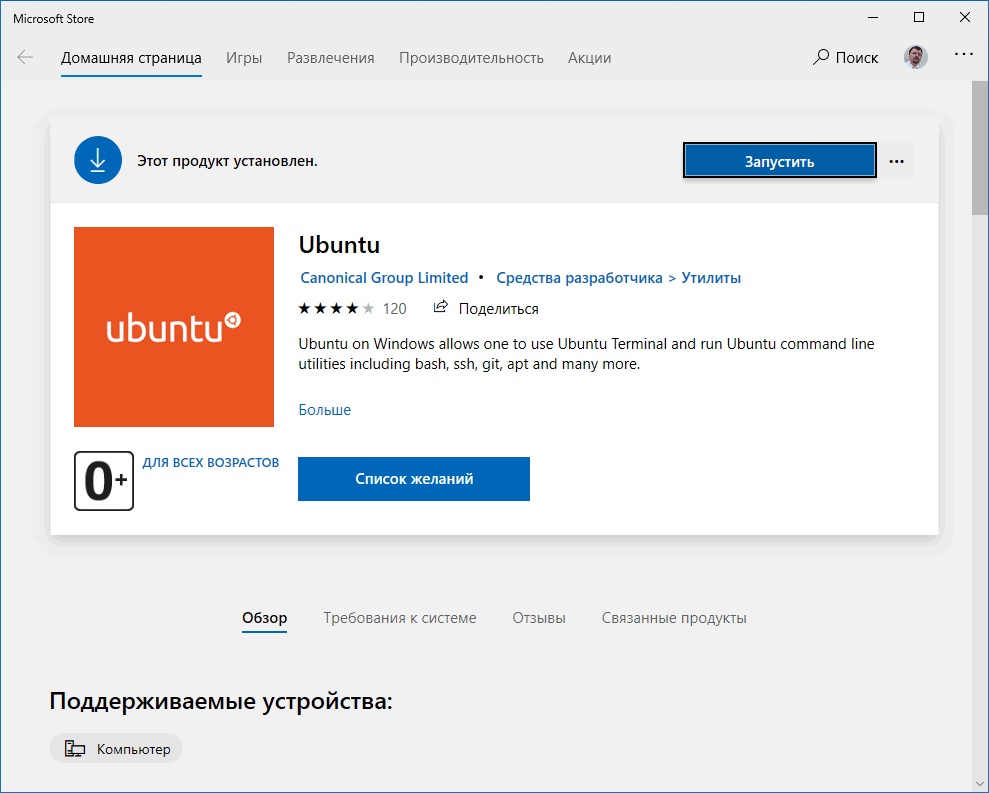
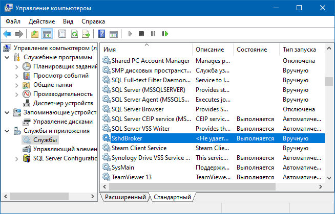
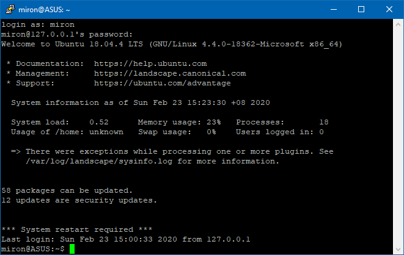
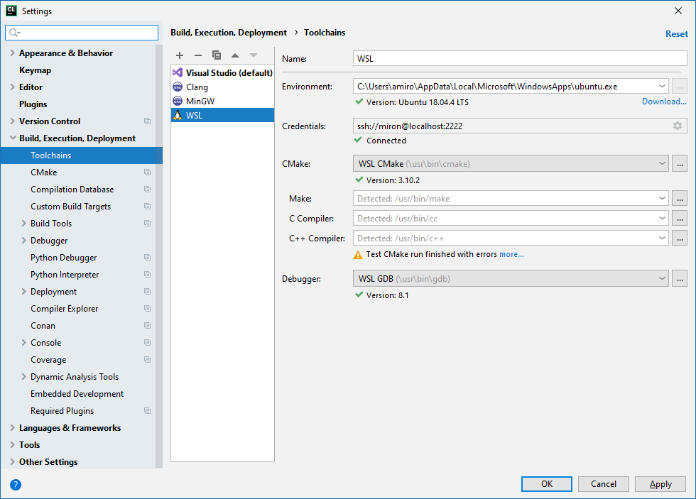
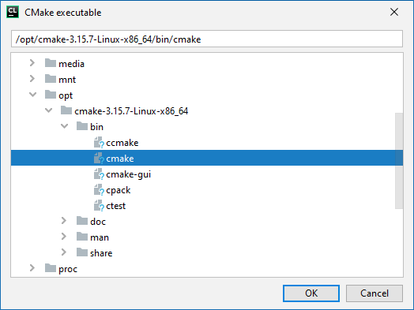
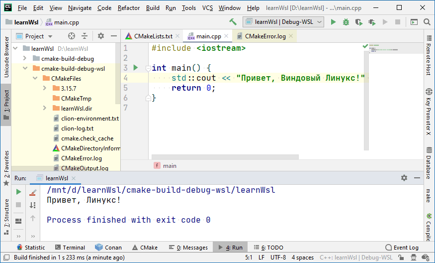

### Разработка с WSL

Первое, о чём необходимо сказать: CLion, к сожалению, не работает с WSL первой версии, так что придётся обновить Windows 10 до актуальной версии, после чего сходить в Windows Store и установить оттуда свежую Ubuntu:



Перед первым запуском Ubuntu надо разрешить соответствующий компонент в Windows, например, с помощью PowerShell:

```
$ Enable-WindowsOptionalFeature -Online -FeatureName Microsoft-Windows-Subsystem-Linux
```

В свежеустановленной Ubuntu устанавливаем инструменты разработчика:

```
$ sudo apt-get install cmake gcc clang gdb build-essential
```

CLion взаимодействует с WSL с помощью SSH, так что придётся настроить его. К счастью, за нас уже написан скрипт, который разрулит большинство проблем:

```
# wget https://raw.githubusercontent.com/JetBrains/clion-wsl/master/ubuntu_setup_env.sh && bash ubuntu_setup_env.sh
```

В итоге в настройках SSHD (файл /etc/ssh/sshd_config) появятся примерно такие строки:

```
# configured by CLion
ListenAddress 127.0.0.1
Port 2222
UsePrivilegeSeparation no
PasswordAuthentication yes
```

Может потребоваться запустить на Windows сервис SshdBroker, если он по каким-либо причинам не стартовал:



Попробуем подключиться к WSL с помощью Putty:



Linux нас пускает, отлично! Можно переходить к настройке CLion. Создаём тулчейн в CLion:



Всё замечательно, однако версия CMake старовата, надо бы обновить. Делается это чрезвычайно просто (просто надо знать, что поддерживаются версии CMake не новее 3.15):

```
# wget https://github.com/Kitware/CMake/releases/download/v3.15.7/cmake-3.15.7-Linux-x86_64.sh
# chmod +x cmake-3.15.7-Linux-x86_64.sh
# ./cmake-3.15.7-Linux-x86_64.sh --prefix=/opt
CMake Installer Version: 3.15.7, Copyright (c) Kitware
This is a self-extracting archive.
The archive will be extracted to: /opt
 
If you want to stop extracting, please press <ctrl-C&gt.
...
```



Судя по всему, поддержка WSL в CLion пока не «отшлифована», т. к. CMake «радует» сообщениями вроде

```
Cannot copy output executable
  '/mnt/d/learnWsl/cmake-build-debug-wsl/CMakeFiles/CMakeTmp/cmTC_d18a4'
to destination specified by COPY_FILE:
  '/mnt/d/learnWsl/cmake-build-debug-wsl/CMakeFiles/3.15.7/CMakeDetermineCompilerABI_CXX.bin'
```

однако, приложения вполне успешно собираются и запускаются:



Отладчик тоже работает.

Вот так незаметно наступило Программистское Счастье: сидя под Windows разрабатывать и отлаживать программы для Linux. 🙂

### * * *

В CLion 2020.1 поддержку WSL докрутили, теперь всё работает просто замечательно!
