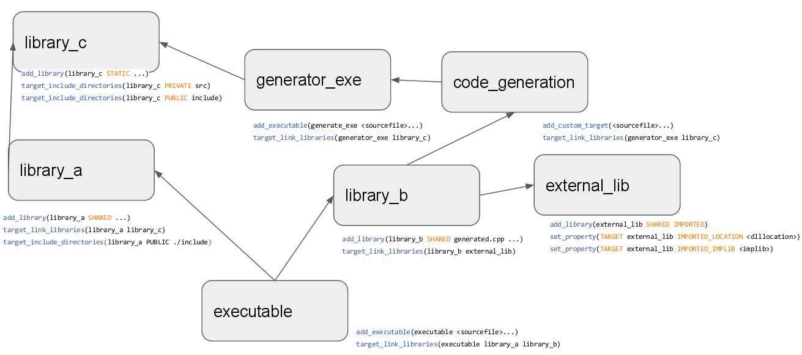
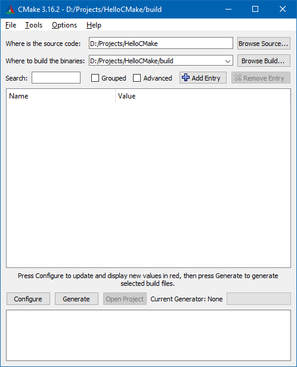
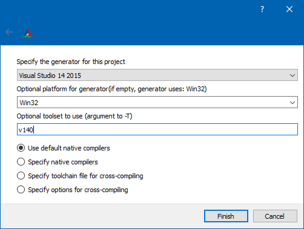

### CMake

CMake -- это кроссплатформенная система автоматизации сборки программного обеспечения из исходного кода. CMake не занимается непосредственно сборкой, а лишь генерирует файлы управления сборкой из файлов CMakeLists.txt. Она выступает в качестве front-end, вызывая непосредственно используемую систему сборки (которая выступает в качестве back-end), так что конечный потребитель может считать, что CMake -- полноценная система сборки.

Официальный сайт: [cmake.org](https://cmake.org).

#### Hello world

Создадим пустую папку `HelloCMake`, а в ней два файла: `hello.cpp`

```c++
#include <iostream>

int main ()
{
  std::cout << "Hello, world!" << std::endl;
  return 0;
}
```

и `CMakeLists.txt`

```cmake
cmake_minimum_required(VERSION 2.8)

project(hello)

add_executable(hello hello.cpp)
```

Теперь нам потребуется всего лишь две команды. Первая заставляет CMake сгенерировать проект для реальной системы сборки (на моём ноутбуке это Visual Studio 2019 Community Edition):

```
> cmake .

-- Building for: Visual Studio 16 2019
-- The C compiler identification is MSVC 19.24.28314.0
-- The CXX compiler identification is MSVC 19.24.28314.0
-- Check for working C compiler: C:/Program Files (x86)/Microsoft Visual Studio/2019/Community/VC/Tools/MSVC/14.24.28314/bin/Hostx64/x64/cl.exe
-- Check for working C compiler: C:/Program Files (x86)/Microsoft Visual Studio/2019/Community/VC/Tools/MSVC/14.24.28314/bin/Hostx64/x64/cl.exe -- works
-- Detecting C compiler ABI info
-- Detecting C compiler ABI info - done
-- Detecting C compile features
-- Detecting C compile features - done
-- Check for working CXX compiler: C:/Program Files (x86)/Microsoft Visual Studio/2019/Community/VC/Tools/MSVC/14.24.28314/bin/Hostx64/x64/cl.exe
-- Check for working CXX compiler: C:/Program Files (x86)/Microsoft Visual Studio/2019/Community/VC/Tools/MSVC/14.24.28314/bin/Hostx64/x64/cl.exe -- works
-- Detecting CXX compiler ABI info
-- Detecting CXX compiler ABI info - done
-- Detecting CXX compile features
-- Detecting CXX compile features - done
-- Configuring done
-- Generating done
-- Build files have been written to: D:/Projects/HelloCMake
```

CMake создала подпапку `CMakeFiles` и горсть текстовых файлов в нашей папке: `hello.sln`, `hello.vcxproj` и др. Наша папка загаживается временными по сути файлами (ведь в любой момент CMake может создать их снова). Поэтому рекомендуется запускать CMake в какой-нибудь временной подпапке, например `build`:

```
> mkdir build
> cd build
> cmake ..

-- Building for: Visual Studio 16 2019
...
-- Build files have been written to: D:/Projects/HelloCMake/build
```

Теперь, когда файл проекта сгенерирован, можно выполнить сборку (всё ещё находясь в подпапке `build`):

```
> cmake --build .

Microsoft (R) Build Engine версии 16.4.0+e901037fe для .NET Framework
(C) Корпорация Майкрософт (Microsoft Corporation). Все права защищены.

  Checking Build System
  Building Custom Rule D:/Projects/HelloCMake/CMakeLists.txt
  hello.cpp
  hello.vcxproj -> D:\Projects\HelloCMake\build\Debug\hello.exe
  Building Custom Rule D:/Projects/HelloCMake/CMakeLists.txt
```

Если сборка проекта прошла успешно, мы можем забрать из папки `build/Debug` нужный нам файл `hello.exe`, а саму папку `build` удалить вместе со всеми подпапками.

Обратите внимание, мы сгенерировали проекты для отладочной сборки. Если нам нужен релизный билд, команда должна быть такая:

```
cmake -D CMAKE_BUILD_TYPE=Release ..
cmake --build . --config Release
```

Также обратите внимание, CMake сама догадалась, как правильно вызвать `MSBuild` для сборки проекта и передала ей все необходимые сведения. Точно так же она умеет сама вызывать `make`, `ninja` и другие системы сборки. От нас (в большинстве случаев) не требуется разбираться в тонкостях тулчейна, используемого на конкретной машине. Это очень важное свойство CMake. В большинстве случаев от нас требуется всего две команды:

```
> cmake ..
> cmake --build .
```

Главное -- не перепутать количество точек в первой и второй строке! :)

Вот схема зависимостей CMake, которую я взял из презентации ["Modern CMake / an Introduction"](https://docs.google.com/presentation/d/18fY0zDtJCMUW5WdY2ZOfKtvb7lXEbBPFe_I6MNJC0Qw):



#### Настройка сборки

На моей машине, кроме Visual Studio 2019, установлена также Visual Studio 2015 Community Edition. Можно заставить CMake использовать для сборки именно её:

```
> cmake -G "Visual Studio 14 2015 Win64" ..

-- Selecting Windows SDK version 10.0.14393.0 to target Windows 10.0.17763.
-- The C compiler identification is MSVC 19.0.24215.1
-- The CXX compiler identification is MSVC 19.0.24215.1
-- Check for working C compiler: C:/Program Files (x86)/Microsoft Visual Studio 14.0/VC/bin/x86_amd64/cl.exe
-- Check for working C compiler: C:/Program Files (x86)/Microsoft Visual Studio 14.0/VC/bin/x86_amd64/cl.exe -- works
-- Detecting C compiler ABI info
-- Detecting C compiler ABI info - done
-- Detecting C compile features
-- Detecting C compile features - done
-- Check for working CXX compiler: C:/Program Files (x86)/Microsoft Visual Studio 14.0/VC/bin/x86_amd64/cl.exe
-- Check for working CXX compiler: C:/Program Files (x86)/Microsoft Visual Studio 14.0/VC/bin/x86_amd64/cl.exe -- works
-- Detecting CXX compiler ABI info
-- Detecting CXX compiler ABI info - done
-- Detecting CXX compile features
-- Detecting CXX compile features - done
-- Configuring done
-- Generating done
-- Build files have been written to: D:/Projects/HelloCMake/build
```

Дополнительно можно указать необходимый [тулсет](Toolsets.md):

```
> cmake -G "Visual Studio 14 2015 Win64" -T v140 ..
```

На моём ноутбуке также установлен тулчейн MinGW-4.9 (для сборки QT-проектов). CMake легко можно заставить использовать его вместо Visual Studio (в примере ниже перевод строки добавлен для читабельности, в реальности его нет):

```
> set PATH=C:/Qt/5.6.3/mingw49_32/bin;C:/Qt/Tools/mingw492_32/bin

> cmake -G "MinGW Makefiles" -D CMAKE_C_COMPILER=gcc -D CMAKE_CXX_COMPILER=g++ \ 
  -D CMAKE_MAKE_PROGRAM=mingw32-make -D CMAKE_BUILD_TYPE=Release ..

-- The C compiler identification is GNU 4.9.2
-- The CXX compiler identification is GNU 4.9.2
-- Check for working C compiler: C:/Qt/Tools/mingw492_32/bin/gcc.exe
-- Check for working C compiler: C:/Qt/Tools/mingw492_32/bin/gcc.exe -- works
-- Detecting C compiler ABI info
-- Detecting C compiler ABI info - done
-- Detecting C compile features
-- Detecting C compile features - done
-- Check for working CXX compiler: C:/Qt/Tools/mingw492_32/bin/g++.exe
-- Check for working CXX compiler: C:/Qt/Tools/mingw492_32/bin/g++.exe -- works
-- Detecting CXX compiler ABI info
-- Detecting CXX compiler ABI info - done
-- Detecting CXX compile features
-- Detecting CXX compile features - done
-- Configuring done
-- Generating done
-- Build files have been written to: D:/Projects/HelloCMake/build

> cmake --build . --config Release

Scanning dependencies of target hello
[ 50%] Building CXX object CMakeFiles/hello.dir/hello.cpp.obj
[100%] Linking CXX executable hello.exe
[100%] Built target hello
```

#### CMake GUI

В поставку CMake входит утилита CMakeGUI, позволяющая создать CMakeLists.txt в "мышинном режиме":





#### Настройка компилятора C++

```cmake
# Способ первый: затребовать от компилятора фичу cxx_std_17
target_compile_features(${TARGET} PUBLIC cxx_std_17)

# Способ второй: указать компилятору на стандарт
set_target_properties(${TARGET} PROPERTIES
    CXX_STANDARD 17
    CXX_STANDARD_REQUIRED YES
    CXX_EXTENSIONS NO
)
```

#### Добавление исходных файлов "скопом", а не по одному

```cmake
project(irbis)

FILE(GLOB HeaderFiles *.h)
FILE(GLOB CppFiles *.cpp)

set(SOURCES ${CppFiles} ${HeaderFiles})

add_library(irbis SHARED ${SOURCES})
```

#### Подпроекты

Подпроекты CMake располагаются в соответствующих подпапках, а в корневом CMakeLists.txt на них ссылаются следующим образом:

```cmake
add_subdirectory(foo)
add_subdirectory(bar)
add_subdirectory(baz)
```

#### Подключение внешних библиотек

```cmake
add_library(netutil STATIC IMPORTED)
set_property(TARGET netutil PROPERTY
            IMPORTED_LOCATION 
            Binary/game_client/libnetutil.a)
target_link_libraries(game netutil)
```

