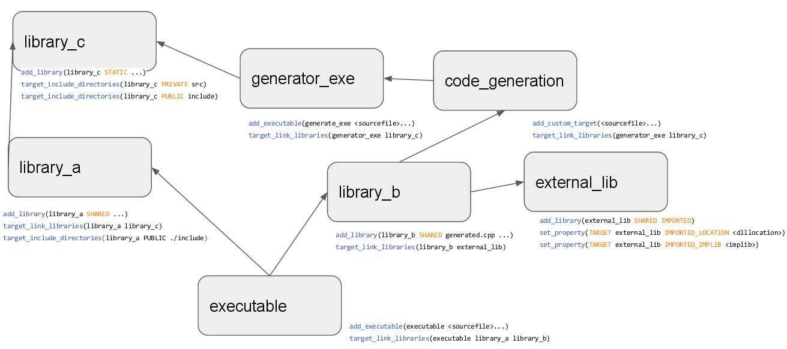

#### Hello, CMake

Создадим пустую папку `HelloCMake`, а в ней два файла: `hello.cpp`

```c++
#include <iostream>

int main ()
{
  std::cout << "Hello, world!" << std::endl;
  return 0;
}
```

и `CMakeLists.txt`

```cmake
cmake_minimum_required(VERSION 2.8)

project(hello)

add_executable(hello hello.cpp)
```

Теперь нам потребуется всего лишь две команды. Первая заставляет CMake сгенерировать проект для реальной системы сборки (на моём ноутбуке это Visual Studio 2019 Community Edition):

```
> cmake .

-- Building for: Visual Studio 16 2019
-- The C compiler identification is MSVC 19.24.28314.0
-- The CXX compiler identification is MSVC 19.24.28314.0
-- Check for working C compiler: C:/Program Files (x86)/Microsoft Visual Studio/2019/Community/VC/Tools/MSVC/14.24.28314/bin/Hostx64/x64/cl.exe
-- Check for working C compiler: C:/Program Files (x86)/Microsoft Visual Studio/2019/Community/VC/Tools/MSVC/14.24.28314/bin/Hostx64/x64/cl.exe -- works
-- Detecting C compiler ABI info
-- Detecting C compiler ABI info - done
-- Detecting C compile features
-- Detecting C compile features - done
-- Check for working CXX compiler: C:/Program Files (x86)/Microsoft Visual Studio/2019/Community/VC/Tools/MSVC/14.24.28314/bin/Hostx64/x64/cl.exe
-- Check for working CXX compiler: C:/Program Files (x86)/Microsoft Visual Studio/2019/Community/VC/Tools/MSVC/14.24.28314/bin/Hostx64/x64/cl.exe -- works
-- Detecting CXX compiler ABI info
-- Detecting CXX compiler ABI info - done
-- Detecting CXX compile features
-- Detecting CXX compile features - done
-- Configuring done
-- Generating done
-- Build files have been written to: D:/Projects/HelloCMake
```

CMake создала подпапку `CMakeFiles` и горсть текстовых файлов в нашей папке: `hello.sln`, `hello.vcxproj` и др. Наша папка загаживается временными по сути файлами (ведь в любой момент CMake может создать их снова). Поэтому рекомендуется запускать CMake в какой-нибудь временной подпапке, например `build`:

```
> mkdir build
> cd build
> cmake ..

-- Building for: Visual Studio 16 2019
...
-- Build files have been written to: D:/Projects/HelloCMake/build
```

Теперь, когда файл проекта сгенерирован, можно выполнить сборку (всё ещё находясь в подпапке `build`):

```
> cmake --build .

Microsoft (R) Build Engine версии 16.4.0+e901037fe для .NET Framework
(C) Корпорация Майкрософт (Microsoft Corporation). Все права защищены.

  Checking Build System
  Building Custom Rule D:/Projects/HelloCMake/CMakeLists.txt
  hello.cpp
  hello.vcxproj -> D:\Projects\HelloCMake\build\Debug\hello.exe
  Building Custom Rule D:/Projects/HelloCMake/CMakeLists.txt
```

Если сборка проекта прошла успешно, мы можем забрать из папки `build/Debug` нужный нам файл `hello.exe`, а саму папку `build` удалить вместе со всеми подпапками.

Обратите внимание, мы сгенерировали проекты для отладочной сборки. Если нам нужен релизный билд, команда должна быть такая:

```
cmake -D CMAKE_BUILD_TYPE=Release ..
cmake --build . --config Release
```

Также обратите внимание, CMake сама догадалась, как правильно вызвать `MSBuild` для сборки проекта и передала ей все необходимые сведения. Точно так же она умеет сама вызывать `make`, `ninja` и другие системы сборки. От нас (в большинстве случаев) не требуется разбираться в тонкостях тулчейна, используемого на конкретной машине. Это очень важное свойство CMake. В большинстве случаев от нас требуется всего две команды:

```
> cmake ..
> cmake --build .
```

Главное -- не перепутать количество точек в первой и второй строке! :)

Вот схема зависимостей CMake, которую я взял из презентации ["Modern CMake / an Introduction"](https://docs.google.com/presentation/d/18fY0zDtJCMUW5WdY2ZOfKtvb7lXEbBPFe_I6MNJC0Qw):

