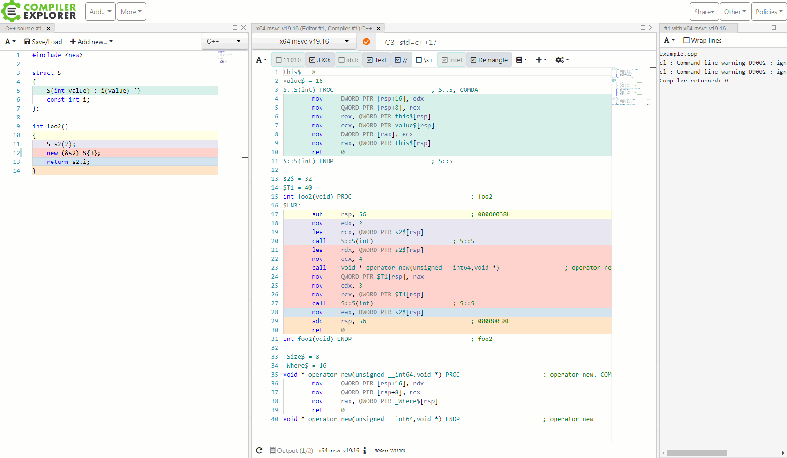
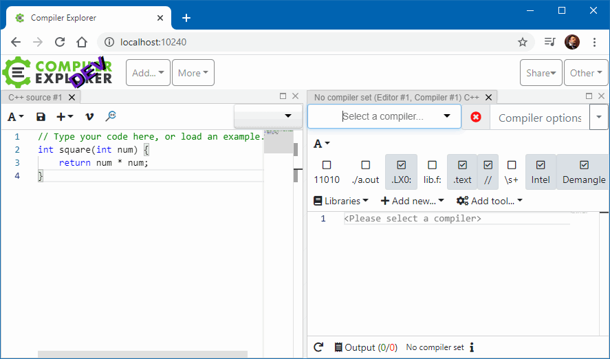
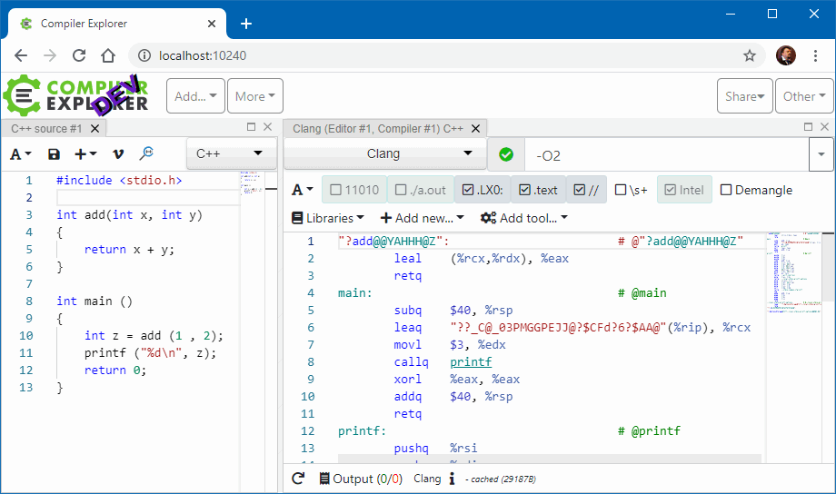
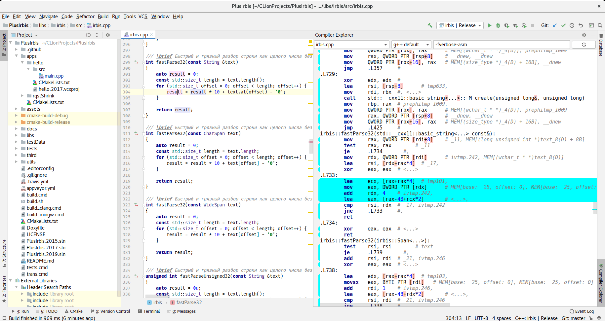
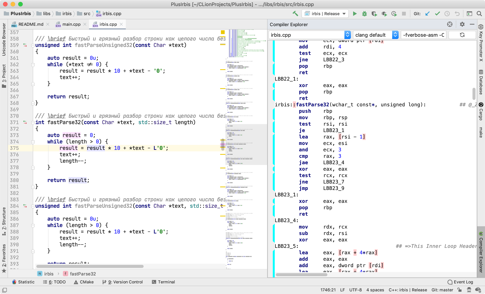

### Свой Compiler Explorer

Наткнулся на такой вот замечательный инструмент для изучения, что там у компилятора «под капотом» — Compiler Explorer. В него загружается исходный код на C++ (или Fortran или Pascal — там довольно много языков поддерживается), а он показывает, в какой машинный код это всё превращается. Да ещё с удобной навигацией и подсветкой! Очень полезный сайт!



Кроме Visual C++, поддерживаются GCC, CLANG, Intel C++ и другие, про которые я не слышал.

#### Своими силами

Сайт [Compiler Explorer](https://godbolt.org/) хорош, желаю ему долгих лет! Но захотелось завести такую штуку локально. Не вопрос, берём и делаем.
    
Первым делом идём на [сайт Node.js](https://nodejs.org/), чтобы установить самую последнюю-распоследнюю LTS версию, а именно 12.14.1, иначе, говорят, Compiler Explorer может не завестись (как выяснилось, вполне заводится и на 10-й версии).
    
Далее клонируем репозиторий к себе:

```    
> git clone --depth 1 https://github.com/mattgodbolt/compiler-explorer.git
Cloning into 'compiler-explorer'...
remote: Enumerating objects: 647, done.
remote: Counting objects: 100% (647/647), done.
remote: Compressing objects: 100% (569/569), done.
remote: Total 647 (delta 172), reused 271 (delta 54), pack-reused 0
Receiving objects: 100% (647/647), 1.87 MiB | 2.66 MiB/s, done.
Resolving deltas: 100% (172/172), done.
```

Устанавливаем необходимые пакеты (это довольно долгая песня, т. к. пакетов очень много):
    
```
> cd compiler-explorer
> npm install
...
added 1176 packages from 1611 contributors and audited 11021 packages in 106.42s
found 2 moderate severity vulnerabilities
run `npm audit fix` to fix them, or `npm audit` for details
```

Пытаемся запустить всё это дело:

```    
> npm start
...
info: Not configuring sentry
info: OPTIONS HASH: 468758e86656a13bc056511e7ea7890ef35006610e98d722d1067e491ae0d674
info: =======================================
info:   git release 4d9e24882ee936dca6ff31ba1853a0035ad8f81c
info:   using webpack dev middleware
info:   Listening on http://localhost:10240/
info:   Startup duration: 2576ms
info: =======================================
info: Hash: 4cd8b5c1f4ecbeee4c54
Version: webpack 4.41.2
Time: 6519ms
Built at: 2020-01-31 17:46:38
...
```

Запускаем браузер и видим просьбу указать компилятор:

    
    
Всё правильно, в Windows g++ по стандартным путям от Linux найти не получится. Будем настраивать.
    
Интересующие нас настройки сложены в папку etc/config и называются незамысловато: LANG.ENV.properties, где LANG – язык, например, `fortran`, а ENV – некое окружение, например, `amazon`.
    
Компиляцией C++ управляет файл `c++.local.properties`. Путём пристального разглядывания его с последующей медитацией была сооружена следующая конструкция для локально установленного Clang (просьба не смеяться громко):

```
defaultCompiler=clang
compilers=clang
compiler.clang.exe=C:\Clang\bin\clang++.exe
compiler.clang.name=Clang
```

Результат изысканий:
    
   
    
Теперь у меня есть свой собственный Complier Explorer, пусть только с Clang. Постепенно прикручу к нему VC++, как только руки дойдут.
    
В Linux всё это дело ставится буквально с пол-пинка и заводится без проблем. Более того, плагин Compiler Explorer для CLion без уговоров сразу стал отображать всё, что от него ожидалось:

   

Под Windows мне его уговорить связаться с локальной копией Compiler Explorer пока не удалось. Поневоле задумаешься, не перебежать ли в Linux окончательно 🙂

Впрочем, на OS X вся машинерия тоже завелась сразу без малейших усилий:

   
