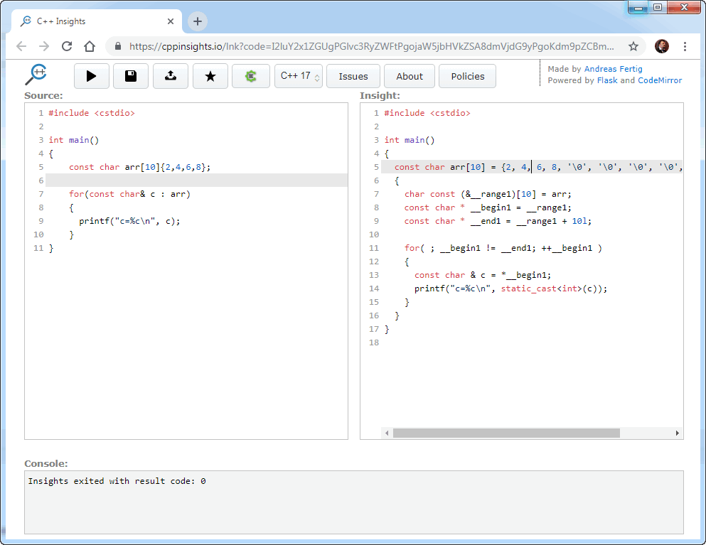

### C++ Insights

Хорошее дополнение к сайту Compiler Explorer — [C++ Insights](https://cppinsights.io/). С помощью этого сервиса можно поглядеть, какой код генерирует компилятор, не спускаясь до уровня ассемблера.

C++ Insights — это инструмент на основе clang, который выполняет преобразование одного исходного кода в другой. Его цель — показать, чем занимается компилятор C++ «за кулисами». Согласитесь, полезно иметь хотя бы примерное представление, что за магия творится, когда строки наших исходников превращаются в биты программы.

