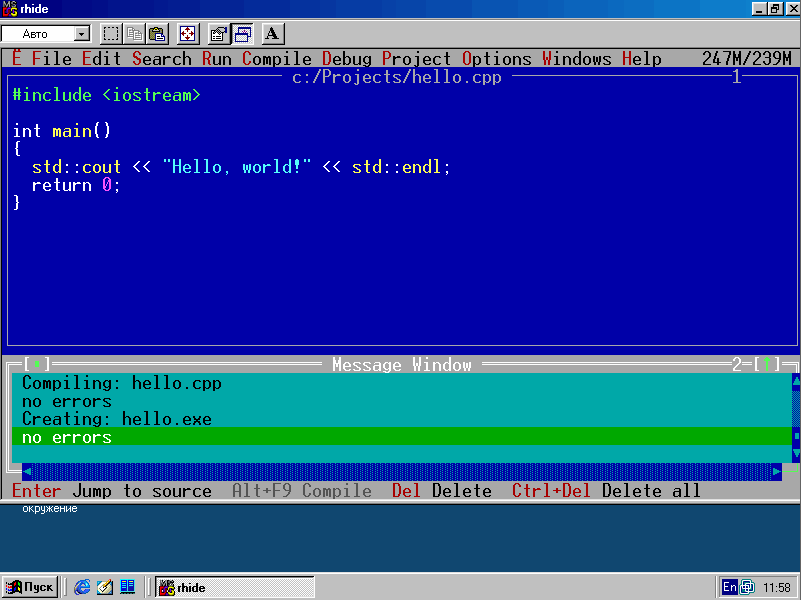

### DJGPP

DJGPP (акроним от DJ’s GNU Programming Platform) — проект по переносу GNU-утилит на платформы DOS и Windows для поддержки DPMI. Название происходит от имени автора — DJ Delorie. Официальный сайт: http://www.delorie.com/djgpp/

DJGPP является свободным программным обеспечением, и большинство утилит под него распространяются под GNU GPL или более пермиссивной лицензией. Может работать только на 32-битных процессорах (80386 и выше). Несовместим с 64-х разрядными версиями Windows, так как они не реализуют 16-битный интерфейс DOS и там нет виртуальной машины DOS, то есть для запуска нужно использовать DOSBox или другую виртуальную машину.

Утилиты разработки DJGPP поставляются также в составе GNU/DOS. В конце 1990-х годов на DJGPP создавалось множество сложных программных продуктов под DOS (например, игра Quake).

Парадоксально, но удобнее всего пользоваться DJGPP из-под Windows, например, Win98 или WinXP, в том числе из-за того, что в Windows есть сеть, браузеры, все дела. Продукт компиляции при этом, конечно же, нормально работает под «голой» DOS (и из-под 32-битной Windows тоже).

Есть вариант кросс-компиляции из UBUNTU в MS-DOS с помощью DJGPP, но я не пробовал. Возможно, это ещё удобнее, т. к. можно ипользовать современную IDE вроде CLion и наслаждаться всеми удобствами.

У DJGPP есть программа-установщик, не слишком удобная, но главное она умеет – распаковать и распихать пакеты по нужным папкам.

В состав DJGPP входит RHIDE — аналог среды Turbo Pascal/Turbo C++. Не VSCode, конечно, но на безрыбье вполне сойдёт.

А началось всё давным-давно с того, что на однажды DJ Delorie подошёл к Столлману и спросил, нет ли у того планов по портированию GCC на MS-DOS. Тот ответил, что GCC невозможно портировать на DOS, т. к. там нет системного вызова fork, да и вообще система 16-битная, памяти всего 640 Кб, этого мало для GCC. «Вызов принят!», — подумал DJ. Так и появился DJGPP 🙂

Что мы имеем на данный момент? Сама платформа DJGPP больше не развивается, но в этом нет необходимости – дальше улучшать инфраструктуру, только портить. Но новые версии GCC/G++ добавляются, например, сконвертированы под DOS G++ версии 5 и 6, так что можно писать под MS-DOS на C++14. Это радует.

Поверх DJGPP работает компилятор для 16-битного режима IA-16.

Радость несколько омрачает тот факт, что «широкие» символы и строки (wchar_t и wstring) в DJGPP не реализованы, и, похоже, никто не собирается их реализовывать. 🙁
