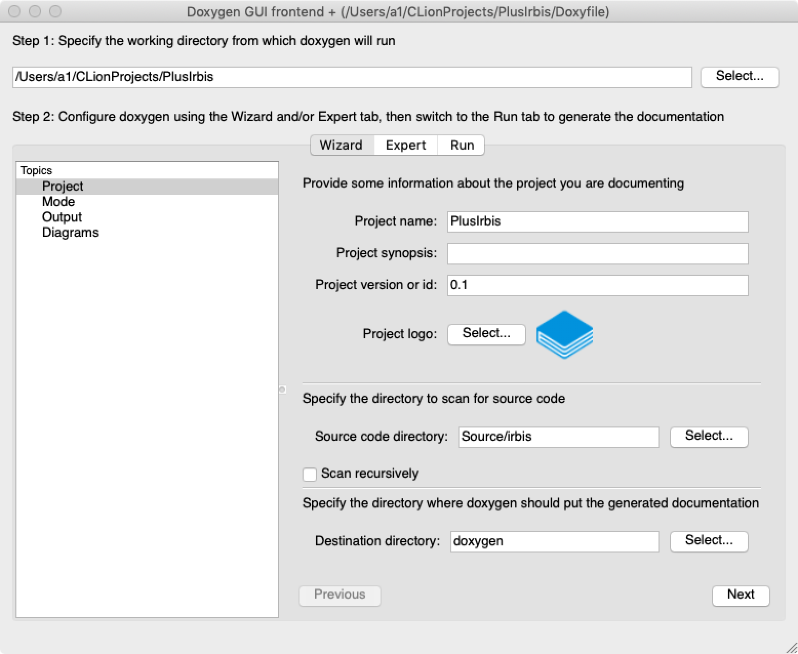

### Doxygen

Doxygen — это кроссплатформенная система документирования исходных текстов, которая поддерживает C++, Си, Objective-C, Python, Java, IDL, PHP, C#, Фортран, VHDL и, частично, D.

Doxygen генерирует документацию на основе набора исходных текстов и также может быть настроен для извлечения структуры программы из недокументированных исходных кодов. Возможно составление графов зависимостей программных объектов, диаграмм классов и исходных кодов с гиперссылками.

Doxygen имеет встроенную поддержку генерации документации в формате HTML, LAΤΕΧ, man, RTF и XML. Также вывод может быть легко сконвертирован в CHM, PostScript, PDF.

Официальный сайт: [http://www.doxygen.nl](http://www.doxygen.nl). GitHub: [https://github.com/doxygen/doxygen](https://github.com/doxygen/doxygen).

Doxygen — консольная программа в духе классической Unix. Она работает подобно компилятору, анализируя исходные тексты и создавая документацию. Параметры создания документации читаются из конфигурационного файла, имеющего простой текстовый формат.

Также имеется утилита с графическим пользовательским интерфейсом.



#### Комментарии специального вида

Для документирования используются комментарии специального вида. Вот, например, как документируется функция:

```c++
/**
  Краткое описание в одну строку.

  Длинное подробное описание.
  Может занимать несколько параграфов, если необходимо.

  @param paramName Описание параметра метода.
  @param  ...
  @return Описание возвращаемого значения.
*/
```

Для Doxygen подходят как многострочные комментарии `/**/`, так и однострочные `///`. Он опознает "свои" комментарии по дополнительным символам в начале комментария:

```c++
/*!
 * Это документирующий комментарий. 
 */

/**
 * Это тоже документирующий комментарий.
 */

///
/// Это тоже документирующий комментарий.
///

//!
//! Это тоже документирующий комментарий.
//!
```

#### Поддержка Markdown


#### Полезные команды

Команды можно вводить как в виде `\command`, так и в виде `@command`.

* `\mainpage` -- указывает, что последующий текст будет помещен на главную (начальную) страницу документации. В HTML это `index.html`.

* `\namespace` -- указывает начало документации для заданного пространства имен.

* `\package` -- укахывает начало документации для заданного пакета Java.

* `\file` -- указывает начало документации для файла с исходными текстами или заголовочного файла.

* `\class` -- указывает начало документации класса.

* `\fn` -- указывает начало документации функции с указанным именем и сигнатурой.

* `\var` -- документация переменной. В PHP указывается так:

```
@var datatype $varname
Description of the variable.
```

* `\property` -- документация свойства.

* `\brief` -- короткое (однострочное) описание.

* `\details` -- длинное описание, возможно, на несколько параграфов.

* `\param` -- описание параметра функции.

* `\return` -- возвращаемое значение.

* `\enum` -- описание `enum`.

* `\def` -- описание макроса вида `#define MAX(x, y)`.

* `\see` -- ссылка СМ.

* `\section` -- начало секции.

* `\par` -- параграф.

* `\example` -- вставка примера кода (с подсветкой) из указанного файла.

* `\li` -- организация списков-перечислений.

* `\image` -- вставка картинки.

* `\copydoc` -- копирование документации из другого объекта (класса/функции).

* `\copybrief` -- копирование краткого описания из другого объекта.

* `\copydetails` -- копирование детального описания из другого объекта.

* `\include` -- вставка файла с примером кода.

* `\includedoc` -- вставка файла с документацией.

* `\verbinclude` -- вставка текста из файла "как есть" (содержимое файла никак не интерпретируется).

* `\htmlinclude` -- вставка HTML.

* `\latexinclude` -- вставка LaTeX.

* `\noop` -- игнорировать текст до конца строки.

* `\note` -- некое примечание относительно функции, класса и т. д.

* `\warning` -- предупреждение относительно функции, класса и т. д.

* `\todo` -- описание, что планируется сделать.

* `\bug` -- описание известного бага функции, класса и т. д.


