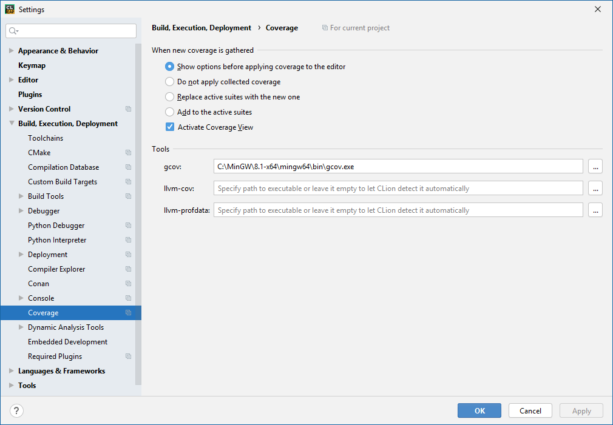
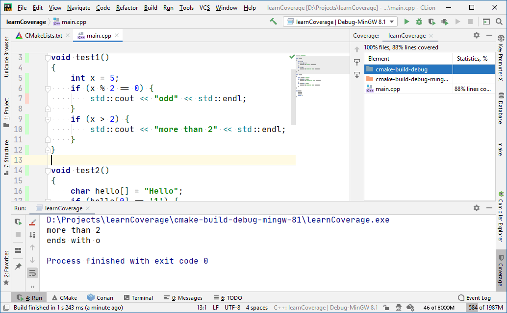

### Утилита Gcov

Gcov — свободно распространяемая утилита для исследования покрытия кода. Gcov генерирует точное количество исполнений для каждого оператора в программе и позволяет добавить аннотации к исходному коду. Gcov поставляется как стандартная утилита в составе пакета GCC.

Официальная страница: http://gcc.gnu.org/onlinedocs/gcc/Gcov.html.

#### Опции командной строки

* **-h (—help)**: Краткая помощь
* **-v (—version)**: Отображение версии программы
* **-a (—all-blocks)**: Печать счетчиков для всех базовых блоков, не только для основного блока в строке
* **-b (—branch-probabilities)**: Сохранить в выходной файл частоты условных переходов и отобразить статистику переходов на стандартный поток вывода. Безусловные переходы по этой опции не показаны, пока не подана опция `-u`
* **-c (—branch-counts)**: Сохранить статистику переходов в виде точных величин, а не процентов вероятности
* **-n (—no-output)**: Не создавать выходной файл gcov
* **-l (—long-file-names)**: Создавать длинные имена для файлов, включенных в исходник по директиве #included. К примеру, если заголовочный файл x.h содержит исполнявшийся код и был включен в файл a.c, то запуск gcov на a.c создаст файл a.c##x.h.gcov вместо x.h.gcov. Это полезно когда x.h включен многократно в различные исходные файлы
* **-p (—preserve-paths)**: Сохранять полный путь в именах создаваемых .gcov файлов. Без этой опции используется лишь имя файла, с ней — имя файла и путь к нему, в котором все символы ‘/’ заменены на символы ‘#’; каталоги ‘.’ удалены; а компоненты ‘..’ переименованы в ‘^’. Полезно в случаях, когда исходные файлы хранятся в нескольких каталогах
* **-f (—function-summaries)**: Выводить статистику по функциям в дополнение к статистике по файлам.
* **-u (—unconditional-branches)**: Включать статистику по безусловным переходам в статистику переходов.
* **-d (—display-progress)**: Отображать прогресс обработки.

CLion поддерживает Gcov «из коробки». Всё, что требуется – указать IDE, где находится исполняемый файл:



Попробуем это в деле. Напишем имитацию неких тестов:

```c++
#include <iostream>
 
void test1()
{
    int x = 5;
    if (x % 2 == 0) {
        std::cout << "odd" << std::endl;
    }
    if (x > 2) {
        std::cout << "more than 2" << std::endl;
    }
}
 
void test2()
{
    char hello[] = "Hello";
    if (hello[0] == '1') {
        std::cout << "starts with 1" << std::endl;
    }
    if (hello[4] == 'o') {
        std::cout << "ends with o" << std::endl;
    }
}
 
int main() {
    test1();
    test2();
    return 0;
}
```

В проект добавим опцию компиляции для coverage:

```c++
cmake_minimum_required(VERSION 3.15)
project(learnCoverage)
set(CMAKE_CXX_STANDARD 11)
add_executable(learnCoverage main.cpp)
set(CMAKE_CXX_FLAGS "--coverage")
```

Вот что получается в итоге:



Расстраивают два обстоятельства: 1) не поддерживается Visual C++, 2) не поддерживается удалённая отладка.

Работать с Gcov можно и напрямую, без CLion, просто это не так удобно:

```
> PATH=C:\MinGW\8.1-x64\mingw64\bin;%PATH%
> g++ -std=c++11 --coverage -o learn main.cpp 
> learn
> gcov main.cpp
> type main.cpp.gcov
        -:    0:Source:main.cpp
        -:    0:Graph:main.gcno
        -:    0:Data:main.gcda
        -:    0:Runs:1
        -:    0:Programs:1
        -:    1:#include <iostream>
        -:    2:
        1:    3:void test1()
        -:    4:{
        1:    5:    int x = 5;
        1:    6:    if (x % 2 == 0) {
    #####:    7:        std::cout << "odd" << std::endl;
        -:    8:    }
        1:    9:    if (x > 2) {
        1:   10:        std::cout << "more than 2" << std::endl;
        -:   11:    }
        1:   12:}
        -:   13:
        1:   14:void test2()
        -:   15:{
        1:   16:    char hello[] = "Hello";
        1:   17:    if (hello[0] == '1') {
    #####:   18:        std::cout << "starts with 1" << std::endl;
        -:   19:    }
        1:   20:    if (hello[4] == 'o') {
        1:   21:        std::cout << "ends with o" << std::endl;
        -:   22:    }
        1:   23:}
        -:   24:
        1:   25:int main() {
        1:   26:    test1();
        1:   27:    test2();
        1:   28:    return 0;
        -:   29:}
```

Бывают в коде куски, которые по тем или иным причинам покрывать не нужно. Например, отладочная печать. Их можно пометить специальными комментариями:

```c++
//LCOV_EXCL_START
void debug_dump()
{
    ...
}
//LCOV_EXCL_STOP
```
