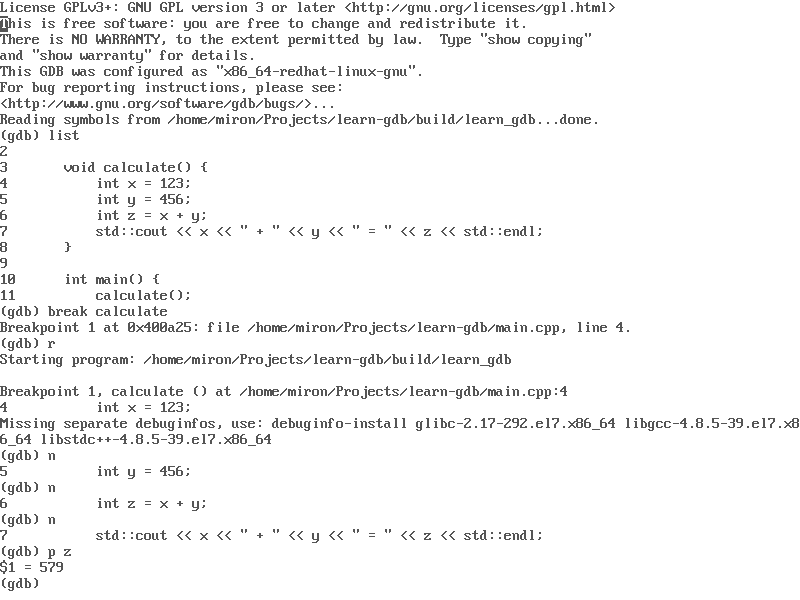

### Gdb

GNU Debugger (gdb) — переносимый отладчик проекта GNU, который работает на многих UNIX-подобных системах и умеет производить отладку многих языков программирования, включая Си, C++, Free Pascal, FreeBASIC, Ada, Фортран и Rust. GDB — свободное программное обеспечение, распространяемое по лицензии GPL.

Раз уж я не боюсь командной строки, пора бы освоить великий и ужасный GDB. 🙂



Тренироваться будем на примере следующей «очень сложной» программы:

```c++
#include <iostream>
 
void calculate() {
    int x = 123;
    int y = 456;
    int z = x + y;
    std::cout << x << " + " << y << " = " << z << std::endl;
}
 
int main() {
    calculate();
    return 0;
}
```

Собирать её будем с помощью следующего скрипта `CMakeLists.txt`:

```cmake
cmake_minimum_required(VERSION 3.15)
project(learn_gdb)
set(CMAKE_CXX_STANDARD 11)
add_executable(learn_gdb main.cpp)
add_compile_options(-O0 -ggdb)
```

Здесь необходимо обратить внимание на флаги компиляции: `-O0` приказывает отключить любую оптимизацию, `-ggdb` просит напихать в исполняемый файл побольше отладочной информации для Gdb.

Ход отладки (не весь) отображён на снимке экрана вверху. Начинается отладка с команды `gdb learn_gdb`, которая запускает gdb и просит его загрузить в себя указанную программу. Gdb обнаруживает в исполняемом файле отладочную информацию и загружает её, о чём радостно сообщает отдельной строкой.

**l**`ist` – я прошу показать исходный код программы, gdb распечатывает некую порцию (по умолчанию, это 10 строк).

**b**`reak calculate` – я прошу установить точку останова на функцию `calculate`. Gdb поясняет, где он нашёл эту функцию: печатает адрес в памяти и номер строки в cpp-файле.

**r**`un` – я прошу запустить программу на выполнение. Многие команды gdb можно сокращать до одной-двух букв: в данном случае `run` я сократил до `r`. Gdb отвечает `Starting program` и тут же останавливается на точке останова: `Breakpoint 1`. Ниже он показывает строчку, которая будет выполнена следующей, если я запущу программу дальше: `4 int x = 123`.

**n**`ext` – выполняем эту строку, переходим к следующей: `5 int y = 456;`. Ещё пару раз next – и мы попадаем на строчку `7 std::cout <<` — к этому моменту значение переменной `z` вычислено и я прошу вывести его на экран.

**p**`rint` **z** – отладчик распечатывает значение переменной `z: $1 = 579`. Здесь `$1` означает, что я могу сослаться на это значение как на `$1`. Следующее выведенное значение будет называться `$2` и т. д.

**f**`inish` – запускаю программу на выполнение до конца (пока она не завершится сама либо принудительно).

```
Run till exit from #0 calculate() at /home/miron/Projects/learn-gdb/main.cpp:7
123 + 456 = 579
main() at /home/miron/Projects/learn-gdb/main.cpp:12
```

Gdb своеобразно рапортовал, что функция main завершилась, стало быть, программа отработала своё, дальше начнутся потроха системных библиотек.

**q**`uit` – я запрашиваю выход из отладчика. Если в этот момент есть отлаживаемая программа, gdb спросит, надо ли завершить её принудительно.

Согласитесь, это ведь несложно? 🙂
