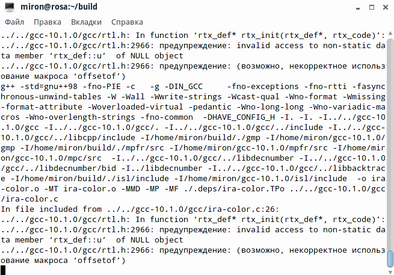

### Собираем GCC/G++ из исходников

Установил я в виртуальную машину свежескачанный ROSA Enterprise Linux Server (RELS) 6.9, запустил автоматическое обновление и решил посмотреть, что за GCC/G++ в системе, а там

```
g++ (GCC) 4.4.7 201203013 (ROSA 4.4.7-18)
Copyright (C) 2010 Free Software Foundation, Inc.
```

УПС! *спела бы Бритни Спирс*. Компилятор от 13 марта 2012 года, он не понимает даже `-std=c++11`. Обнять и плакать!

Но плакать мы не будем! Соберём GCC сами, из исходников. Вот как это делается

```
$ cd ~
$ wget http://mirror.linux-ia64.org/gnu/gcc/releases/gcc-10.1.0/gcc-10.1.0.tar.gz
$ tar xfz gcc-10.1.0.tar.gz
$ cd gcc-10.1.0
$ contrib/download_prerequisites
$ cd ~
$ mkdir build
$ cd build
$../gcc-10.1.0/configure -v --build=x86_64-linux-gnu \
  --host=x86_64-linux-gnu --target=x86_64-linux-gnu \
  --prefix=/usr/local/gcc-10.1 --enable-languages=c,c++ \
  --program-suffix=-10.1 --disable-multilib
$ make -j 4
```

По экрану бегут весёлые строчки: GCC сам себя собирает и выносит себе предупреждения



Примерно через 50 минут GCC успокаивается и сообщает, что он всё собрал более-менее успешно. Мы отвечаем

```
$ sudo make install
$ cd /usr/local/gcc-10.1/bin
$ ./g++-10.1
```

Вот что нам рассказывает о себе свежескомпилированный G++

```
COLLECT_GCC=./g++-10.1
COLLECT_LTO_WRAPPER=/usr/local/gcc-10.1/libexec/gcc/x86_64-linux-gnu/10.1.0/lto-wrapper
Target: x86_64-linux-gnu
Configured with: ../gcc-10.1.0/configure -v --build=x86_64-linux-gnu --host=x86_64-linux-gnu --target=x86_64-linux-gnu --prefix=/usr/local/gcc-10.1 --enable-languages=c,c++ --program-suffix=-10.1 --disable-multilib
Thread model: posix
Supported LTO compression algorithms: zlib
gcc version 10.1.0 (GCC)
```

Пробуем собрать им стандартный Hello, world:

```
$ vim hello.cc
$ /usr/local/gcc-10.1/bin/g++10.1 -o hello hello.cc
$ ./hello
Hello, world!
```

Теперь что-нибудь поновее, с элементами C++20: `ranges.cc`:

```c++
#include <vector>
#include <ranges>
#include <iostream>
  
int main()
{
    std::vector<int> ints { 0,1,2,3,4,5 };
    auto even = [](int i){ return 0 == i % 2; };
    auto square = [](int i) { return i * i; };
  
    for (int i : ints | std::views::filter (even) 
      | std::views::transform (square)) {
        std::cout << i << ' ';
    }
    std::cout << std::endl;
}
```

Нужно учесть, что стандартные библиотеки C/C++, лежащие по путям `$LD_LIBRARY_PATH`, конечно же, ничего не знают про новые штучки C++20 (они и про C++11 не в курсе), так что придётся задать путь до новых стандартных библиотек вручную:

```
$ vim ranges.cc
$ /usr/local/gcc-10.1/bin/g++10.1 -o ranges -std=c++20 ranges.cc
$ LD_LIBRARY_PATH=/usr/local/gcc-10.1/lib64/:$LD_LIBRARY_PATH ./ranges
0 4 16 
```

Ну что же, попробуем собрать новеньким компилятором PlusIrbis!

```
$ git clone --depth=1 https://github.com/amironov73/PlusIrbis.git
Initialized empty Git repository in /home/miron/PlusIrbis/.git/
remote: Enumerating objects: 380, done.
remote: Counting objects: 100% (380/380), done.
remote: Compressing objects: 100% (332/332), done.
remote: Total 380 (delta 52), reused 191 (delta 23), pack-reused 0
Receiving objects: 100% (380/380), 43.80 MiB | 9.28 MiB/s, done.
Resolving deltas: 100% (52/52), done.
 
$ cd PlusIrbis
$ mkdir artifacts
$ mkdir build
$ cd build
$ CC=/usr/local/gcc-10.1/bin/gcc-10.1 CXX=/usr/local/gcc-10.1/bin/g++-10.1 \
  LD_LIBRARY_PATH=/usr/local/gcc-10.1/lib64/:$LD_LIBRARY_PATH \
  cmake -D CMAKE_BUILD_TYPE=Release ..
-- The C compiler identification is GNU 10.1.0
-- The CXX compiler identification is GNU 10.1.0
-- Check for working C compiler: /usr/local/gcc-10.1/bin/gcc10.1
-- Check for working C compiler: /usr/local/gcc-10.1/bin/gcc10.1 -- works
-- Detecting C compiler ABI info
-- Detecting C compiler ABI info - done
-- Check for working CXX compiler: /usr/local/gcc-10.1/bin/g++10.1
-- Check for working CXX compiler: /usr/local/gcc-10.1/bin/g++10.1 -- works
-- Detecting CXX compiler ABI info
-- Detecting CXX compiler ABI info - done
-- Configuring done
-- Generating done
-- Build files have been written to: /home/miron/PlusIrbis/build
 
$ cmake --build . --target install -- -j 4
Install the project...
...
-- Install configuration: "Release"
-- Installing: /home/miron/PlusIrbis/artifacts/irbis.h
-- Installing: /home/miron/PlusIrbis/artifacts/rfid.h
-- Installing: /home/miron/PlusIrbis/artifacts/libirbis.a
-- Installing: /home/miron/PlusIrbis/artifacts/librfid.a
-- Installing: /home/miron/PlusIrbis/artifacts/safeTests
-- Installing: /home/miron/PlusIrbis/artifacts/onlineTests
-- Installing: /home/miron/PlusIrbis/artifacts/hello
-- Installing: /home/miron/PlusIrbis/artifacts/rqstShrink
-- Installing: /home/miron/PlusIrbis/artifacts/sigler
-- Installing: /home/miron/PlusIrbis/artifacts/readCard
-- Installing: /home/miron/PlusIrbis/artifacts/sendChar
-- Installing: /home/miron/PlusIrbis/artifacts/irbisProxy
$ cd ../artifacts/
$ LD_LIBRARY_PATH=/usr/local/gcc-10.1/lib64/:$LD_LIBRARY_PATH ./hello
Client version: 0.1 alpha
Running on UNIX
Server version: 64.2014
max MFN: 2,329,694
NOOP
FORMAT: Лаврентьев, Олег. Будущее Ангарской нефтехимической компании 
 поставлено на карту / О. Лаврентьев // СМ Номер один. - 2000. - 25 дек. 
 -  С. 4
READ: Будущее Ангарской нефтехимической компании поставлено на карту
SEARCH: 12,076 37,416 46,287 151,401 184,517 184,737 233,541 282,043 466,949 
660,908 674,435 722,688 874,588 874,638 874,728 875,349 876,612 876,959 
877,381 877,513 878,620 879,405 879,463 894,322 894,335 902,821 903,034 
903,059 903,206 904,020 909,476 910,896 921,893 921,900 1,051,277 1,097,026 
1,109,933 1,110,060 1,120,115 1,260,242 1,347,912 1,348,220 1,348,400 
1,348,795 1,348,934 1,349,092 1,349,424 1,349,428 1,353,350 1,353,564 
1,353,642 1,357,089 1,357,800 1,383,136 1,383,584 1,397,972 1,398,013 
1,405,076 1,430,652 1,431,622 1,446,078 1,470,381 1,472,788 1,509,769 
1,510,217 1,511,740 1,588,518 1,588,546 1,589,511 1,613,151 1,625,182 
1,629,796 1,630,912 1,641,651 1,642,987 1,666,640 1,671,874 1,675,102 
1,684,624 1,684,625 1,695,315 1,715,344 1,721,138 1,721,945 1,721,960 
1,722,241 1,726,547 1,747,372 1,754,807 1,819,274 1,821,197 1,830,375 
1,845,777 1,864,364 1,886,191 1,899,152 1,944,267 1,987,911 2,021,174 
2,033,845 2,053,947 2,086,450 2,093,174 2,123,986 2,161,339 2,166,621 
2,214,447 2,232,530 2,284,144 2,284,965 2,286,644 2,287,632 2,295,171
```

Как видим, всё работает, можно использовать!