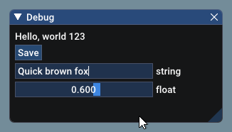
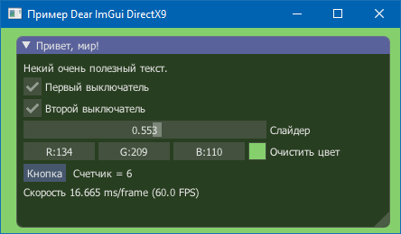

### Библиотека ImGUI

GitHub: https://github.com/ocornut/imgui

Библиотека для построения пользовательского интерфейса для несложных игрушек, медиаплееров и аналогичных приложений. Отличается тем, что отрисовка интерфейса происходит немедленно, т. е. виджеты, составляющие интерфейс, не хранят внутренее состояние (или хранят минимум), а каждый раз отрисовываются на основании кода. Код как правило выглядит так:

```c++
ImGui::Text ("Hello, world %d", 123);
if (ImGui::Button ("Save")) {
    MySaveFunction();
}
ImGui::InputText ("string", buf, IM_ARRAYSIZE (buf));
ImGui::SliderFloat ("float", &f, 0.0f, 1.0f);
```

При каждой отрисовке кадра ImGui снова отрисовывает статический текст, кнопку, строку ввода и слайдер. В результате получается примерно такое:



При определённой сноровке можно лепить такие вот интерфейсы:


Библиотека работает на Windows, Linux и OSX. Поддерживается рендеринг через DirectX9, DirectX10, DirectX11, DirectX12, OpenGL (legacy), OpenGL3/ES/ES2 (modern), Vulkan, Metal. Платформы: GLFW, SDL2, Win32, Glut, OSX. Фреймворки: Emscripten, Allegro5, Marmalade. Сама библиотека написана на довольно простом C++, имеются байндинги для C, C#/.Net, ChaiScript, D, Go, Haskell, Haxe/hxcpp, Java, JavaScript, Julia, Kotlin, Lua, Odin, Pascal, PureBasic, Python, Ruby, Rust, Swift и других языков.

Использовать библиотеку довольно легко: соответствующие файлы просто надо скопировать в свой проект. Часть файлов надо брать всегда, например, imgui.cpp, imgui_draw.cpp, imgui_widgets.cpp, другие — в зависимости от рендеринга, например, imgui_impl_dx9.cpp, imgui_impl_win32.cpp.

Потом в качестве основы берётся файл примера, например, example_win32_directx9/main.cpp и дотачивается напильником, благо, он обильно снабжен комментариями. Я так и поступил :)

`CMakeLists.txt`:

```cmake
cmake_minimum_required(VERSION 2.8)
 
project(Project0)
set(CMAKE_CXX_STANDARD 11)
 
add_executable(Project0 WIN32 main.cpp
        imgui.h
        imgui_internal.h
        imconfig.h
        imgui.cpp
        imgui_draw.cpp
        imgui_widgets.cpp
        imgui_impl_dx9.cpp
        imgui_impl_dx9.h
        imgui_impl_win32.cpp
        imgui_impl_win32.h
        imstb_textedit.h
        imstb_rectpack.h
        imstb_truetype.h)
 
target_link_libraries(Project0 d3d9.lib)
```

`main.cpp`:

```c++
#include "imgui.h"
#include "imgui_impl_dx9.h"
#include "imgui_impl_win32.h"
#include <d3d9.h>
#define DIRECTINPUT_VERSION 0x0800
#include <dinput.h>
#include <tchar.h>
 
// Data
static LPDIRECT3D9              g_pD3D = NULL;
static LPDIRECT3DDEVICE9        g_pd3dDevice = NULL;
static D3DPRESENT_PARAMETERS    g_d3dpp = {};
 
// Forward declarations of helper functions
bool CreateDeviceD3D(HWND hWnd);
void CleanupDeviceD3D();
void ResetDevice();
LRESULT WINAPI WndProc(HWND hWnd, UINT msg, WPARAM wParam, LPARAM lParam);
 
// Main code
int WinMain (HINSTANCE hInstance, HINSTANCE hPrevInstance, LPSTR lpCmdLine, int nShowCmd)
//int main(int, char**)
{
    // Create application window
    WNDCLASSEX wc =
        {
            sizeof(WNDCLASSEX),
            CS_CLASSDC, WndProc,
            0L,
            0L,
            GetModuleHandle(NULL),
            NULL,
            NULL,
            NULL,
            NULL,
            _T("ImGui Example"),
            NULL
        };
    ::RegisterClassEx(&wc);
    HWND hwnd = ::CreateWindow
            (wc.lpszClassName,
                    "\u041F\u0440\u0438\u043C\u0435\u0440 Dear ImGui DirectX9",
                    WS_OVERLAPPEDWINDOW,
                    100,
                    100,
                    480,
                    300,
                    NULL,
                    NULL,
                    wc.hInstance,
                    NULL
            );
 
    // Initialize Direct3D
    if (!CreateDeviceD3D(hwnd))
    {
        CleanupDeviceD3D();
        ::UnregisterClass(wc.lpszClassName, wc.hInstance);
        return 1;
    }
 
    // Show the window
    ::ShowWindow(hwnd, SW_SHOWDEFAULT);
    ::UpdateWindow(hwnd);
 
    // Setup Dear ImGui context
    IMGUI_CHECKVERSION();
    ImGui::CreateContext();
    ImGuiIO& io = ImGui::GetIO();
 
    // Включаем поддержку для отображения кириллицы.
    ImFontConfig font_config;
    font_config.OversampleH = 1; //or 2 is the same
    font_config.OversampleV = 1;
    font_config.PixelSnapH = 1;
    static const ImWchar ranges[] =
        {
            0x0020, 0x00FF, // Basic Latin + Latin Supplement
            0x0400, 0x044F, // Cyrillic
            0,
        };
    io.Fonts->AddFontFromFileTTF("tahoma.ttf", 14.0f, &font_config, ranges);
 
    // Setup Dear ImGui style
    //ImGui::StyleColorsDark();
    ImGui::StyleColorsClassic();
 
    // Setup Platform/Renderer bindings
    ImGui_ImplWin32_Init(hwnd);
    ImGui_ImplDX9_Init(g_pd3dDevice);
 
    // Our state
    bool show_demo_window = false;
    bool show_another_window = false;
    ImVec4 clear_color = ImVec4(0.45f, 0.55f, 0.60f, 1.00f);
 
    // Main loop
    MSG msg;
    ZeroMemory(&msg, sizeof(msg));
    while (msg.message != WM_QUIT)
    {
        // Poll and handle messages (inputs, window resize, etc.)
        // You can read the io.WantCaptureMouse, io.WantCaptureKeyboard flags to tell if dear imgui wants to use your inputs.
        // - When io.WantCaptureMouse is true, do not dispatch mouse input data to your main application.
        // - When io.WantCaptureKeyboard is true, do not dispatch keyboard input data to your main application.
        // Generally you may always pass all inputs to dear imgui, and hide them from your application based on those two flags.
        if (::PeekMessage(&msg, NULL, 0U, 0U, PM_REMOVE))
        {
            ::TranslateMessage(&msg);
            ::DispatchMessage(&msg);
            continue;
        }
 
        // Start the Dear ImGui frame
        ImGui_ImplDX9_NewFrame();
        ImGui_ImplWin32_NewFrame();
        ImGui::NewFrame();
 
        // Show a simple window that we create ourselves.
        // We use a Begin/End pair to created a named window.
        {
            static float f = 0.0f;
            static int counter = 0;
 
            ImGui::Begin("Привет, мир!"); // Create a window called "Hello, world!" and append into it.
 
            ImGui::Text("Некий очень полезный текст."); // Display some text (you can use a format strings too)
            ImGui::Checkbox("Первый выключатель", &show_demo_window);      // Edit bools storing our window open/close state
            ImGui::Checkbox("Второй выключатель", &show_another_window);
 
            ImGui::SliderFloat("Слайдер", &f, 0.0f, 1.0f);            // Edit 1 float using a slider from 0.0f to 1.0f
            ImGui::ColorEdit3("Очистить цвет", (float*)&clear_color); // Edit 3 floats representing a color
 
            if (ImGui::Button("Кнопка")) // Buttons return true when clicked (most widgets return true when edited/activated)
                counter++;
            ImGui::SameLine();
            ImGui::Text("Счетчик = %d", counter);
 
            ImGui::Text("Скорость %.3f ms/frame (%.1f FPS)", 1000.0f / ImGui::GetIO().Framerate, ImGui::GetIO().Framerate);
            ImGui::End();
        }
 
        // Rendering
        ImGui::EndFrame();
        g_pd3dDevice->SetRenderState(D3DRS_ZENABLE, false);
        g_pd3dDevice->SetRenderState(D3DRS_ALPHABLENDENABLE, false);
        g_pd3dDevice->SetRenderState(D3DRS_SCISSORTESTENABLE, false);
        D3DCOLOR clear_col_dx = D3DCOLOR_RGBA((int)(clear_color.x*255.0f), (int)(clear_color.y*255.0f), (int)(clear_color.z*255.0f), (int)(clear_color.w*255.0f));
        g_pd3dDevice->Clear(0, NULL, D3DCLEAR_TARGET | D3DCLEAR_ZBUFFER, clear_col_dx, 1.0f, 0);
        if (g_pd3dDevice->BeginScene() >= 0)
        {
            ImGui::Render();
            ImGui_ImplDX9_RenderDrawData(ImGui::GetDrawData());
            g_pd3dDevice->EndScene();
        }
        HRESULT result = g_pd3dDevice->Present(NULL, NULL, NULL, NULL);
 
        // Handle loss of D3D9 device
        if (result == D3DERR_DEVICELOST && g_pd3dDevice->TestCooperativeLevel() == D3DERR_DEVICENOTRESET)
            ResetDevice();
    }
 
    ImGui_ImplDX9_Shutdown();
    ImGui_ImplWin32_Shutdown();
    ImGui::DestroyContext();
 
    CleanupDeviceD3D();
    ::DestroyWindow(hwnd);
    ::UnregisterClass(wc.lpszClassName, wc.hInstance);
 
    return 0;
}
 
// Helper functions
 
bool CreateDeviceD3D(HWND hWnd)
{
    if ((g_pD3D = Direct3DCreate9(D3D_SDK_VERSION)) == NULL)
        return false;
 
    // Create the D3DDevice
    ZeroMemory(&g_d3dpp, sizeof(g_d3dpp));
    g_d3dpp.Windowed = TRUE;
    g_d3dpp.SwapEffect = D3DSWAPEFFECT_DISCARD;
    g_d3dpp.BackBufferFormat = D3DFMT_UNKNOWN;
    g_d3dpp.EnableAutoDepthStencil = TRUE;
    g_d3dpp.AutoDepthStencilFormat = D3DFMT_D16;
    g_d3dpp.PresentationInterval = D3DPRESENT_INTERVAL_ONE;           // Present with vsync
    //g_d3dpp.PresentationInterval = D3DPRESENT_INTERVAL_IMMEDIATE;   // Present without vsync, maximum unthrottled framerate
    if (g_pD3D->CreateDevice(D3DADAPTER_DEFAULT, D3DDEVTYPE_HAL, hWnd, D3DCREATE_HARDWARE_VERTEXPROCESSING, &g_d3dpp, &g_pd3dDevice) < 0)
        return false;
 
    return true;
}
 
void CleanupDeviceD3D()
{
    if (g_pd3dDevice) { g_pd3dDevice->Release(); g_pd3dDevice = NULL; }
    if (g_pD3D) { g_pD3D->Release(); g_pD3D = NULL; }
}
 
void ResetDevice()
{
    ImGui_ImplDX9_InvalidateDeviceObjects();
    HRESULT hr = g_pd3dDevice->Reset(&g_d3dpp);
    if (hr == D3DERR_INVALIDCALL)
        IM_ASSERT(0);
    ImGui_ImplDX9_CreateDeviceObjects();
}
 
// Win32 message handler
extern LRESULT ImGui_ImplWin32_WndProcHandler(HWND hWnd, UINT msg, WPARAM wParam, LPARAM lParam);
LRESULT WINAPI WndProc(HWND hWnd, UINT msg, WPARAM wParam, LPARAM lParam)
{
    if (ImGui_ImplWin32_WndProcHandler(hWnd, msg, wParam, lParam))
        return true;
 
    switch (msg)
    {
    case WM_SIZE:
        if (g_pd3dDevice != NULL && wParam != SIZE_MINIMIZED)
        {
            g_d3dpp.BackBufferWidth = LOWORD(lParam);
            g_d3dpp.BackBufferHeight = HIWORD(lParam);
            ResetDevice();
        }
        return 0;
    case WM_SYSCOMMAND:
        if ((wParam & 0xfff0) == SC_KEYMENU) // Disable ALT application menu
            return 0;
        break;
    case WM_DESTROY:
        ::PostQuitMessage(0);
        return 0;
    }
    return ::DefWindowProc(hWnd, msg, wParam, lParam);
}
```

Бо́льшая часть этого файла — необходимый бойлерплейт, создающий окно и обрабатывающий системные сообщения. Собственно отрисовка интерфейса поместилась в следующих строках:

```c++
static bool show_demo_window  = false; // состояние переключателя № 1
static bool show_another_window  = false; // состояние переключателя № 2
static float f = 0.0f; // положение слайдера (см. ниже)
static int counter = 0; // счетчик нажатий кнопок
 
ImGui::Begin("Привет, мир!"); // как видим, нет проблем с кириллицей
 
ImGui::Text("Некий очень полезный текст."); // статический текст
ImGui::Checkbox("Первый выключатель", &show_demo_window); // простой переключатель
ImGui::Checkbox("Второй выключатель", &show_another_window); // ещё один
 
ImGui::SliderFloat("Слайдер", &f, 0.0f, 1.0f); // слайдер
ImGui::ColorEdit3("Очистить цвет", (float*)&clear_color); // три слайдера (RGB)
 
if (ImGui::Button("Кнопка")) { // кнопка выдает true, когда нажата
    counter++;
}
ImGui::SameLine(); // на той же строке
ImGui::Text("Счетчик = %d", counter); // статический текст
 
ImGui::Text("Скорость %.3f ms/frame (%.1f FPS)", 1000.0f / ImGui::GetIO().Framerate, ImGui::GetIO().Framerate);
ImGui::End(); // закончили описание окна
```


