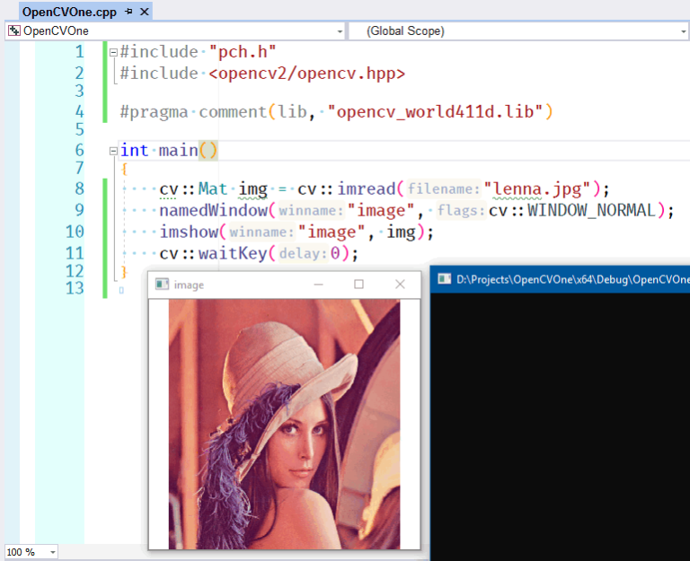

### Осваиваем OpenCV под Visual Studio 2017

Сначала идём на страницу https://opencv.org/releases/ и скачиваем оттуда релиз 4-й версии. Распаковываем его в папку C:\OpenCV. Добавляем путь `C:\opencv\build\x64\vc15\bin` в переменную `PATH`.

Создаём пустой консольный проект C/C++, в его свойствах добавляем папку `C:\opencv\build\include` в `Additional Include Directories`, а папку `C:\opencv\build\x64\vc15\lib` в `Additional Library Directories`.

Сочиняем «очень сложную» программу следующего содержания:

```c++
#include "pch.h"
#include <opencv2/opencv.hpp>
 
#pragma comment(lib, "opencv_world411d.lib")
 
int main()
{
    cv::Mat img = cv::imread("lenna.jpg");
    namedWindow("image", cv::WINDOW_NORMAL);
    imshow("image", img);
    cv::waitKey(0);
    return 0;
}
```

Компилируем, запускаем, радуемся.


