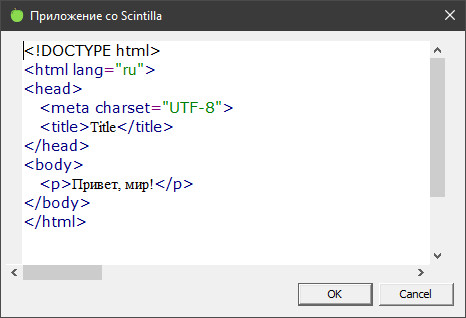

### Scintilla

https://ru.wikipedia.org/wiki/Scintilla

Scintilla — компонент для редактирования текста с открытым исходным кодом для Microsoft Windows и Linux с GTK+, разработанный Нейлом Ходжсоном (англ. Neil Hodgson).

Официальный сайт: https://www.scintilla.org

Репозиторий: https://sourceforge.net/projects/scintilla

#### Особенности

Основное предназначение Scintilla — редактирование исходных текстов программ. Для этого он имеет ряд специальных возможностей:

* Отображение номеров строк.
* Сворачивание структурных блоков текста (классов, функций, циклов и т. п.).
* Подсветка синтаксиса для разных языков программирования и разметки данных, причём могут одновременно использоваться разные шрифты, как моноширинные, так и пропорциональные.
* Автоматическая установка отступов.
* Подсветка парных или непарных (незакрытых) скобок.
* Автоматическое завершение используемых в файле имён типов, функций, переменных.
* Всплывающие подсказки о параметрах функций.
* Установка закладок.
* Поддержка Unicode.
  
На Linux использует библиотеку GTK+, на Windows — Windows API.

#### Использование

Существуют по меньшей мере десятки приложений, использующих Scintilla. Известные приложения, использующие Scintilla:

* SciTE — текстовый редактор, который первоначально был создан для демонстрации возможностей Scintilla.
* Notepad++ — текстовый редактор для Microsoft Windows.
* Geany — легковесная кроссплатформенная интегрированная среда разработки.
* FbEdit — среда разработки под Windows для языка FreeBasic.
* Code::Blocks — кроссплатформенная интегрированная среда разработки с открытым исходным кодом.
* CodeLite — свободная кроссплатформенная среда разработки программного обеспечения для языка С/С++ с открытым исходным кодом.
* FlashDevelop — открытая среда разработки RIA Flex, Flash, Haxe для Microsoft Windows.
* Aegisub — кроссплатформенный редактор субтитров.
* Notepad2 — текстовый редактор для Microsoft Windows, как замена стандартному приложению Блокнот.
* PureBasic IDE — кроссплатформенная интегрированная среда разработки для языка PureBasic.
* MySQL Workbench — инструмент для визуального проектирования баз данных.
* Visual Prolog — Visual Prolog.
* µVision (начиная с версии 4.53.0.4) - интегрированная среда разработки для микроконтроллеров.

Актуальная версия 4.4.4 требует C++17, прошлая (но до сих пор поддерживаемая) 3.20.0 требует C++11, меня интересует 3.x.x.

Как скомпилировать это сокровище с помощью Visual C++?

1. Идём на SourceForge, скачиваем ZIP-файл с исходниками, распаковываем.
2. В Visual Studio (не ниже 2015) открываем файл `win32/SciLexer.vcxproj`.
3. Переключаемся на сборку `x64-Release`.
4. Запускаем компиляцию, VC++ ругается «`Error C2039 'wstring': is not a member of 'std' (compiling source file ..\win32\PlatWin.cxx)`».
5. Дописываем `#include <string>` в начало файла `UniConversion.h`.
6. Собираем снова, на этот раз удачно. В папке x64/Release обнаруживаем файлы `SciLexer.dll` и `SciLexer.lib`.

Альтернативный вариант: в `x64 Native Tools Command Prompt for VS 2019` в подпапке `win32` запустить

```
nmake -f scintilla.mak
```

В дополнение к `SciLexer.dll` мы получим ещё `Scintilla.dll` (на случай, если лексер нам не нужен).

Теперь попробуем написать примитивный HTML-редактор вроде такого



Нам потребуются заголовочные файлы из папки `include` и только что собранная DLL-библиотека.

`CMakeLists.txt`:

```cmake
cmake_minimum_required(VERSION 2.8)
project(SciApp)
set(CMAKE_CXX_STANDARD 11)

include_directories(${PROJECT_SOURCE_DIR}/include)
link_libraries(imm32.lib msimg32.lib)

add_executable(SciApp WIN32
        main.cpp SciApp.rc resource.h)
```

`resource.h`:

```c++
#define IDD_MAIN_DIALOG                 101
#define IDI_MAIN_ICON                   103
#define IDC_STATIC                      -1
```

`SciApp.rc`

```
#include "resource.h"
#include "winres.h"

LANGUAGE LANG_RUSSIAN, SUBLANG_DEFAULT
#pragma code_page(1251)

IDD_MAIN_DIALOG DIALOGEX 0, 0, 309, 176
STYLE DS_SETFONT | DS_MODALFRAME | DS_FIXEDSYS | DS_CENTER | WS_POPUP | WS_CAPTION | WS_SYSMENU
EXSTYLE WS_EX_APPWINDOW
CAPTION "Приложение со Scintilla"
FONT 8, "MS Shell Dlg", 400, 0, 0x1
BEGIN
    DEFPUSHBUTTON   "OK",IDOK,198,155,50,14
    PUSHBUTTON      "Cancel",IDCANCEL,252,155,50,14
END

IDI_MAIN_ICON ICON "science.ico"
```

Наконец, `main.cpp`:

```c++
#include <windows.h>
#include <CommCtrl.h>
#include <tchar.h>
#include <wchar.h>
#include <stdio.h>

#include "Scintilla.h"
#include "SciLexer.h"

#include "resource.h"

// окно Scintilla
static HWND editor;

// отправка сообщения в редактор
LRESULT SendEditor (UINT Msg, WPARAM wParam=0, LPARAM lParam=0)
{
    return ::SendMessage (editor, Msg, wParam, lParam);
}

const COLORREF black = RGB (0,0,0);
const COLORREF white = RGB (0xff,0xff,0xff);

// установка стиля текста
void SetAStyle
    (
        int style,
        COLORREF fore,
        COLORREF back = white,
        int size = -1,
        const char *face = nullptr
    )
{
    SendEditor (SCI_STYLESETFORE, style, fore);
    SendEditor (SCI_STYLESETBACK, style, back);
    if (size >= 1) {
        SendEditor (SCI_STYLESETSIZE, style, size);
    }
    if (face) {
        SendEditor (SCI_STYLESETFONT, style, reinterpret_cast<LPARAM> (face));
    }
}

// инициализация и отображение окна Scintilla
BOOL InitializeScintilla
    (
        HWND hwnd
    )
{
    HINSTANCE hInstance = ::GetModuleHandle (nullptr);

    HMODULE module = ::LoadLibrary ("SciLexer.dll");
    if (!module) {
        ::MessageBox
            (
                hwnd,
                "The Scintilla DLL could not be loaded.",
                "Error loading Scintilla",
                MB_OK | MB_ICONERROR
            );
        return TRUE;
    }

    editor = ::CreateWindow
        (
            "Scintilla",
            "Source",
            WS_CHILD | WS_VSCROLL | WS_HSCROLL | WS_CLIPCHILDREN,
            5, 10,
            440, 240,
            hwnd,
            0,
            hInstance,
            0
        );
    if (!editor) {
        ::MessageBox
            (
                hwnd,
                "The Scintilla window could not be created.",
                "Error creating Scintilla",
                MB_OK | MB_ICONERROR
            );
        return TRUE;
    }

    ::ShowWindow (editor, SW_SHOW);
    ::SetFocus (editor);

    SetAStyle (STYLE_DEFAULT, black, white, 11, "Verdana");
    SendEditor (SCI_SETLEXER, SCLEX_HTML);
    SendEditor (SCI_STYLECLEARALL); // Copies global style to all others

    const COLORREF red = RGB(0xFF, 0, 0);
    const COLORREF offWhite = RGB(0xFF, 0xFB, 0xF0);
    const COLORREF darkGreen = RGB(0, 0x80, 0);
    const COLORREF darkBlue = RGB(0, 0, 0x80);

    // Hypertext default is used for all the document's text
    SetAStyle(SCE_H_DEFAULT, black, white, 11, "Times New Roman");

    // Unknown tags and attributes are highlighed in red.
    // If a tag is actually OK, it should be added in lower case to the htmlKeyWords string.
    SetAStyle (SCE_H_TAG, darkBlue);
    SetAStyle (SCE_H_TAGUNKNOWN, red);
    SetAStyle (SCE_H_ATTRIBUTE, darkBlue);
    SetAStyle (SCE_H_ATTRIBUTEUNKNOWN, red);
    SetAStyle (SCE_H_NUMBER, RGB(0x80,0,0x80));
    SetAStyle (SCE_H_DOUBLESTRING, RGB(0,0x80,0));
    SetAStyle (SCE_H_SINGLESTRING, RGB(0,0x80,0));
    SetAStyle (SCE_H_OTHER, RGB(0x80,0,0x80));
    SetAStyle (SCE_H_COMMENT, RGB(0x80,0x80,0));
    SetAStyle (SCE_H_ENTITY, RGB(0x80,0,0x80));

    return FALSE;
}

// инициализация диалога
BOOL InitializeDialog
    (
        HWND hwnd
    )
{
    HINSTANCE hInstance = ::GetModuleHandle (nullptr);

    // загружаем иконку диалога из ресурсов
    HICON hicon = (HICON) ::LoadImage
        (
            hInstance,
            MAKEINTRESOURCE(IDI_MAIN_ICON),
            IMAGE_ICON,
            0,
            0,
            LR_DEFAULTCOLOR | LR_DEFAULTSIZE
        );
    ::SendMessage
        (
            hwnd,
            WM_SETICON,
            ICON_BIG,
            (LPARAM) hicon
        );
    ::SendMessage
        (
            hwnd,
            WM_SETICON,
            ICON_SMALL,
            (LPARAM) hicon
        );

    return FALSE;
}

// процедура-обработчик сообщений для диалогового окна
BOOL CALLBACK DialogProc
    (
        HWND hwnd,
        UINT message,
        WPARAM wParam,
        LPARAM lParam
    )
{
    switch (message)
    {
        case WM_INITDIALOG:
            if (InitializeDialog (hwnd)
                || InitializeScintilla (hwnd)) {
                ::exit (1);
            }
            return FALSE;

        case WM_CLOSE:
            ::EndDialog (hwnd, 0);
            return FALSE;

        default:
            return FALSE;
    }
}

// точка входа в программу
int WINAPI WinMain
    (
        HINSTANCE hInstance,     // текущий экземпляр приложения
        HINSTANCE hPrevInstance, // не используется
        LPSTR pCmdLine,          // командная строка
        int iCmdShow             // режим отображения окна
    )
{
    return (int) DialogBox
        (
            hInstance,
            MAKEINTRESOURCE (IDD_MAIN_DIALOG),
            nullptr,
            (DLGPROC) DialogProc
        );
}
```
