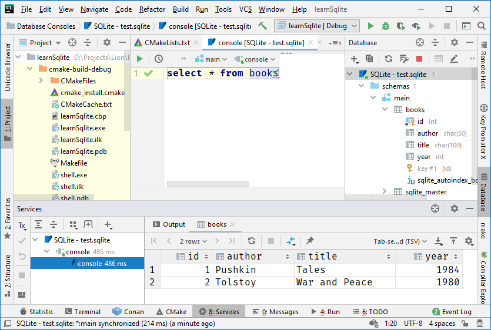

### Библиотека SQLite

SQLite — это встраиваемая кроссплатформенная БД, которая поддерживает достаточно полный набор команд SQL и доступна в исходных кодах (на языке C). Исходные коды SQLite находятся в public domain, то есть вообще никаких ограничений на использование.

Сайт: [http://sqlite.org](http://sqlite.org).

Особенности:

* Поддерживаются транзакции в соответствии с принципом ACID. Даже после сбоя операционной системы или отключения электричества.

* Готово к применению без конфигурирования. 

* Поддержка SQL с расширенными возможностями, например, индексы по выражениям, частичные индексы, JSON, общие выражения для таблиц, оконные функции. 

* База данных хранится в одном файле кроссплатформенного формата. 

* Поддержка баз данных вплоть до терабайтов. Поддерживаются строки и блобы вплоть до гигабайтов. 

* Малый объем кода, менее 600 Кб.

* Простой API. 

* Быстрая база данных, в некторых случаях работает со скоростью файловой системы. 

* Написано на ANSI C. Штатный биндинг для TCL. Неисчислимые (посторонние) биндинги к другим языкам. 

* Хорошо прокомментированный код со 100% покрытием тестами ветвлений. 

* Предусмотрен вариант "амальгама", когда достаточно добавить в свой проект один (большой) C-файл. 

* Отсутствуют внешние зависимости. Всё необходимое уже включено в поставку. 

* Кроссплатформенность: Android, *BSD, iOS, Linux, Mac, Solaris, VxWorks, Windows (Win32, WinCE, WinRT) поддерживаются из коробки. На остальные системы легко портировать самому.

* В комплект поставки входит утилита командной строки для администрирования баз. 

CMakeLists.txt:

```
cmake_minimum_required(VERSION 2.8)
project(learnSqlite)
set(CMAKE_CXX_STANDARD 11)
include_directories(shell ${PROJECT_SOURCE_DIR}/sqlite)

set(SOURCES main.cpp sqlite/sqlite3.c)

# тестовая программа
add_executable(learnSqlite ${SOURCES})

# шелл
add_executable(sqlite3 sqlite/shell.c sqlite/sqlite3.c)
```

main.cpp:

```c++
#include <cstdlib>
#include <iostream>
#include "sqlite/sqlite3.h"

static int callback (void *data, int argc, char **argv, char **azColName)
{
    for(int i = 0; i<argc; i++){
        std::cout << azColName[i] << " = " << (argv[i] ? argv[i] : "NULL") << std::endl;
    }
    std::cout << std::endl;
    return 0;
}

int main() 
{
    sqlite3 *db = nullptr;
    char *errorMessage;
    int rc = sqlite3_open_v2
        (
            "test.db",
            &db,
            SQLITE_OPEN_READWRITE | SQLITE_OPEN_CREATE,
            nullptr
        );
    if (rc) {
        std::cout << "Error: " << sqlite3_errmsg (db);
        sqlite3_close (db);
        return 1;
    }

    std::cout << "Database opened" << std::endl;

    const char *sqlText = "create table if not exists books ("
        "id int primary key not null, "
        "author char(50), "
        "title char(100), "
        "year int"
        ");";
    rc = sqlite3_exec (db, sqlText, nullptr, 0, &errorMessage);
    if (rc != SQLITE_OK) {
        std::cout << "SQL error: " << errorMessage << std::endl;
        free (errorMessage);
        sqlite3_close (db);
        return 2;
    }

    std::cout << "Table created" << std::endl;

    sqlText = "insert into books (id, author, title, year) "
        "values (1, 'Pushkin', 'Tales', 1984); "
        "insert into books (id, author, title, year) "
        "values (2, 'Tolstoy', 'War and Peace', 1980); ";
    rc = sqlite3_exec (db, sqlText, nullptr, 0, &errorMessage);
    if (rc != SQLITE_OK) {
        std::cout << "SQL error: " << errorMessage << std::endl;
        free (errorMessage);
        sqlite3_close (db);
        return 2;
    }

    std::cout << "Records inserted" << std::endl;

    sqlText = "select * from books";
    rc = sqlite3_exec (db, sqlText, callback, 0, &errorMessage);
    if (rc != SQLITE_OK) {
        std::cout << "SQL error: " << errorMessage << std::endl;
        free (errorMessage);
        sqlite3_close (db);
        return 2;
    }

    std::cout << "All done" << std::endl;

    sqlite3_close (db);
    return 0;
}
```


