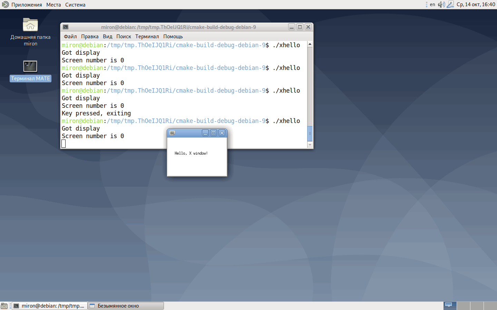

### Hello, World!

По первому впечатлению программировать под X Window System примерно так же, как под «голый» оконный WinAPI: нудно, но не страшно.

Библиотеки для программирования под X устанавливаются стандартным заклинанием

```bash
sudo apt install libx11-dev
```

Вот что мы хотим запрограммировать (Debian с рабочим столом MATE):



Вот что для этого нам надо. `CMakeLists.txt`:

```cmake
cmake_minimum_required(VERSION 2.8)
project(xhello C)
set(CMAKE_C_STANDARD 90)
link_libraries(X11)
add_executable(xhello main.c)
```

`main.c`:

```c
#include <stdio.h>
#include <string.h>
#include <X11/Xlib.h>
 
static Display *display;
static int screenNumber;
static Window window;
 
static void redraw_window (void)
{
    GC gc = XCreateGC (display, window, 0 , NULL);
    const char *text = "Hello, X window!";
 
    XSetForeground (display, gc, BlackPixel (display, screenNumber));
 
    XDrawString
        (
            display,
            window,
            gc,
            20,
            50,
            text,
            (int) strlen (text)
        );
 
    XFreeGC (display, gc);
    XFlush (display);
}
 
int main ()
{
    int left = 100, top = 100, width = 200, height = 100;
    int borderWidth = 2;
    unsigned long borderColor, backgroundColor;
    XEvent event;
 
    /* Устанавливаем связь с X-сервером */
    display = XOpenDisplay (NULL);
    if (!display) {
        fputs ("Can't open display\n", stderr);
        return 1;
    }
 
    printf ("Got display\n");
    screenNumber = XDefaultScreen (display);
    printf ("Screen number is %d\n", screenNumber);
    borderColor = BlackPixel (display, screenNumber);
    backgroundColor = WhitePixel (display, screenNumber);
 
    /* Создаем простое окно */
    window = XCreateSimpleWindow
        (
            display,
            RootWindow (display, screenNumber),
            left, top, width, height,
            borderWidth,
            borderColor,
            backgroundColor
        );
 
    /* События,  которые будет обрабатывать программа */
    XSelectInput
        (
            display,
            window,
            ExposureMask | KeyPressMask
        );
 
    /* Показ окна */
    XMapWindow (display, window);
 
    /* Цикл обработки сообщений */
    while (1) {
        XNextEvent (display, &event);
 
        switch (event.type) {
            case Expose:
                /* Нас просят перерисовать окно */
                redraw_window ();
                break;
 
            case KeyPress:
                /* По нажатию на любую кнопку завершаемся */
                printf ("Key pressed, exiting\n");
                goto DONE;
        }
    }
 
    DONE:
 
    /* Закрываем дисплей */
    XCloseDisplay (display);
    printf ("That's all, folks!\n");
 
    return 0;
}
```

Я же говорил, примерно так же, как WinAPI. :)
