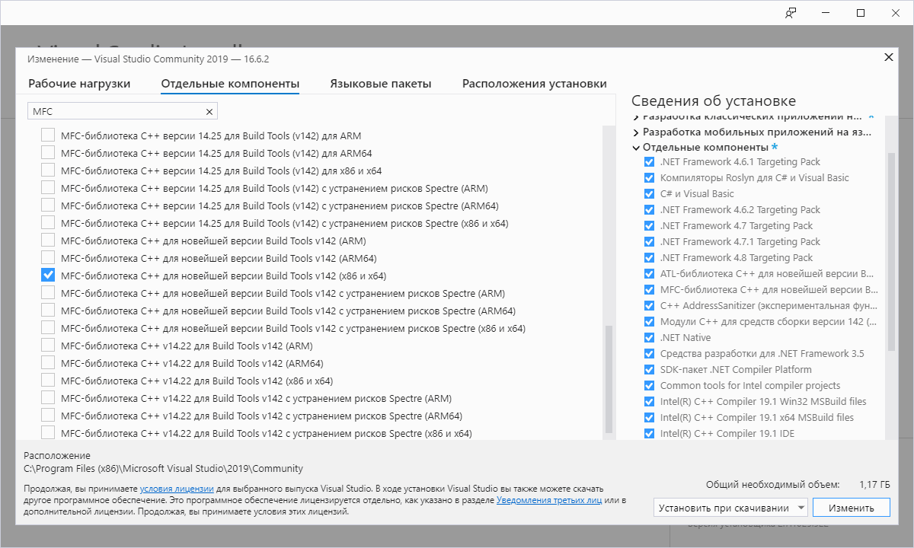
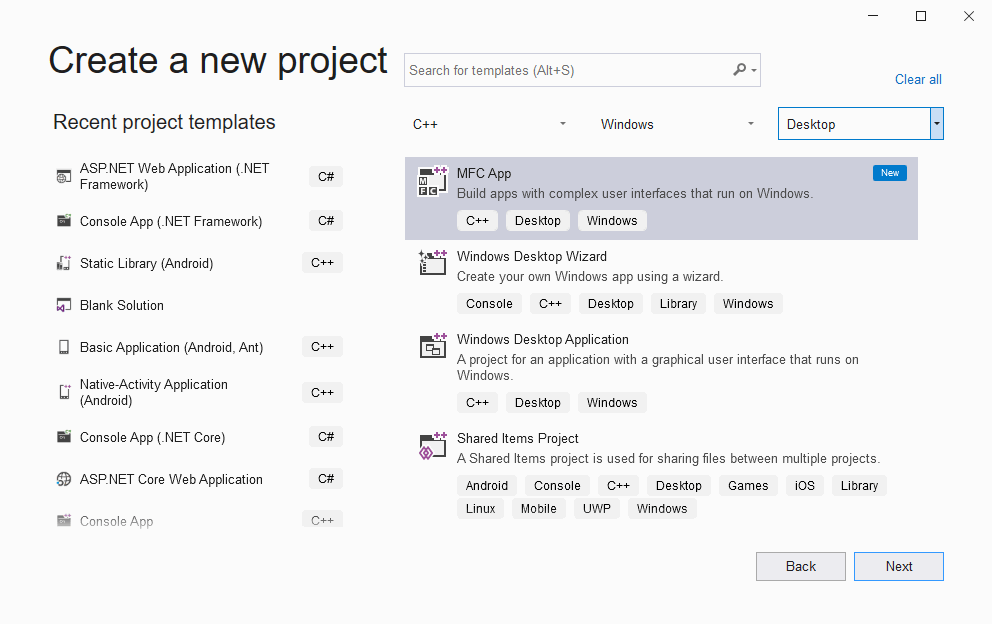
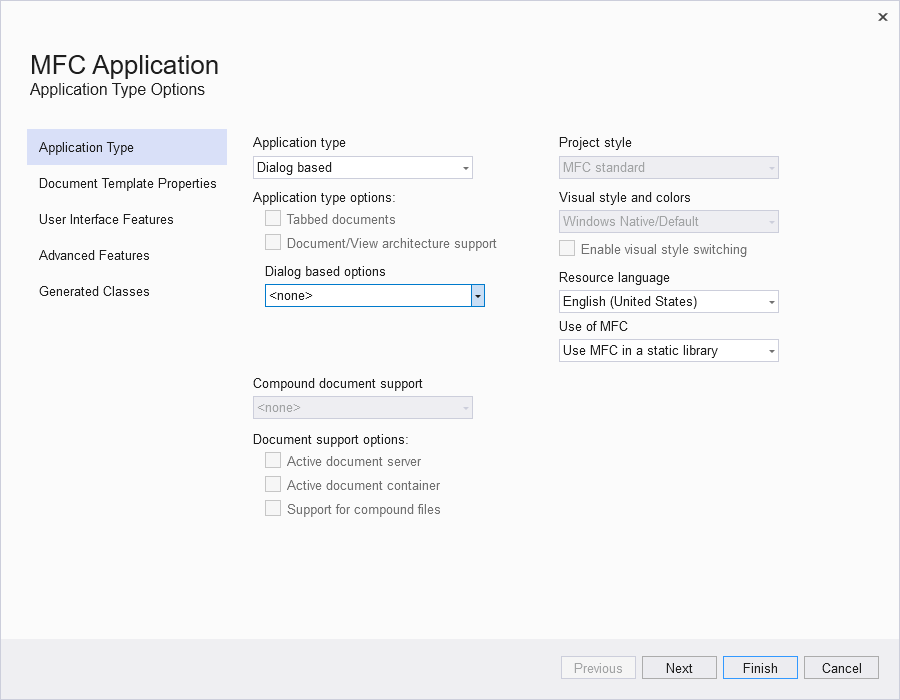
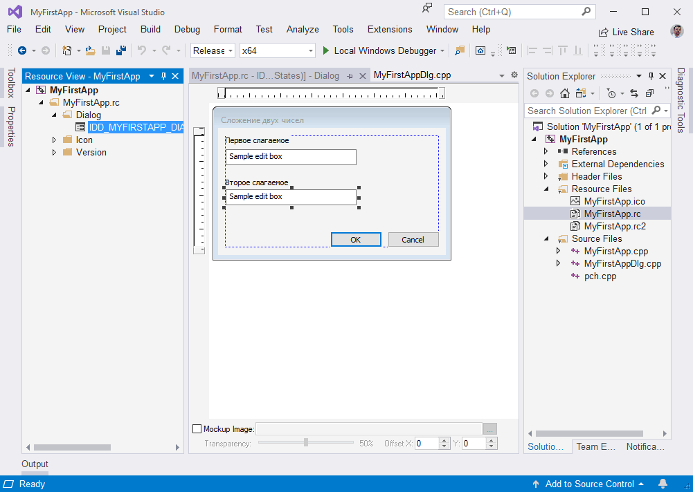
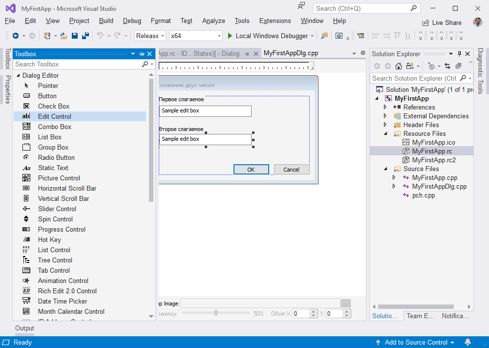
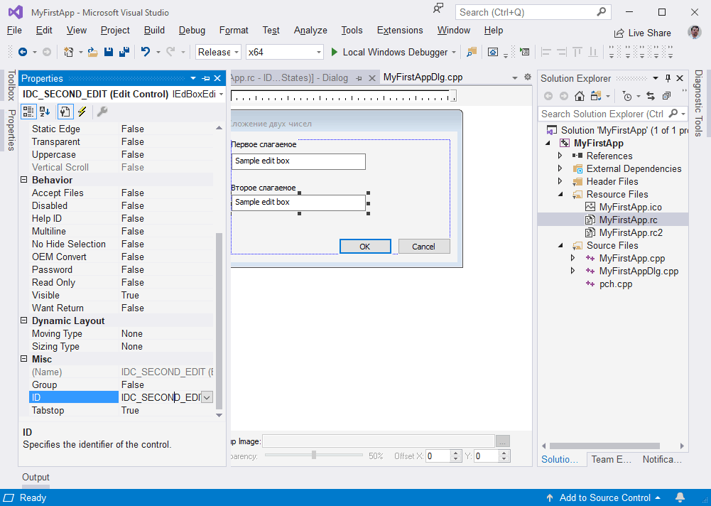
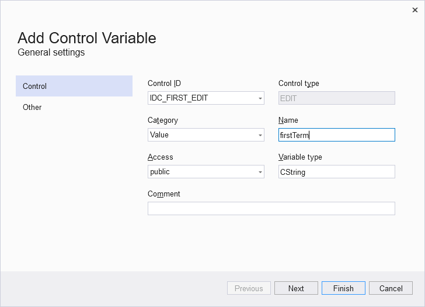
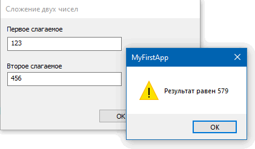

### Первое приложение

Для начала нам необходимо убедиться, что в Visual Studio установлены необходимые пакеты:



Запускаем Visual Studio и выбираем соответствующий тип проекта:



Наше первое приложение будет Dialog-based (так проще всего)



Visual Studio некоторое время подумает и, если всё настроено верно, сгенерирует болванку приложения. Можно скомпилировать и запустить эту болванку, чтобы убедиться, что среда функционирует как надо.

Приступаем к дизайну диалогового окна. Для этого находим в дереве файлов решения файл `MyFirstApp.rc`, двойным щелчком открываем его в «Resource View». Там в свою очередь находим `IDC_MYFIRSTAPP_DIALOG` и запускаем дизайнер диалога двойным щелчком.



Что от нас требуется на данном этапе? Хватать контролы со вкладки Toolbox и перетаскивать их на диалог, стараясь расположить их поаккуратнее.



При необходимости можно менять свойства контролов с помощью вкладки Properties. Так, например, можно поменять стандартные идентификаторы `IDC_EDIT1` на более осмысленные `IDC_FIRST_EDIT`.



Также можно создать переменные для значений, хранящихся в контролах. Для этого нужно щёлкнуть правой кнопкой мыши по контролу и выбрать пункт «Add variable». Конечно, переменную можно добавить в описание класса вручную, но лучше доверить это «волшебнику», т. к. он дополнительно добавит строчки, получающие данные из контрола или наоборот — передающие данные в контрол.



Теперь запрограммируем реакцию на нажатие кнопки OK. Для этого в дизайнере дважды щёлкнем по ней. Нас перекинет в редактор кода, курсор будет помещен внутрь метода OnBnClickedOk. Отредактируем его так:

```c++
// MyFirstAppDlg.cpp : implementation file
//
 
#include "pch.h"
#include "framework.h"
#include "MyFirstApp.h"
#include "MyFirstAppDlg.h"
#include "afxdialogex.h"
 
#ifdef _DEBUG
#define new DEBUG_NEW
#endif
 
// CMyFirstAppDlg dialog
 
CMyFirstAppDlg::CMyFirstAppDlg(CWnd* pParent /*=nullptr*/)
    : CDialogEx(IDD_MYFIRSTAPP_DIALOG, pParent)
    , firstTerm(_T(""))
    , secondTerm(_T(""))
{
    m_hIcon = AfxGetApp()->LoadIcon(IDR_MAINFRAME);
}
 
void CMyFirstAppDlg::DoDataExchange(CDataExchange* pDX)
{
    CDialogEx::DoDataExchange(pDX);
    DDX_Text(pDX, IDC_FIRST_EDIT, firstTerm);
    DDX_Text(pDX, IDC_SECOND_EDIT, secondTerm);
}
 
BEGIN_MESSAGE_MAP(CMyFirstAppDlg, CDialogEx)
    ON_WM_PAINT()
    ON_WM_QUERYDRAGICON()
    ON_BN_CLICKED(IDOK, &CMyFirstAppDlg::OnBnClickedOk)
END_MESSAGE_MAP()
 
// CMyFirstAppDlg message handlers
 
BOOL CMyFirstAppDlg::OnInitDialog()
{
    CDialogEx::OnInitDialog();
 
    // Set the icon for this dialog.  The framework does this automatically
    //  when the application's main window is not a dialog
    SetIcon(m_hIcon, TRUE);   // Set big icon
    SetIcon(m_hIcon, FALSE);  // Set small icon
 
    // TODO: Add extra initialization here
 
    return TRUE;  // return TRUE  unless you set the focus to a control
}
 
// If you add a minimize button to your dialog, you will need the code below
//  to draw the icon.  For MFC applications using the document/view model,
//  this is automatically done for you by the framework.
 
void CMyFirstAppDlg::OnPaint()
{
    if (IsIconic())
    {
        CPaintDC dc(this); // device context for painting
 
        SendMessage(WM_ICONERASEBKGND, 
           reinterpret_cast<WPARAM>(dc.GetSafeHdc()), 0);
 
        // Center icon in client rectangle
        int cxIcon = GetSystemMetrics(SM_CXICON);
        int cyIcon = GetSystemMetrics(SM_CYICON);
        CRect rect;
        GetClientRect(&rect);
        int x = (rect.Width() - cxIcon + 1) / 2;
        int y = (rect.Height() - cyIcon + 1) / 2;
 
        // Draw the icon
        dc.DrawIcon(x, y, m_hIcon);
    }
    else
    {
        CDialogEx::OnPaint();
    }
}
 
// The system calls this function to obtain the cursor to display while the user drags
//  the minimized window.
HCURSOR CMyFirstAppDlg::OnQueryDragIcon()
{
    return static_cast<HCURSOR>(m_hIcon);
}
 
void CMyFirstAppDlg::OnBnClickedOk()
{
    CDataExchange dx (this, true);
    this->DoDataExchange (&dx);
    wchar_t *end;
    long firstTerm = wcstol (this->firstTerm.GetString(), &end, 10);
    long secondTerm = wcstol (this->secondTerm.GetString(), &end, 10);
    long summa = firstTerm + secondTerm;
    CString message;
    message.Format (L"Результат равен %ld", summa);
    AfxMessageBox (message.GetString());
    this->EndDialog (0);
}
```

Если всё запрограммировано правильно, у нас должен получиться калькулятор для сложения двух целых чисел:



Полученный EXE-файл весит около 4 мегабайт в релизной версии или 13 мегабайт в отладочной (я использовал статическую линковку).
