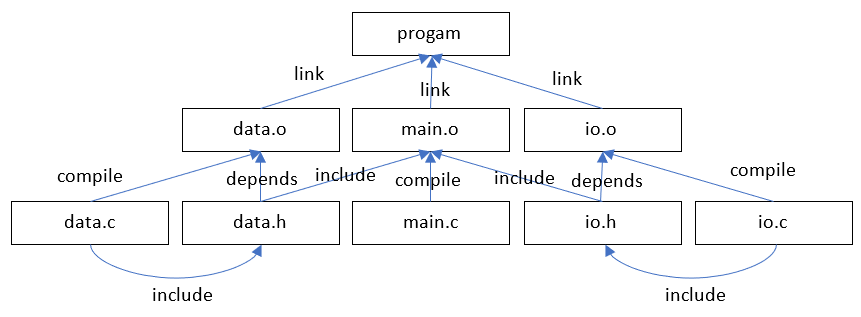

### Make

Утилита make, вообще говоря, инструмент для изготовления одних файлов из других. Ей без разницы, что это за файлы, она с одинаковым усердием будет генерировать PDF-файлы из HTML или отправлять сигналы на Марс и записывать ответы. Эта способность к трансформации файлов очень ценна, и программисты не могли пройти мимо. :)

В кратком изложении философия make такова:

1. У нас есть некий набор исходных файлов.
2. Мы хотим получить некий набор итоговых файлов.
3. Для этого у нас есть какие-то системные программы (команды), которые требуется выполнить в определённой последовательности. Именно этим и занимается make.

make - универсальный инструмент, поэтому ей требуется инструкция, в которой должны быть:

1. Перечислены все желаемые итоговые файлы, сколько бы их ни было.
2. Для каждого итогового файла перечисляются все исходные или промежуточные файлы, необходимые его изготовления.
3. Для каждого итогового файла приводится последовательность команд, которые должны быть поданы, чтобы получился именно этот файл. Заметьте, мы не можем сказать make "догадайся сама, что надо сделать" или "вот тебе десяток способов на выбор, сама реши, какой из них лучше".

На самом деле, make может руководствоваться правилами, которые не содержат команд, а лишь ссылаются на другие правила.

Допустим, у нас есть такая сложная программа:

```c
// data.h

int compute (int left, int right); // вычисления

//===============================================
// data.c

#include "data.h"

int compute (int left, int right)
{
    return left + right;
}

//===============================================
// io.h

int read_left_value();  // получение исходных данных
int read_right_value();

//===============================================
// io.c

#include "io.h"

int read_left_value()
{
    return 123;
}

int read_right_value()
{
    return 321;
}

//===============================================
// main.c

#include <stdio.h>

#include "io.h"
#include "data.h"

int main (int argc, char **argv)
{
    int left_value = read_left_value();
    int right_value = read_right_value();
    int computed_result = compute (left_value, right_value);
    printf ("Result is %d\n", computed_value);

    return 0;
}
```

Из пяти исходных файлов (`io.h`, `io.c`, `data.h`, `data.c` и `main.c`) нам необходимо получить один итоговый `program` и три промежуточных: `io.o`, `data.o` и `main.o`. Взаимые зависимости между этими файлами можно изобразить в виде графа:



Заметьте: системный заголовочный файл `stdio.h` мы не включаем в граф, т. к. во-первых, предполагается, что он предустановлен вместе с комипилятором, и, во-вторых, редактировать его мы не будем.

Вот какой `Makefile` получается в результате:

```makefile
program: io.o data.o main.o
    cc -o program io.o data.o main.o

io.o: io.c io.h
    cc -o io.o io.c

data.o: data.c data.h
    cc -o data.o data.c

main.o: main.c io.h data.h
    cc -o main.o main.c
```

`Makefile` состоит из набора правил, каждое из которых выглядит так:

```makefile
цель: пререквизит ...
    команда
    ..
```

**Цель** - это нужный нам конечный или промежуточный файл.

**Пререквизит** - это файл, который требуется для достижения цели. Он тем или иным способом трансформируется в целевой файл. Бывают цели без пререквизитов, они просто требуют выполнения неких действий в любом случае.

**Правило** - набор команд, которые должны быть успешно выполнены для достижения цели. Как правило, сбой при выполнении любой из команд в последовательности приводит к остановке make с соответствующим сообщением об ошибке (впрочем, это условие можно при необходимости отключить). О неудачном выполнении команды сообщают путём возврата кода, не равного нолю.

Здесь многоточия означают, что как пререквизитов, так и команд может быть больше одной.

Между правилами может быть произвольное (в том числе нулевое) число пустых строк. Они ни на что, кроме читаемости `Makefile` не влияют.

**Важно**: строки с командами обязательно должны начинаться со знака табуляции (именно табуляции, пробелы не заменят!), иначе make откажется исполнять такой `Makefile`.
