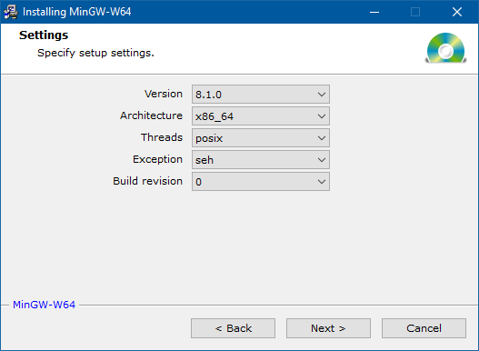
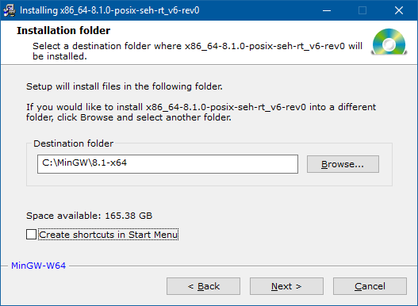
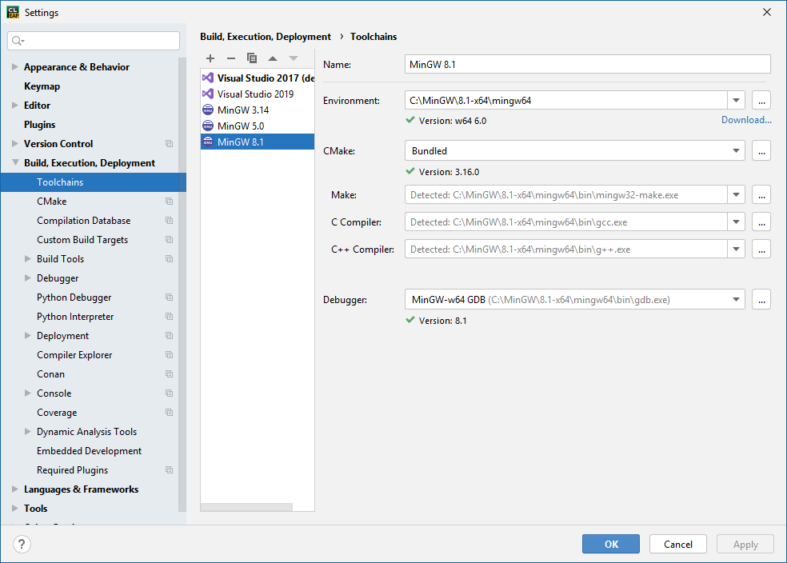
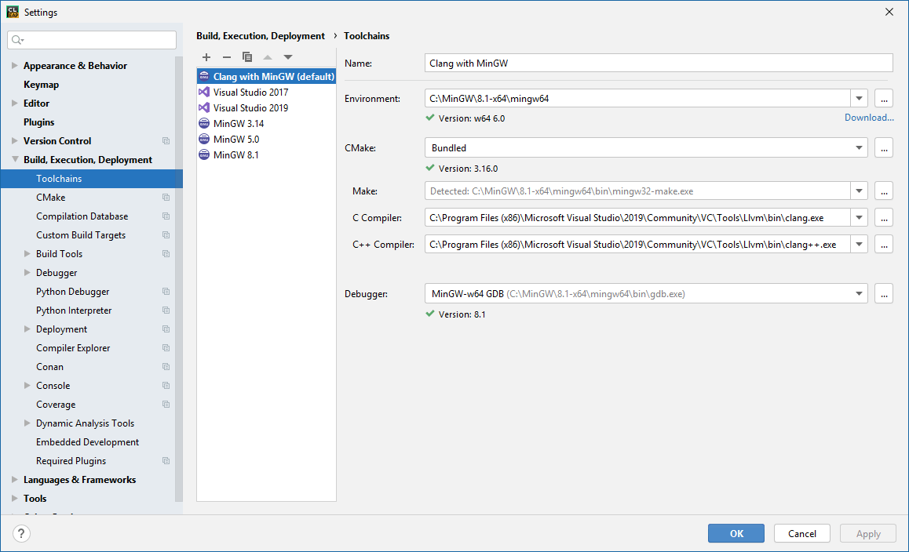
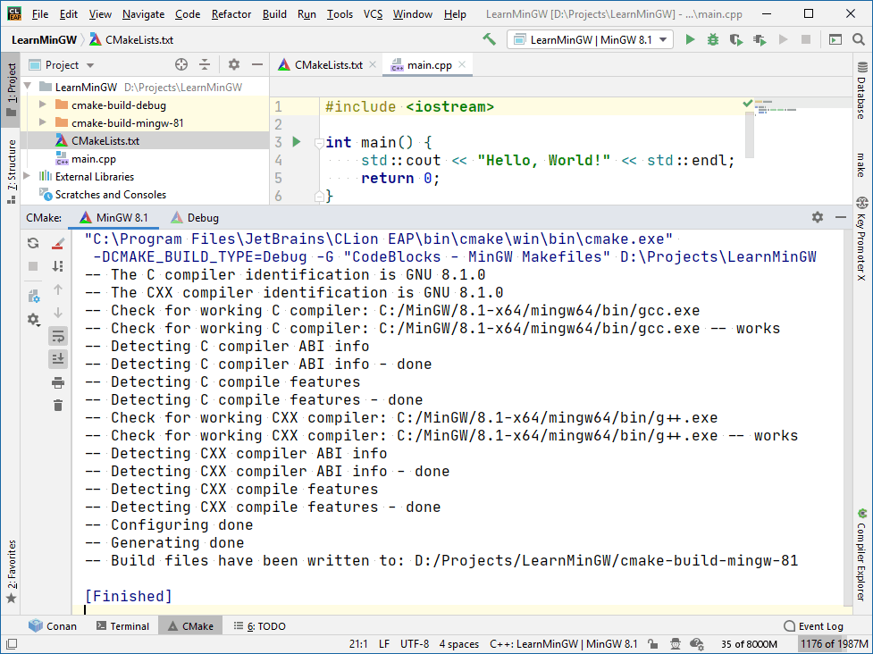

### MinGW

MinGW (Minimalist GNU for Windows) — набор инструментов разработки программного обеспечения для создания приложений под Windows. Включает в себя компилятор, родной программный порт GNU Compiler Collection (GCC) под Windows вместе с набором свободно распространяемых библиотек импорта и заголовочных файлов для Windows API. В MinGW включены расширения для библиотеки времени выполнения Microsoft Visual C++ для поддержки функциональности C99.

Официальный сайт: http://mingw.org/, но загружать лучше отсюда: https://sourceforge.net/projects/mingw-w64/, уж очень удобная там программка для установки:



Установить разных версий можно столько, сколько нужно, друг другу они не мешают. Я устанавливаю так:



Т. е. в папке `C:\MinGW` создаются подпапки с разными версиями на все случаи жизни.

Несмотря на то, что и Cygwin, и MinGW используются для портирования программного обеспечения Unix под Windows, они используют разный подход: цель Cygwin — предоставить полный слой POSIX (подобный тому, который находится в Linux и других Unix-системах) над Windows, жертвуя производительностью там, где это необходимо для совместимости. Соответственно, такой подход требует от Win32 программ, написанных с Cygwin, запуска поверх копилефтной библиотеки совместимости, которая должна распространяться с программой, а также с исходным кодом программы. Целью MinGW является предоставление нативной функциональности и производительности посредством прямых вызовов Windows API. В отличие от Cygwin, MinGW не нуждается в DLL-слое совместимости и, таким образом, программы не обязаны распространяться с исходным кодом.

Само собой, MinGW отлично дружит с CLion, причём разных версий MinGW можно добавить в CLion столько, сколько понадобится, главное — самому в них не запутаться:



Однако, надо иметь в виду одну особенность: по умолчанию приложения, собранные MinGW, зависят от динамических библиотек `libgcc_s_seh-1.dll`, `libstdc++-6.dll` и проч. Придётся таскать их вместе с EXE-файлом. Либо можно заставить MinGW линковать статически с помощью опции `-static`:

```cmake
cmake_minimum_required(VERSION 2.8)
project(LearnMinGW)
 
set(CMAKE_CXX_STANDARD 14)
 
add_compile_options(-static)
 
add_executable(LearnMinGW main.cpp)
```

MinGW дружит с Clang: последний работает как frontend, в то время как все библиотеки и прочая обвязка предоставляются первым.




