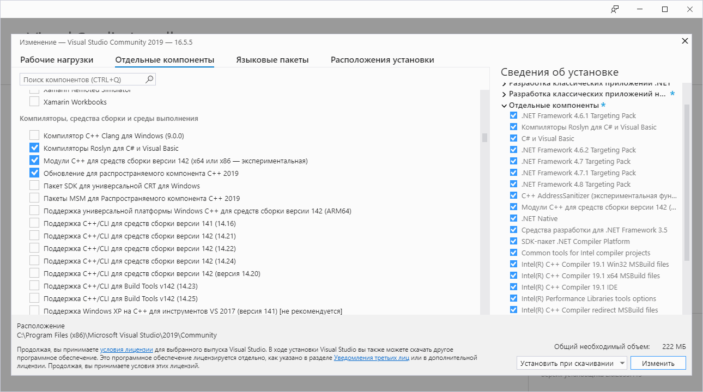
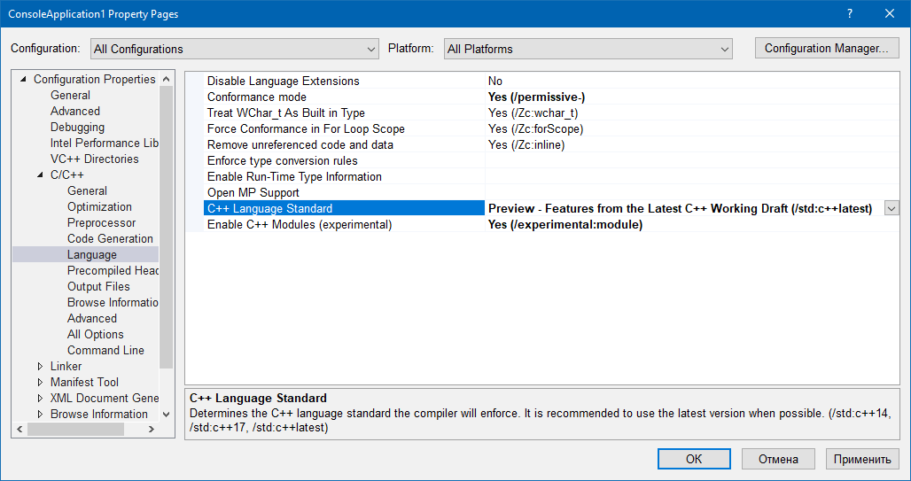
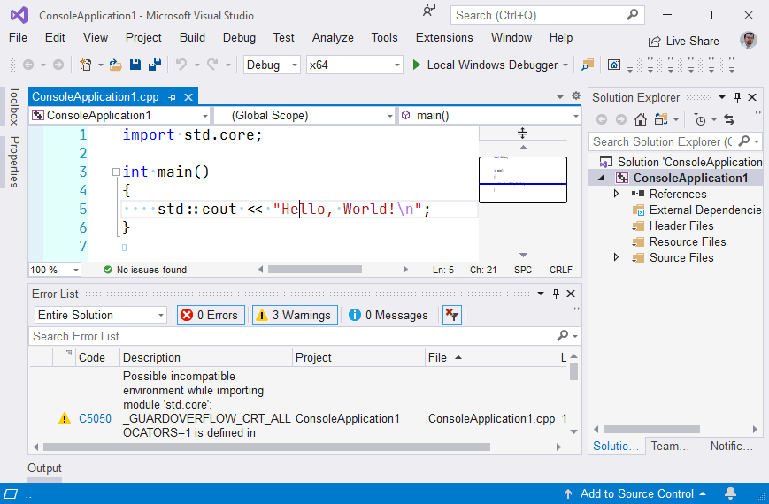
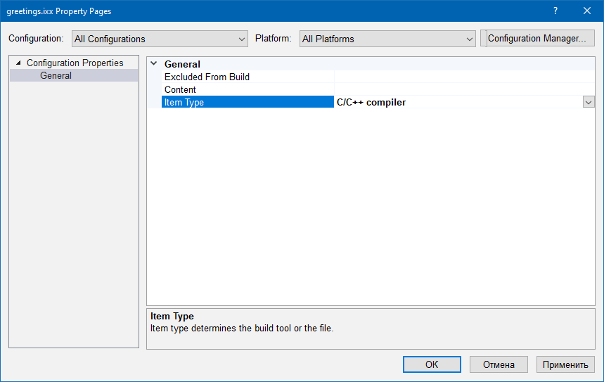
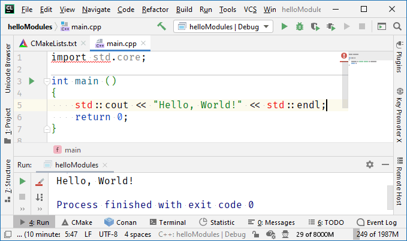

### Модули C++20 в Visual Studio 2019

[Начиная с версии 16.5](https://mariusbancila.ro/blog/2020/05/07/modules-in-vc-2019-16-5/), в Visual Studio появилась экспериментальная поддержка модулей из C++20. Её необходимо доустановить, т. к. по умолчанию она выключена:



В свойствах проекта также необходимо явно включить поддержку C++20 и модулей:



ReSharper, конечно же, придётся засаспендить, иначе он весь текст программы раскрашивает красным. Впрочем, даже без ReSharper’а студия сама себе выписывает предупреждения:



Несмотря на предупреждения, код успешно компилируется и запускается. Скомпилировать программу с модулями можно и с командной строки:

```
cl /std:c++latest /EHsc /experimental:module /MD ConsoleApplication1.cpp
```

Обратите внимание на опции `/EHsc /MD`, они обязательны, без них не заработает.

Модуль `std.core` содержит большую часть стандартной библиотеки C++. В целом дело обстоит так:

* **std.regex** соответствует заголовочному файлу `<regex>`;
* **std.filesystem** соответствует `<filesystem>`;
* **std.memory** соответствует `<memory>`;
* **std.threading** соответствен `<atomic>`, `<condition_variable>`, `<future>`, `<mutex>`, `<shared_mutex>`, `<thread>`;
* **std.core** содержит оставшиеся части стандартной библиотеки C++.

Теперь сделаем собственный модуль. Важно: модуль должен иметь расширение `.ixx`, так что добавляем в проект файл `greetings.ixx` следующего содержания:

```c++
export module greetings;
 
import std.core;
 
export std::string getGreeting()
{
    return "Hello, World!";
}
```

А файл `ConsoleApplication.cpp` перепишем так:

```c++
import std.core;
import greetings;
 
int main()
{
    std::cout << getGreeting() << "\n";
}
```

И проект перестаёт собираться. 🙁

Из-за нестандартного расширения файла `greetings.ixx` Visual Studio не воспринимает его как C++ (поэтому не подсвечивает синтаксис и не подсказывает IntelliSence), ей надо подсказать (правая кнопка мыши на файле -> `Properties`):



Собрать программу можно и в командной строке:

```
cl /std:c++latest /EHsc /experimental:module /MD ConsoleApplication1.cpp greetings.ixx
```

В модуль, кроме функций, могут входить структуры/классы:

```c++
export module my;
  
import std.core;
  
export struct point
{
   int x, y;
   point (int x_, int y_) : x {x_}, y {y_} {}
};
```

и/или шаблоны:

```c++
export module my2;
  
export template <typename T>
struct foo
{
    T value;
     
    foo (T const v) : value (v) {}
};
  
export template <typename T>
foo <T> make_foo (T const value)
{
    return foo <T> (value);
}
```

В общем, движение в правильном направлении, одобряю. 🙂

#### Как там в CLion?

В CLion поддержка C++20, в т. ч. модулей также находится в состоянии «50/50»:



Т. е. подсветка и IntelliSense не работают. Однако проекты собираются и запускаются (что логично, ведь можно использовать тот же компилятор Visual C++):

```cmake
cmake_minimum_required(VERSION 3.16)
project(helloModules)
 
set(CMAKE_CXX_STANDARD 20)
set(CMAKE_CXX_FLAGS "${CMAKE_CXX_FLAGS} /experimental:module")
 
add_executable(helloModules main.cpp)
```
