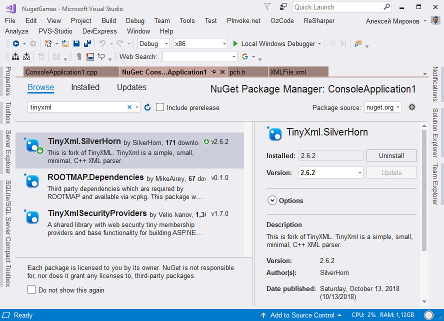

### NuGet для C++

Я, конечно, знал, что NuGet работает и для проектов типа «нативный C++», однако, попробовал первый раз. Результат ошеломляющий: почти так же удобно, как и в C#! Microsoft проделала замечательную работу по прикручиванию NuGet к Visual Studio.

Вот пример. Допустим, мне нужно по-быстрому прочитать содержание некоторого (несложного) XML-файла. Выбираем пункт «Manage NuGet packages» и видим следующее (найдите 10 отличий от C#):



Все необходимые пути для INCLUDE и LIB прописываются «магически». Поэтому после установки пакета просто пишем

```c++
#include "pch.h"
#include <iostream>
 
#include "tinyxml.h";
 
int main()
{
    TiXmlDocument doc("XMLFile.xml");
    bool ok = doc.LoadFile();
    std::cout << "Load result: " << ok << std::endl;
    if (ok)
    {
        TiXmlElement *root = doc.RootElement();
        std::cout << "Root element: " << root->ValueStr() << std::endl;
        std::cout << "Element text: " << root->GetText() << std::endl;
    }
}
```

Создадим простейший XML-файл следующего содержания

```xml
<?xml version="1.0" encoding="utf-8"?>
<Hello>World</Hello>
```
 
Результат выполнения программы:

```
Load result: 1
Root element: Hello
Element text: World
```

Это было несложно (c).
