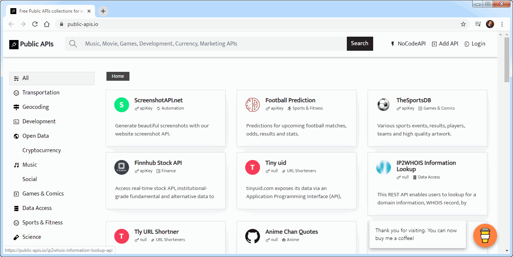

### Агрегатор Public APIs

Сайт: https://public-apis.io/

Это — агрегатор открытых API от сервисов, разработанных как крупными ИТ-компаниями вроде Google, TripAdvisor и Mailchimp, так и энтузиастами с GitHub. Автор платформы — front-end-разработчик Мохд Даниш (Mohd Danish), который также представил сервис для поиска вакансий Tweet Jobs.

Что интересно: библиотека насчитывает более 680 API. Все они разбиты на 50 категорий, в которые входят: медицина, погода, новости, информационная безопасность, открытые данные, облачные хранилища, машинное обучение. В списке программных интерфейсов есть инструменты для обработки естественной речи, скрейпинга, автоматизации GitLab и другие. Ориентироваться помогает поиск. API можно искать по ключевым словам и по компании-разработчику.

Внимание: База пополняется довольно медленно, но вы можете самостоятельно предложить отсутствующие API. На сайте нет спецификации программных интерфейсов, и чтобы узнать об инструменте подробнее, приходится открывать документацию.

Бонус: Даниш также запустил NoCodeAPI, готовые к использованию без модификаций backend-кода — например, позволяющие конвертировать XML или RSS в JSON или настроить хуки в Slack.
