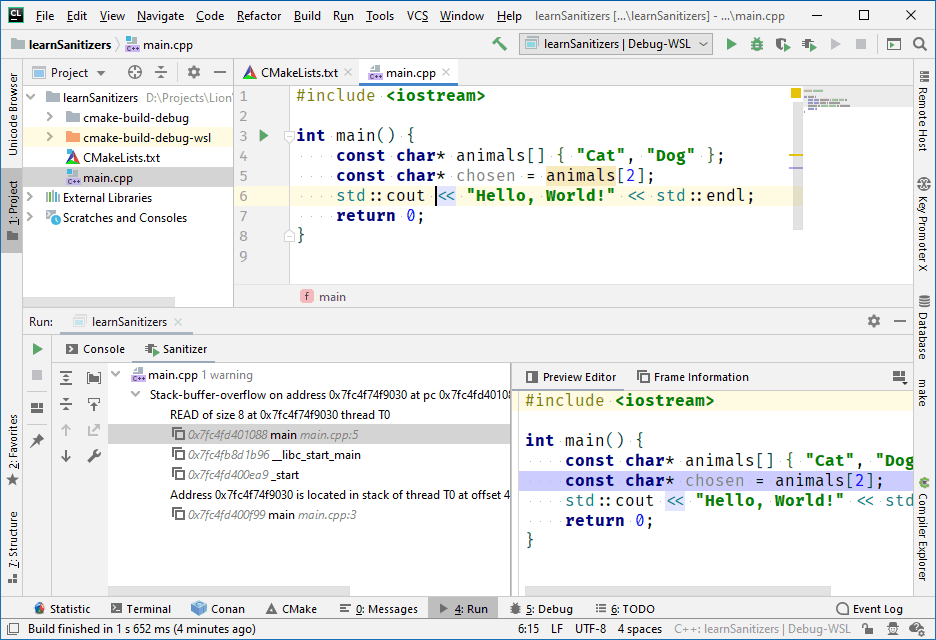
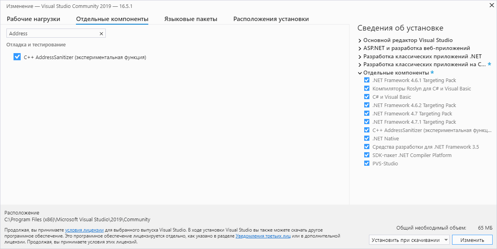

### Санитайзеры

CMakeLists.txt:

```
cmake_minimum_required(VERSION 2.8)

project(learnSanitizers)
 
set(CMAKE_CXX_STANDARD 11)
set(CMAKE_CXX_FLAGS "${CMAKE_CXX_FLAGS} -fsanitize=address -fno-omit-frame-pointer")
set(CMAKE_LINKER_FLAGS "${CMAKE_LINKER_FLAGS} -fsanitize=address -fno-omit-frame-pointer")

add_executable(learnSanitizers main.cpp)
```

main.cpp:

```c++
#include <iostream>
 
int main() {
    const char* animals[] { "Cat", "Dog" };
    const char* chosen = animals[2];
    std::cout << "Hello, World!" << std::endl;
    return 0;
}
```

Поддержка в CLion:



Поддержка в MSVC 2019.5:


