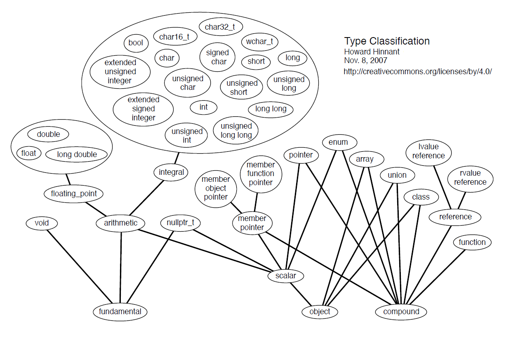

### Типы данных

* void
* integral
* floating point
* nullptr_t
* class/struct
* array
* pointer
* rvalue reference
* lvalue reference
* union
* enum
* function
* member object pointer
* member function pointer



#### Фундаментальные типы

* `void` -- нужен для `void*`.

* `char`, `unsigned char` и `signed char` -- разные типы! `char` тоже считается целочисленным типом, просто для него можно задавать литералы в виде `'A'`.

* `wchar_t` -- тип для широких символов. Может иметь разный размер в разных реализациях (как 2 байта, так и 4). `wchar_t` тоже целочисленный тип (см. выше).

* `char16_t` и `char32_t` -- тоже типы для широких символов, но с известным размером. Начиная с C++ 11.

* `char8_t` -- для строк в UTF-8. Начиная с C++ 20.

* `bool` -- имеет ровно два значения: `true` и `false`.

* Целочисленные типы: `short int`, `int`, `long int` и `long long int` (последний -- начиная с C++ 11). У всех, кроме `int` суффикс `int`  можно опустить (чаще всего так и поступают).

```
1 == sizeof(char) <= sizeof(short) <= sizeof(int) <= sizeof(long) <= sizeof(long long)
```

К целочисленным типам можно прицепить префиксы `unsigned` или `signed`. Если нет префикса, считается, что неявно прицеплен `signed`.

В Windows x86: `sizeof(int) == sizeof(long) == sizeof(void*) == 4`. В Windows x64: `sizeof(int) == sizeof(long) == 4; sizeof(void*) == 8`. В Unix x64: `sizeof(int) == 4; sizeof(long) == sizeof(void*) == 8`.

* Типы с плавающей точкой: `float` (обычно 32 бита), `double` (64 бита) и `long double` (80 бит).

#### Важные и нужные типы

* `size_t` -- беззнаковое целое, возвращаемое `sizeof(something)`. Обычно имеет тот же размер, что и указатель на данной платформе.

* `ptrdiff_t` -- знаковое целое, используемое для хранения разности двух указателей. Обычно имеет тот же размер, что и указатель на данной платформе.

* `nullptr_t` -- тип для `nullptr`.

* `intptr_t` и `uintptr_t` -- целое (знаковое и беззнаковое), вмещающее в себя указатель на данной платформе.

#### Челочисленные типы фиксированной ширины

Введены, начиная с C++ 11. Заголовочный файл `<cstdint>`.

* `int8_t`, `int16_t`, `int32_t`, `int64_t`, `uint8_t`, `uint16_t`, `uint32_t`, `uint64_t`. 

* `int_fast8_t`, `int_fast16_t`, `int_fast32_t`, `int_fast64_t`, `uint_fast8_t`, `uint_fast16_t`, `uint_fast32_t`, `uint_fast64_t`.

* `int_least8_t`, `int_least16_t`, `int_least32_t`, `int_least64_t`, `uint_least8_t`, `uint_least16_t`, `uint_least32_t`, `uint_least64_t`.  

