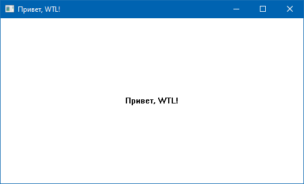

### "Hello, WTL" в CLion

При определённой сноровке писать WTL-приложения можно и с помощью CLion. Вот как это делается.

Создаём новый проект в CLion и копируем в подпапку WTL все заголовочные файлы от WTL. Сам проект немного редактируем (обратите внимание на указание WIN32 в объявлении приложения).

Естественно, в Visual Studio должен быть установлен пакет ATL для используемого тулчейна, тут никуда не денешься.

CLion легко и просто компилирует и отлаживает это приложение (релизная версия весит 164 Кб).

