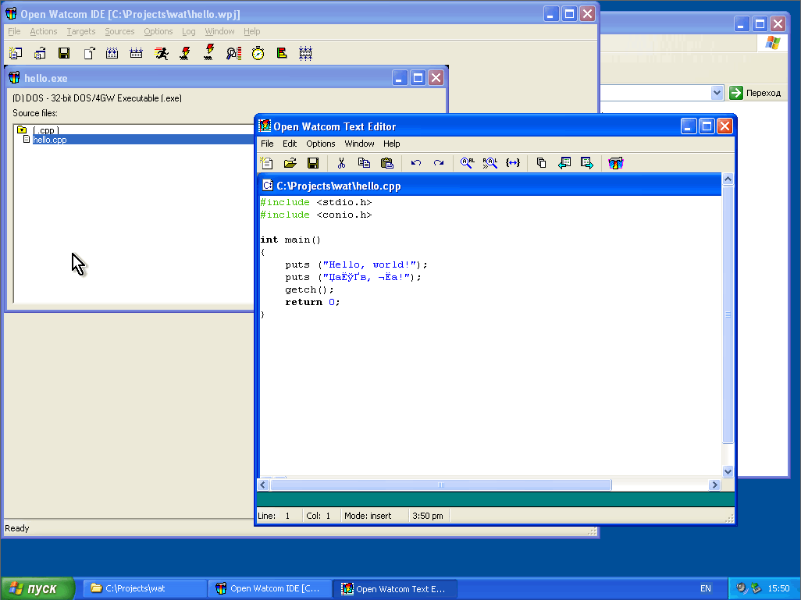

### Watcom

Помню, как я где-то в 1995 году, волнуясь, я запускал программку следующего содержания:

```c++
#include <stdio.h>
#include <malloc.h>
 
int main()
{
  void *ptr = malloc (1000000);
  printf("Allocated block: %p", ptr);
  return 0;
}
```

и с восторгом наблюдал вывод:

```
DOS/4GW Protected Mode Run-time  Version 1.97
Copyright (c) Rational Systems, Inc. 1990-1994
Allocated block: 02b20038
```

Я могу разместить в памяти мегабайт данных! Ура! Ура! Ура!

Так я познакомился с Watcom C/C++, тогда версии 9. Он позволял создавать программки как под привычную 16-битную MS-DOS, так и под 32-битный DOS-расширитель DOS/4GW (а также под Windows 3.1, но тогда программирование под Windows меня мало волновало). Это было волшебно! Я мог написать свой собственный Doom! Если захотел бы, конечно. 😉

Через некоторое время мне в руки попала Windows 95 с компилятором Visual C++ 2.0, и 32-битность перестала удивлять. А потом я узнал, что Watcom «накрылся», но к тому времени я уже навострячился использовать G++ под Linux и DJGPP под MS-DOS, так что горевал я недолго.

Теперь Watcom вернулся под именем Open Watcom — проекта сообщества по поддержке и развитию многоплатформных компиляторов Watcom C, C++ и Fortran и сопутствующих программ. Сейчас он представляет из себя непойми что: C++11 не поддерживается (и, скорее всего, не будет), даже C++03 поддержан лишь частично (например,std::wcout нет). Зато до сих пор можно скомпилировать программку под OS/2. 🙂

Снимок экрана в порядке ностальгии:



### Wiki

https://wiki.archlinux.org/index.php/Open_Watcom

Open Watcom is a Fortran/C/C++' compiler with many cross-compilation targets. Those old enough most likely fondly remember old DOS games ending with the DOS4GW extender, where the "W" stands for "watcom". In general it was a very popular compiler for high-end games at the time for producing very efficient binaries in memory-constrained environments (like DOS). Watcom lives on as Open Watcom, with an official release at version 1.9 and an unofficial fork at version 2.0.

#### Installation

The unofficial 2.0 release can be installed with the openwatcom-v2AUR package.

#### Wmake

Open Watcom comes with its own make utility (wmake). On Windows hosts, CMake supports generating wmake files. At this moment, it is unfortunately not possible to generate wmake files for cross compilation with CMake on Linux.

#### Using the Open Watcom package in Wine

The openwatcom-v2AUR package includes executables for all supported host platforms by default. This can be quite handy sometimes if one for example wants to debug a cross-compiled binary using the watcom debugger wd. In principle, the same could be done also with DOS emulators for example. Steps to set up a WINEPREFIX to use the already existing Watcom install:

* create a fresh WINEPREFIX (for example $HOME/.watcom) by WINEPREFIX=$HOME/.watcom winecfg
* cd to $WINEPREFIX/drive_c and make a symlink to /opt/watcom named watcom (ln -s /opt/watcom watcom)
* run regedit
* under HKEY_CURRENT_USER/Environment , add the following string variables
* WATCOM = C:\WATCOM
* PATH = C:\WATCOM\BINNT
* EDPATH = C:\WATCOM\EDDAT
* WIPFC = C:\WATCOM\WIPFC

#### Compilers

Open Watcom comes with a very efficient native 16-bit compiler supporting DOS and Win16 targets and a 32-bit x86 compiler targetting many different OSes (NT/Win32, OS/2, NetWare, Linux, ...). There is also experimental support for PowerPC, Alpha AXP, MIPS and SPARC architectures. A major aim for the v2 development is support for x86_64 and ARM architectures. The two most obvious "competitors" of Open Watcom would be the GCC-based MinGW (for Win32-targets) and DJGPP (for DOS targets).

#### 16-bit x86 compilers

The 16-bit x86 compilers finds its OS-independent libraries in the $WATCOM/lib286 directory and its OS-dependent libraries in $WATCOM/lib286/${target_os} sub-directory. Some OSes might need extra library paths, which can be added by the LIBPATH environment variable.

* **wcc**: the 16-bit "compile only" C compiler
* **wpp**: the 16-bit "compile only" C++ compiler
* **wcl**: the 16-bit "compile and link" utility for C/C++
* **wfc**: the 16-bit "compile only" Fortran compiler
* **wfl**: the 16-bit "compile and link" utility for Fortran
* **owcc**: the POSIX compatible "compile and link" utility. Set CC=owcc in a project depending on GNU makefiles.

#### 32-bit x86 compilers

The 32-bit x86 compilers finds its OS-independent libraries in the $WATCOM/lib386 directory and its OS-dependent libraries in $WATCOM/lib386/${target_os} sub-directory. Some OSes might need extra library paths, which can be added by the LIBPATH environment variable.

* **wcc386**: the 32-bit "compile only" C compiler
* **wpp386**: the 32-bit "compile only" C++ compiler
* **wcl386**: the 32-bit "compile and link" utility for C/C++
* **wfc386**: the 32-bit "compile only" Fortran compiler
* **wfl386**: the 32-bit "compile and link" utility for Fortran
* **owcc** : the POSIX compatible "compile and link" utility. Set CC=owcc in a project depending on GNU makefiles.

#### Comparisons to other (cross-) compilers

A striking difference compared to the binutils-based compilers (gcc, clang, pcc) when used as a cross compiler is that Open watcom only uses a single compiler (one for each target CPU architecture) and the target OS is determined by a compilation flag (see "cross compiling" below). Further, many OS-independent libraries lives in a generic architecture-specific location ($WATCOM/lib286 and $WATCOM/lib386) and only libraries with OS-specific features are put into OS-specific sub-directories - this is thanks to the Open Watcom C runtime that is distributed together with the compiler. This means that it is very easy to use a single install of Open Watcom as a cross compiler for a wide range of OSes. In contrast, a cross-compile toolchain based on binutils typically requires building a target-specific "trinity" of binutils, compiler and libc. Another advantage of Open Watcom as a Win32 cross compiler is that the resulting binaries and libraries integrate nicely with the target OS. For example, Python compiled with Open Watcom can load plugins compiled with MSVC. This is similar to how the different binutils-based compilers (often) can use libraries built with another binutils-based compiler. At this moment, the resulting binaries are not as optimized as those made by GCC.

#### Compiler optimization flags and other options

The Watcom compilers do not follow the same standard as GCC for flags (for example, it will not understand -O3 by default). It has a rich set of options to define target architecture, optimizations and other things. Some recommended flags for optimized 16-bit code can be found here.

#### (Cross-) compilation : Common settings

To cross compile, set the correct environment variables and a compile flag telling the compiler which target is intended. Without compile flags defining target, a native build is assumed.

Common for all targets (from an Arch Linux host):

```
export WATCOM=/opt/watcom
export PATH=$WATCOM/binl:$PATH
export EDPATH=$WATCOM/eddat
export WIPFC=$WATCOM/wipfc
```

A small overview of all build targets can be found here.

#### Linux

for C, use compilers: wcc386, wcl386 or owcc add -bt=linux for wcc386 or -bcl=linux for wcl386 or -blinux for owcc. Flags not absolutely needed since the compiler assumes a native build if nothing else is added.

```
export INCLUDE=$WATCOM/lh
```

#### DOS (16-bit)

add -bt=dos for wcc or -bcl=dos for wcl or -bdos for owcc

```
export INCLUDE=$WATCOM/h
```

#### DOS (32-bit DOS4GW Extender)

add -bt=dos for wcc386 or -bt=dos -l=dos4g for wcl386 or -bdos4g for owcc

```
export INCLUDE=$WATCOM/h
```

#### WIN16

add -bt=windows for wcc or -bcl=windows for wcl or -bwindows for owcc

```
export INCLUDE=$WATCOM/h:$WATCOM/h/win
```

#### WIN32

add -bt=nt for wcc386 or -bcl=nt for wcl386 or -bnt for owcc

```
export INCLUDE=$WATCOM/h:$WATCOM/h/nt
```

#### OS/2 (16-bit)

add -bt=os2 for wcc or -bcl=os2 for wcl or -bos2 for owcc

```
export INCLUDE=$WATCOM/h:$WATCOM/h/os21x
export LIBPATH=$WATCOM/binp/dll:$LIBPATH
```

#### OS/2 (32-bit)

add -bt=os2 for wcc386 or -bt=os2 -l=os2v2 for wcl386 or -bos2v2 for owcc

```
export INCLUDE=$WATCOM/h:$WATCOM/h/os2
export LIBPATH=$WATCOM/binp/dll:$LIBPATH
```

#### Netware

add -bt=netware for wcc386 or -bcl=netware for wcl386 or -bnetware for owcc

```
export INCLUDE=$WATCOM/h:$WATCOM/novh
export LIBPATH=$WATCOM/nlm:$LIBPATH
```

Some packages may need a | proprietary set of libraries and headers from Novell, which have been packaged in AUR: ow-netware_ndk

#### QNX

The Watcom compiler also supports QNX as a target, but since the libraries were not redistributable with the open source Open Watcom distribution, it has not been well-tested ever since. In theory, it might be possible to still compile for QNX if a C library is built for Watcom

#### Packaged third-party libraries and utilities

There are many 3rd party libraries and resources ready for Watcom. The packaging should conform to the MinGW packaging guidelines, but with the difference that they are packaged as much as possible as split packages. One exception to the split package aim is when one target has unique (or proprietary) build dependencies. Pre-packaged libraries and compiler front ends are meant to make it easy for someone to start using the cross compiler. Below are some resources packaged for Arch linux:

#### Libraries

ow-zlibAUR || targets : 32-bit : linux, Win32, DOS(4GW), OS/2, Netware 16-bit: DOS, Win16, OS/2
ow-libbz2AUR
Curses: ow-curses-win32aAUR : 32-bit: Win32, DOS(4GW) 16-bit: DOS, (Win16 a work-in-progress)
Extra languages
One area where GCC is stronger than Open Watcom is language support. To mitigate this, some source-to-source compilers can be built on/for Watcom.

#### See also

The Open Watcom community is relatively small, with moderate activity on Reddit. The primary discussions are done on the "contributors" and "users.c_cpp" groups on the Open Watcom newsgroups a third option is the user forums on sourceforge.
