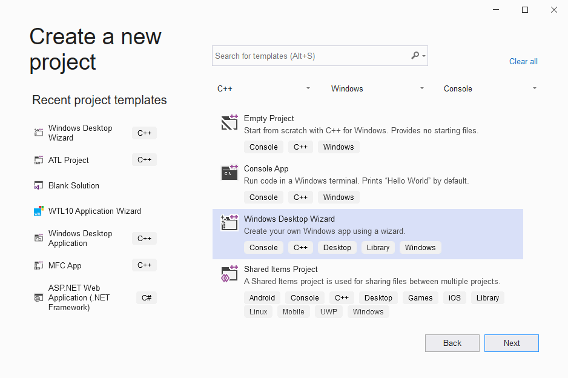
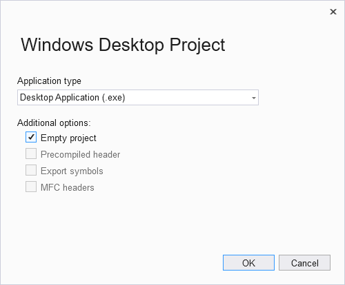
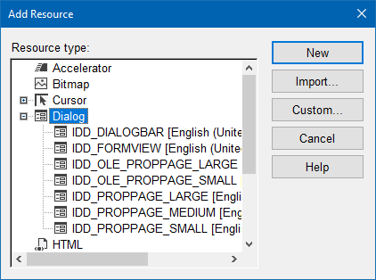
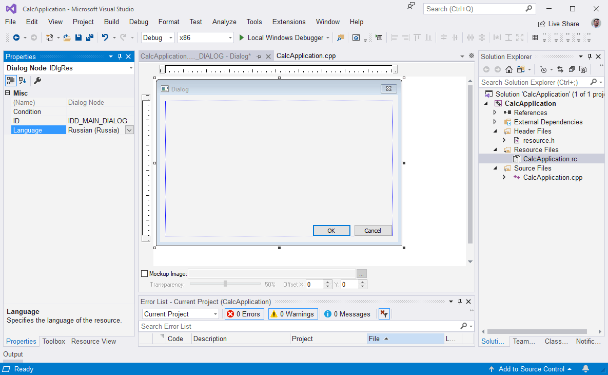
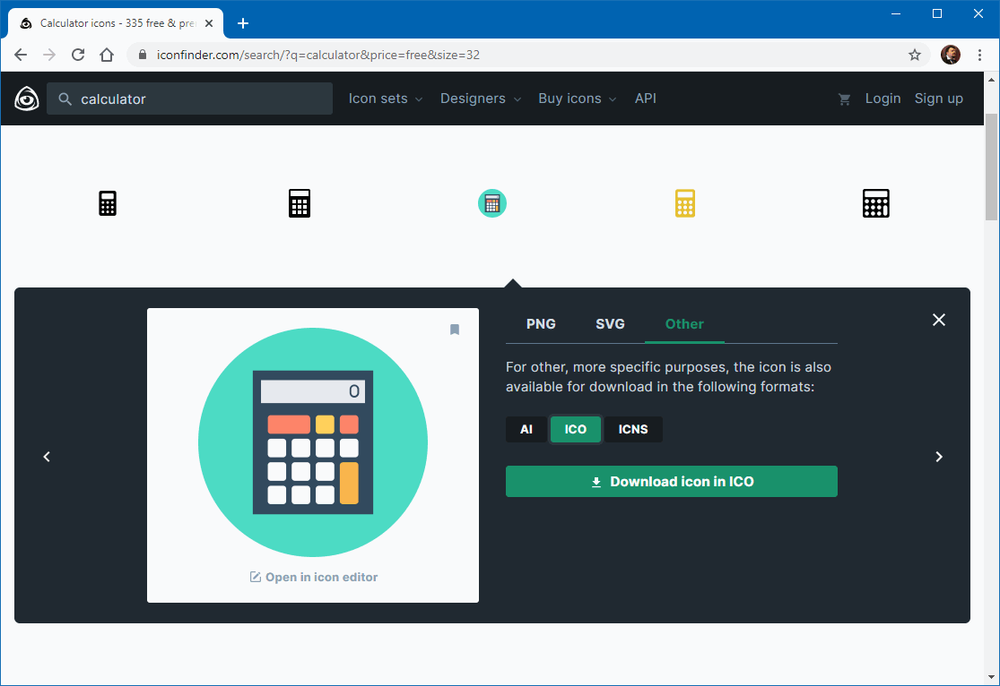
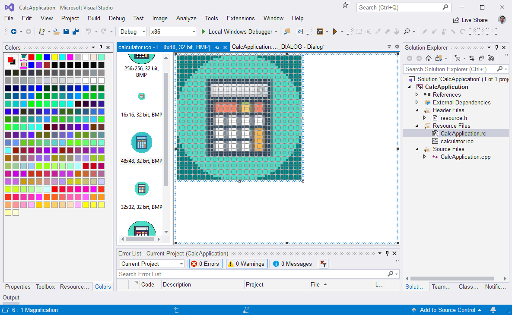
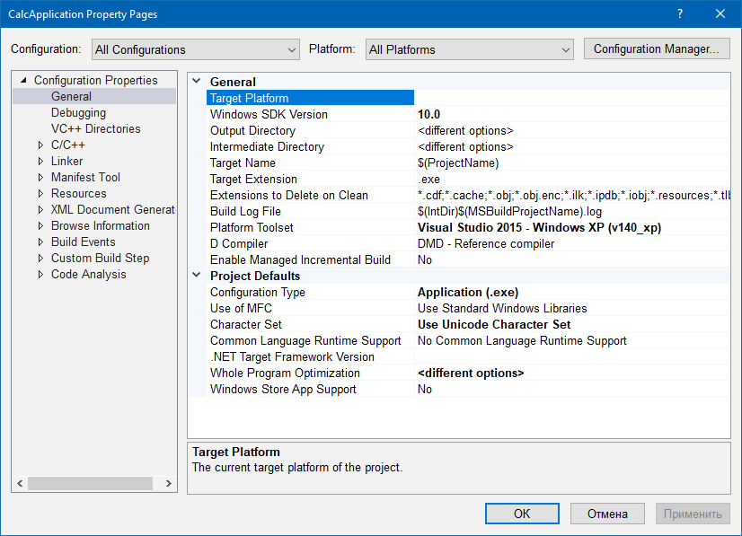
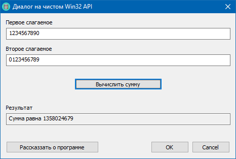
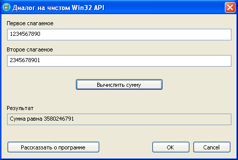
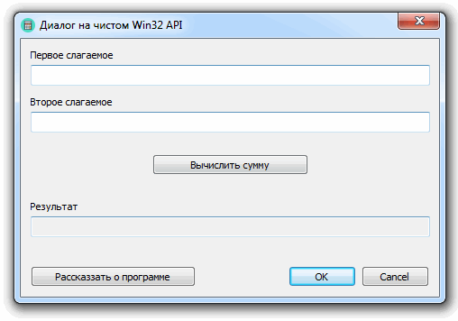

### Приложение на основе диалога

Продолжаем погружаться в пучины UI-программирования на платформе Win32. На сей раз создадим калькулятор, складывающий два числа на чистом WINAPI. Для этого лучше всего подходит Visual Studio, потому что в CLion редактора ресурсов, к сожалению, нет и не предвидится.

Строго говоря, в приложении мало C++, потому что классы и шаблоны тут были бы излишни. Я думаю, этот стиль программирования можно назвать «C++ без классов» 🙂

Итак, приступим! Позовём «Windows Desktop Wizard», чтобы он наколдовал нам пустой проект.



Выбираем «Empty project»: мы собираемся сделать всё сами вручную.



Создаём файл ресурсов `CalcApplication.rc` и добавляем в него диалог.



Меняем идентификатор ресурса на `IDC_MAIN_DIALOG`, проверяем, чтобы язык был установлен «Russian (Russia)».



Нам потребуется иконка для приложения и окна. Идём на сайт https://iconfinder.com (или любой другой) и скачиваем понравившуюся нам.



Импортируем её в файл ресурсов. При необходимости можно что-нибудь подредактировать.



Т. к. у меня на ноутбуке установлена не только Visual Studio 2019 (в которой собственно всё и происходит), но и Visual Studio 2015, можно использовать тулчейн от совместимой с Windows XP версии среды разработки.



Вот как выглядит программа под Windows 10.



Можно добавить в исходный код «магические» строчки, которые включат:

Использование библиотеки более современных контролов CommCtl.dll
Поддержку визуальных тем оформления для Windows XP/7
В принципе, можно обойтись без CommCtl и тем оформления, но тогда программа будет выглядеть не так привлекательно в Windows XP/7. Напомню, как она должна выглядеть:





Вот текст `CalcApplication.cpp`:

```c++
#include <windows.h>
#include <CommCtrl.h>
#include <tchar.h>
#include <wchar.h>
#include <stdio.h>

#include "resource.h"

// подключаем библиотеку современных контролов
#pragma comment (lib, "ComCtl32.lib")

// включаем поддержку тем
#if defined _M_IX86
#pragma comment(linker,"/manifestdependency:\"type='win32' name='Microsoft.Windows.Common-Controls' version='6.0.0.0' processorArchitecture='x86' publicKeyToken='6595b64144ccf1df' language='*'\"")
#elif defined _M_X64
#pragma comment(linker,"/manifestdependency:\"type='win32' name='Microsoft.Windows.Common-Controls' version='6.0.0.0' processorArchitecture='amd64' publicKeyToken='6595b64144ccf1df' language='*'\"")
#else
#pragma comment(linker,"/manifestdependency:\"type='win32' name='Microsoft.Windows.Common-Controls' version='6.0.0.0' processorArchitecture='*' publicKeyToken='6595b64144ccf1df' language='*'\"")
#endif

// инициализация диалога
BOOL InitializeDialog 
    (
        HWND hwnd
    )
{
    // загружаем иконку диалога из ресурсов
    HICON hicon = (HICON) LoadImage
        (
            GetModuleHandle (nullptr),
            MAKEINTRESOURCE(IDI_MAIN_ICON),
            IMAGE_ICON,
            0,
            0,
            LR_DEFAULTCOLOR | LR_DEFAULTSIZE
        );
    SendMessage
        (
            hwnd,
            WM_SETICON,
            ICON_BIG,
            (LPARAM) hicon
        );
    SendMessage
        (
            hwnd,
            WM_SETICON,
            ICON_SMALL,
            (LPARAM) hicon
        );

    // ограничиваем длину вводимого текста
    SendDlgItemMessage (hwnd, IDC_FIRST_TERM_EDIT, EM_SETLIMITTEXT, 10, 0);
    SendDlgItemMessage (hwnd, IDC_SECOND_TERM_EDIT, EM_SETLIMITTEXT, 10, 0);

    return FALSE;
}

// простая процедура для окна "О программе"
BOOL CALLBACK AboutProc
    (
        HWND hwnd,
        UINT message,
        WPARAM wParam,
        LPARAM lParam
    )
{
    switch (message)
    {
        case WM_CLOSE:
            EndDialog (hwnd, 0);
            return FALSE;

        // обрабатываем нажатие ESC
        case WM_COMMAND:
            if (LOWORD (wParam) == IDCANCEL) 
            {
                EndDialog (hwnd, 0);
            }
            return FALSE;

        default:
            return FALSE;
    }
}

// показ окна "О программе"
void AboutProgram
    (
        HWND hwnd
    )
{
    DialogBox
        (
            GetModuleHandle (nullptr),
            MAKEINTRESOURCE (IDD_ABOUT_DIALOG),
            nullptr,
            (DLGPROC) AboutProc
        );
}

// Процедура вычисления суммы двух введенных чисел
void Calculate
    (
        HWND hwnd
    )
{
    const int MaxLength = 30;
    TCHAR firstTerm[MaxLength], secondTerm[MaxLength];
    
    ZeroMemory (firstTerm, sizeof (firstTerm));
    ZeroMemory (secondTerm, sizeof (secondTerm));
    
    GetDlgItemText 
        (
            hwnd, 
            IDC_FIRST_TERM_EDIT, 
            firstTerm, 
            MaxLength
        );
    GetDlgItemText 
        (
            hwnd, 
            IDC_SECOND_TERM_EDIT, 
            secondTerm, 
            MaxLength
        );

    int firstValue = 0, secondValue = 0;

#ifdef UNICODE
    swscanf_s (firstTerm, _T("%u"), &firstValue);
    swscanf_s (secondTerm, _T("%u"), &secondValue);
#else
    sscanf_s (firstTerm, "%u", &firstValue);
    sscanf_s (secondTerm, "%u", &secondValue);
#endif

    int resultValue = firstValue + secondValue;
    TCHAR resultText[MaxLength];
    ZeroMemory (resultText, MaxLength);
#ifdef UNICODE
    swprintf_s (resultText, _T("Сумма равна %u"), resultValue);
#else
    sprintf_s (resultText, "Сумма равна %u", resultValue);
#endif

    SetDlgItemText (hwnd, IDC_RESULT_EDIT, resultText);
}

// обработка нажатий кнопок
BOOL HandleCommand
    (
        HWND hwnd,
        UINT message,
        WPARAM wParam,
        LPARAM lParam
    )
{
    switch (LOWORD (wParam))
    {
        case IDOK:
        case IDCANCEL:
            SendMessage (hwnd, WM_CLOSE, 0, 0);
            break;

        case IDC_CALCULATE_BUTTON:
            Calculate (hwnd);
            break;

        case IDC_ABOUT_BUTTON:
            AboutProgram (hwnd);
            break;

        default:
            break;
    }

    return FALSE;
}

// процедура-обработчик сообщений для диалогового окна
BOOL CALLBACK DialogProc
    (
        HWND hwnd,
        UINT message,
        WPARAM wParam,
        LPARAM lParam
    )
{
    switch (message)
    {
        case WM_INITDIALOG:
            return InitializeDialog (hwnd);

        case WM_COMMAND:
            return HandleCommand 
                (
                    hwnd, 
                    message, 
                    wParam, 
                    lParam
                );

        case WM_CLOSE:
            EndDialog (hwnd, 0);
            return FALSE;

        default:
            return FALSE;
    }
}

// точка входа в программу
int WINAPI WinMain
    (
        HINSTANCE hInstance,     // текущий экземпляр приложения
        HINSTANCE hPrevInstance, // не используется
        LPSTR pCmdLine,          // командная строка
        int iCmdShow             // режим отображения окна
    )
{
    InitCommonControls();

    return (int) DialogBox
        (
            hInstance,
            MAKEINTRESOURCE (IDD_MAIN_DIALOG),
            nullptr,
            (DLGPROC) DialogProc
        );
}
```
