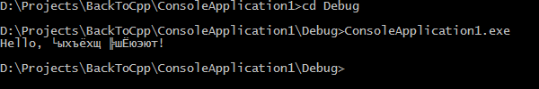
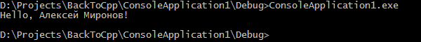

### Русский язык в консоли Windows

Допустим, мы написали такую сверхсложную программку на C++:

```c++
#include "stdafx.h"
 
#include <string>
#include <iostream>
 
void SayHello(std::string name)
{
    std::cout << "Hello, " << name << "!" << std::endl;
}
 
int main()
{
    SayHello("Алексей Миронов");
 
    return 0;
}
```

и она выведет абракадабру 🙁



Решение: где-нибудь в начале программы вставить строку:

```c++
setlocale(LC_ALL, "Russian");
```

Сразу становится намного лучше:



Естественно, консоль должна быть оснащена шрифтами с поддержкой кириллицы (например, Lucida Console или Consolas).  Правда, этот метод имеет недостаток: ввод кириллицы как не работал без setlocale, так не работает и с ним, вводится абракадабра.

Важно! Исходные тексты должны быть строго либо в кодировке ANSI (CP1251 в нашем случае) либо UTF-8 (предпочтительнее, т. к. позволит корректно собрать EXE даже на нерусифицированной Windows).

Можно использовать Win32 API:

```c++
#include <Windows.h>
 
...
 
SetConsoleCP(1251);
SetConsoleOutputCP(1251);
```
 
Это делает программу непереносимой на другие платформы, зато начинают нормально работать как ввод, так и вывод кириллицы.

Если нам нужен не только русский текст в консоли, но и, например, грузинский, греческий и т. п., «заклинания» меняются:

```c++
#include <iostream>
#include <io.h>
#include <fcntl.h>
 
int wmain(int argc, wchar_t* argv[])
{
    _setmode(_fileno(stdout), _O_U16TEXT);
    _setmode(_fileno(stdin),  _O_U16TEXT);
    _setmode(_fileno(stderr), _O_U16TEXT);
 
    std::wcout << L"Unicode -- English -- Русский -- Ελληνικά -- Español."
      << std::endl;
    // или
    wprintf(L"%s", L"Unicode -- English -- Русский -- Ελληνικά -- Español.\n");
 
    return 0;
}
```

Важное замечание: потоки ввода-вывода находятся либо в «широком», либо в «узком» состоянии — то есть, в них выводится либо только `char*`, либо только `wchar_t*`. После первого вывода переключение не всегда возможно. Поэтому такой код:

```c++
cout << 5;            // или printf("%d", 5);
wcout << L"привет";   // или wprintf(L"%s", L"привет");
```

вполне может не сработать. Используйте только `wprintf/wcout`.
